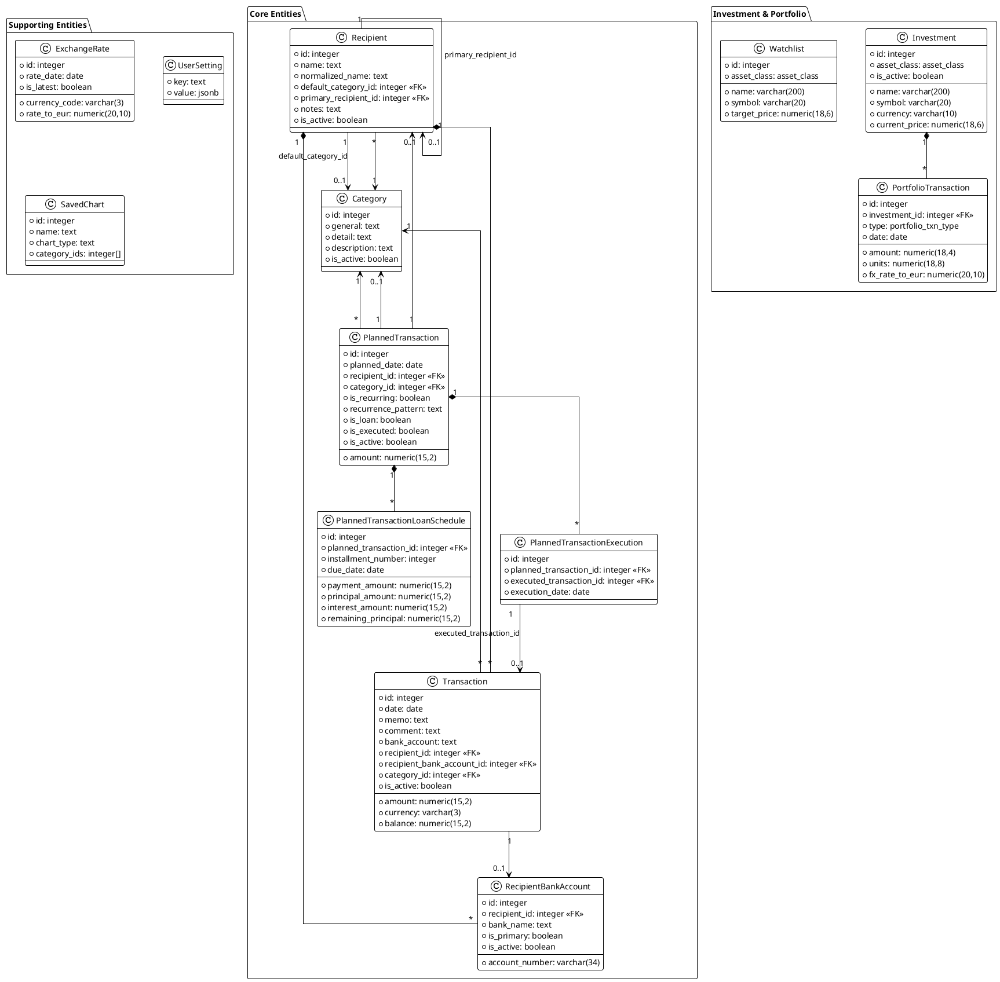
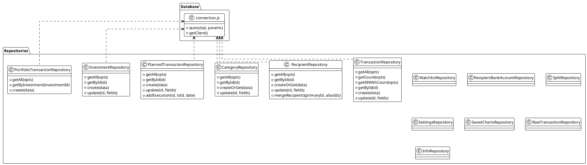
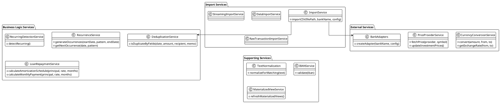
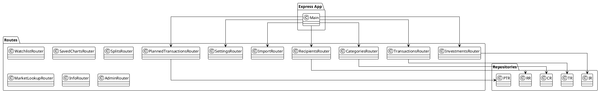
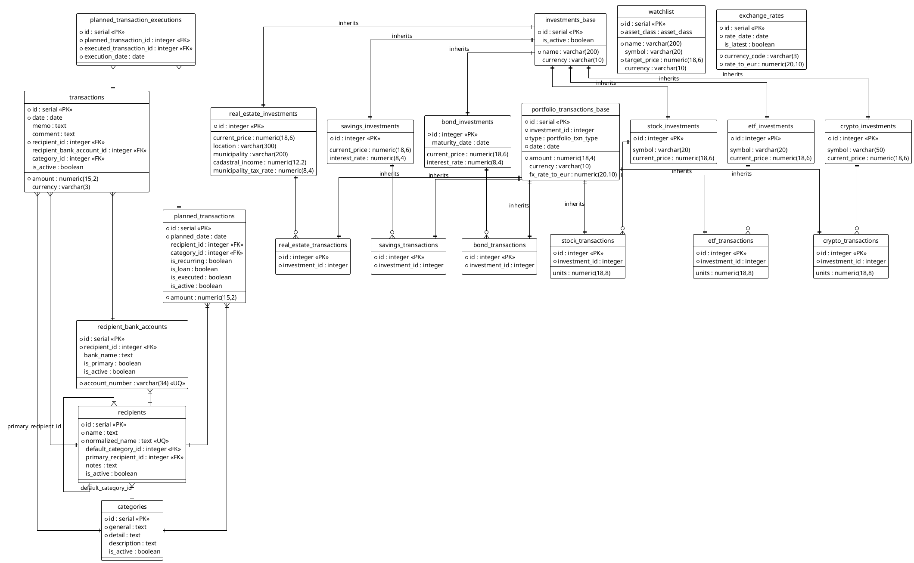
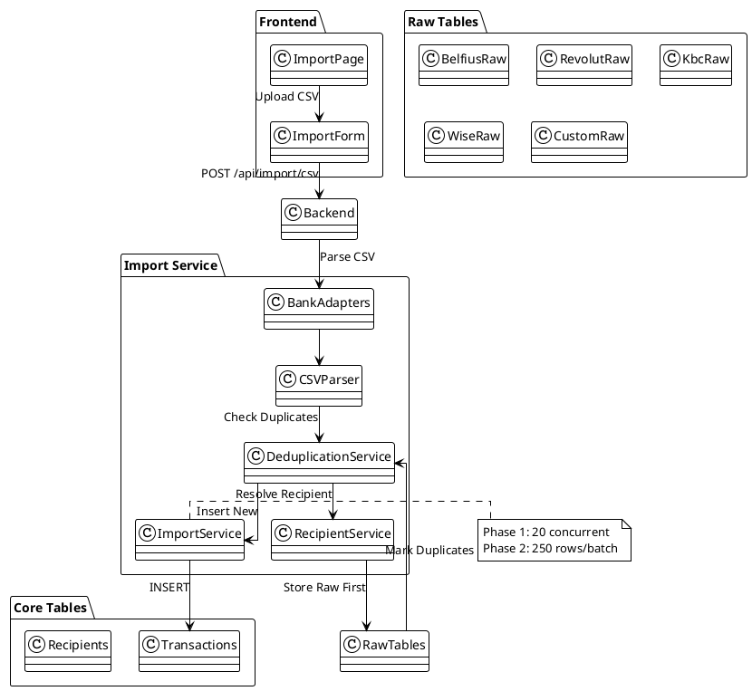
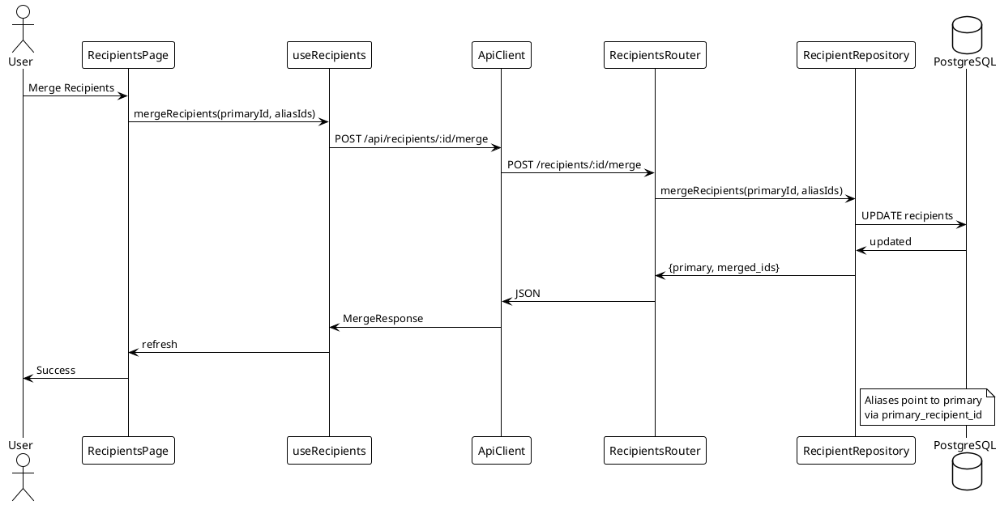
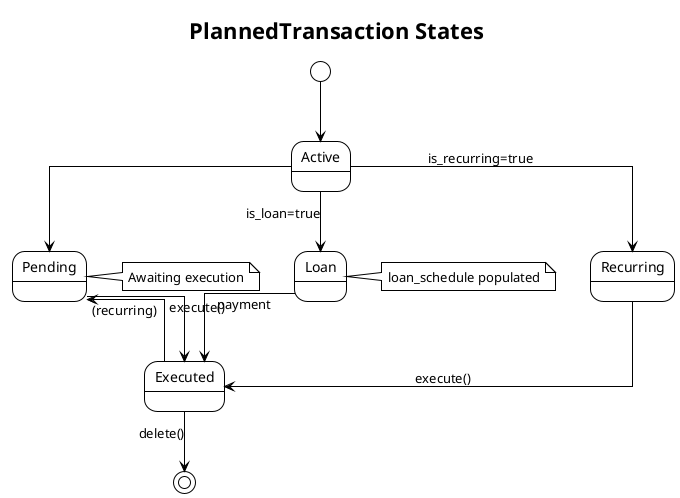

# Backend Architecture

This document contains UML diagrams for the Node.js backend application.

> **Note**: These diagrams are generated from the codebase and should be regenerated when significant changes are made.

## Domain Model

The core entities and their relationships.



Source diagram: [[docs/diagrams/backend-api-layer.puml]]

## Repository Layer

Data access layer showing repositories and their dependencies.



## Service Layer

Business logic services and their interactions.



## API Layer

Express routes and their connections to repositories and services.



## Database Schema

ERD showing all tables and their relationships.



## Import Pipeline

End-to-end flow showing how CSV files are imported, parsed, deduplicated, and stored.



## System Architecture

High-level view of the complete system architecture.

```plantuml
@startuml
!theme plain
skinparam linetype ortho
skinparam nodesep 35
skinparam ranksep 60

actor "User" as User

package "Client" {
  rectangle "Browser (React App)" {
    node "React 18 + TypeScript" as ReactApp
    node "Vite" as Vite
    node "Tailwind CSS + Radix UI" as UI
    node "React Router v7" as Router
    node "TanStack Query" as ReactQuery
    node "React Context" as Context
  }
}

cloud "HTTP/JSON" as Network

package "Server" {
  rectangle "Node.js Backend" {
    node "Express.js" as Express
    node "Middleware" as Middleware {
      CORS, Compression, Rate Limiter
    }
    node "Routes" as Routes
    node "Services" as Services
    node "Repositories" as Repos
  }
}

database "PostgreSQL 18" as DB {
  node "Tables"
  node "Materialized Views"
  node "Indexes"
  node "Triggers"
}

cloud "External Services" as External {
  node "ECB (Exchange Rates)"
  node "CoinGecko (Crypto)"
  node "Yahoo Finance (Stocks)"
  node "Kraken (Crypto)"
}

User --> ReactApp : HTTPS
ReactApp --> Express : REST API
Express --> Middleware
Middleware --> Routes
Routes --> Services
Services --> Repos
Repos --> DB : SQL
Services --> External : API Calls

@enduml
```

## Deployment Architecture

Development, production (Docker), and desktop deployment models.

```plantuml
@startuml
!theme plain
skinparam linetype ortho
skinparam nodesep 35
skinparam ranksep 50

package "Development" {
  node "Local Machine" as Dev {
    component "Frontend (Vite)" as FrontendDev
    component "Node.js (Bun)" as BackendDev
    component "PostgreSQL" as PostgresDev
  }
}

package "Production (Docker)" {
  node "Docker Host" as DockerHost {
    container "app" as AppContainer {
      node "Node.js Server"
      node "Static Files"
    }
    container "db" as DBContainer {
      node "PostgreSQL 18"
    }
  }
}

package "Desktop (Electron)" as Desktop {
  node "Electron Main"
  node "Electron Renderer"
}

actor "User" as User

User --> Dev : Dev Access
User --> DockerHost : HTTPS
User --> Desktop : Desktop App

Dev --> PostgresDev
AppContainer --> DBContainer
Desktop --> AppContainer

@enduml
```

## Currency Conversion Flow

How exchange rates are fetched, cached, and used for currency normalization.

```plantuml
@startuml
!theme plain
skinparam linetype ortho
skinparam nodesep 30
skinparam ranksep 40

actor "User" as User

package "Frontend" {
  class TransactionPage
  class ApiClient
}

package "Backend Services" {
  class CurrencyConversionService {
    +convert(amount, from, to)
    +getExchangeRate(from, to)
  }
  class ExchangeRateRepository
}

cloud "ECB API" as ECB
database "PostgreSQL" as DB {
  table "exchange_rates"
}

User --> TransactionPage : View EUR
TransactionPage --> ApiClient : GET /transactions?normalize_to_eur=true
ApiClient --> CurrencyConversionService : convert(100, USD, EUR)
CurrencyConversionService --> ExchangeRateRepository : getExchangeRate(USD, EUR)

alt Cache hit
  ExchangeRateRepository --> DB : SELECT
  DB --> ExchangeRateRepository : rate
else Cache miss
  ExchangeRateRepository --> ECB : GET /rates
  ECB --> ExchangeRateRepository : rates
  ExchangeRateRepository --> DB : INSERT
end

ExchangeRateRepository --> CurrencyConversionService : rate
CurrencyConversionService --> ApiClient : converted
ApiClient --> TransactionPage : EUR amount
TransactionPage --> User : display

@enduml
```

## Price Provider Flow

Automatic price updates for investments from external providers.

Migration compatibility note:
- `0017_investment_custom_provider_history` updates inheritance compatibility for custom-provider latest/history fields and metals view/trigger wiring ([[alembic/versions/0017_investment_custom_provider_history.py]]).
- `0019_asset_price_history_cache` adds persisted historical quote cache (`asset_price_history`) used by read-through provider history fetches and startup backfill for held assets ([[alembic/versions/0019_asset_price_history_cache.py]]).

```plantuml
@startuml
!theme plain
skinparam linetype ortho
skinparam nodesep 30
skinparam ranksep 40

package "Backend Services" {
  class PriceProviderService {
    +updateInvestmentPrices()
  }
  class InvestmentRepository
}

cloud "Providers" as Providers {
  Binance
  YahooFinance
  Kinesis
  CustomJSON
}

database "PostgreSQL" as DB

PriceProviderService --> InvestmentRepository : getActiveInvestments()
InvestmentRepository --> DB : SELECT

loop For each investment
  alt provider = 'binance'
    PriceProviderService --> Binance : GET price
  else provider = 'yahoo'
    PriceProviderService --> YahooFinance : GET price
  else provider = 'kinesis'
    PriceProviderService --> Kinesis : GET trendline
  else provider = 'custom'
    PriceProviderService --> CustomJSON : GET latest/history
  end
  Providers --> PriceProviderService : price
  PriceProviderService --> InvestmentRepository : update price
  InvestmentRepository --> DB : UPDATE current_price
end

@enduml
```

Source diagram: [[docs/diagrams/price-provider-flow.puml]]

Database addition note:
- Historical quote persistence table: `asset_price_history` (`investment_id`, `price_date`, `close_price`, `source`, `fetched_at`, `updated_at`) created by schema init and Alembic migration.

## Recurring Detection Flow

Automatic detection of recurring transactions from transaction history.

```plantuml
@startuml
!theme plain
skinparam linetype ortho
skinparam nodesep 30
skinparam ranksep 40

package "Backend Services" {
  class RecurringDetectionService {
    +detectRecurring()
  }
  class TransactionRepository
  class PlannedTransactionRepository
}

database "PostgreSQL" as DB {
  table "transactions"
  table "planned_transactions"
}

RecurringDetectionService --> TransactionRepository : getLastN(1000)
TransactionRepository --> DB : SELECT
DB --> TransactionRepository : transactions

RecurringDetectionService --> DB : group by (recipient, amount)
DB --> RecurringDetectionService : candidate patterns

RecurringDetectionService --> PlannedTransactionRepository : create planned
PlannedTransactionRepository --> DB : INSERT
DB --> PlannedTransactionRepository : created

@enduml
```

## Materialized View Refresh Flow

How materialized views are maintained for performance.

```plantuml
@startuml
!theme plain
skinparam linetype ortho
skinparam nodesep 30
skinparam ranksep 40

package "Backend" {
  class MaterializedViewService
  class SchemaInit
}

database "PostgreSQL" as DB {
  node "Materialized Views" as MatViews {
    category_monthly_stats
    recipient_monthly_stats
    monthly_trends
  }
  node "Indexes" as Indexes
}

SchemaInit --> MaterializedViewService : check version

alt version match
  MaterializedViewService --> MatViews : REFRESH MATERIALIZED VIEW
else version mismatch
  MaterializedViewService --> MatViews : CREATE
  MaterializedViewService --> Indexes : CREATE INDEX
end

MatViews --> DB : refreshed

@enduml
```

## Recipient Merge Sequence

How recipients are merged and unmerged.



## PlannedTransaction State Machine

Lifecycle states for planned transactions.



## Diagram Source Files

The raw PlantUML source files are stored in `docs/diagrams/`:

**Backend Architecture:**
- `backend-domain-model.puml` - Core domain entities
- `backend-repository-layer.puml` - Data access layer
- `backend-service-layer.puml` - Business logic services
- `backend-api-layer.puml` - API routes and controllers
- `backend-database-schema.puml` - Database ERD

**Import & Processing:**
- `import-pipeline.puml` - CSV import flow
- `import-sequence.puml` - Detailed import sequence
- `currency-conversion-flow.puml` - Exchange rate conversion
- `price-provider-flow.puml` - Investment price updates
- `recurring-detection-flow.puml` - Recurring transaction detection
- `materialized-view-flow.puml` - Materialized view refresh

**Sequence & State Diagrams:**
- `recipient-merge-sequence.puml` - Recipient merge workflow
- `planned-transaction-state.puml` - PlannedTransaction lifecycle

**System-Wide:**
- `system-architecture.puml` - Full system overview
- `deployment-architecture.puml` - Deployment diagram
- `api-communication.puml` - Frontend to Backend communication
- `use-case-diagram.puml` - User interactions overview
- `transaction-state.puml` - Transaction lifecycle states

## Regenerating Diagrams

To regenerate these diagrams after code changes:

1. Review the relevant source files
2. Update the PlantUML source in the respective `.puml` file
3. The diagrams in this document will render the updated content

---

**Related Documentation**
- [[API Documentation]] - API endpoint details
- [[Database Schema]] - Detailed schema documentation
- [[Features Overview]] - Feature descriptions
