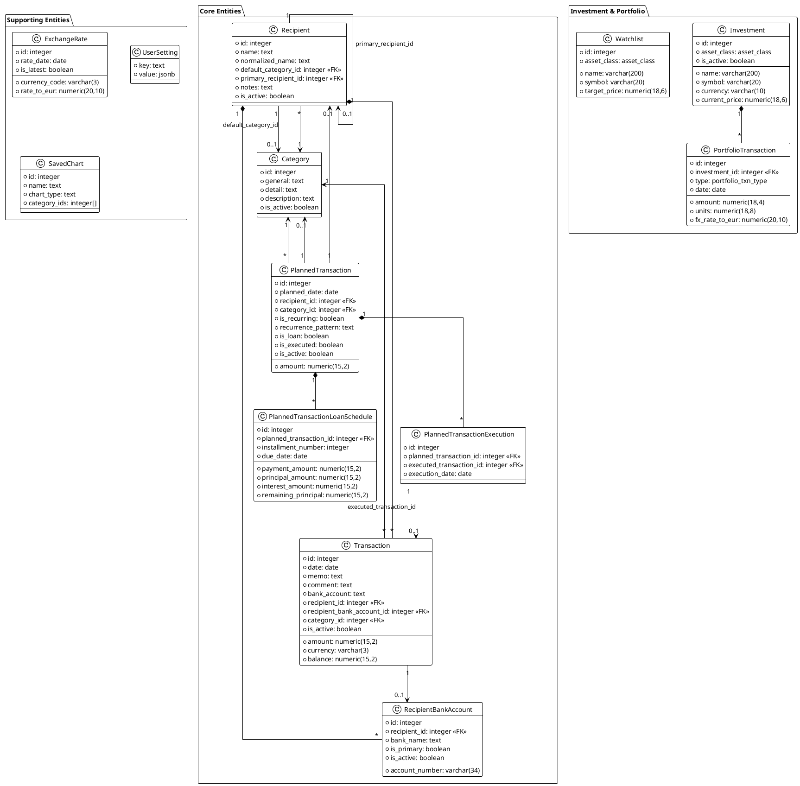
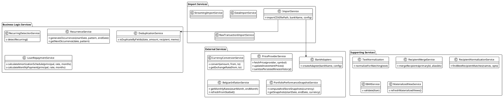
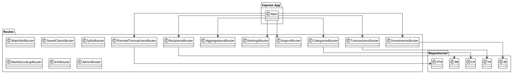
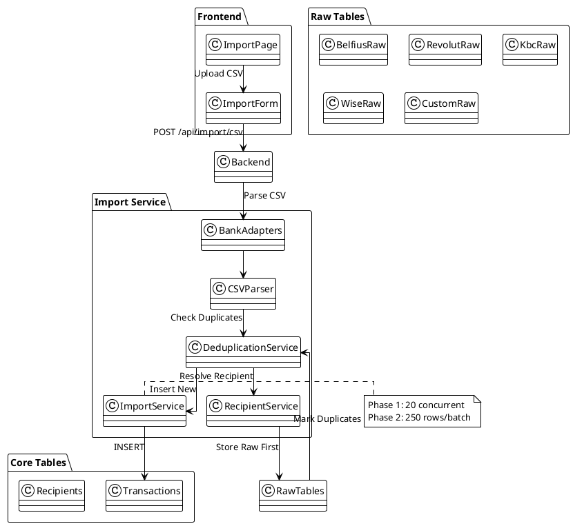
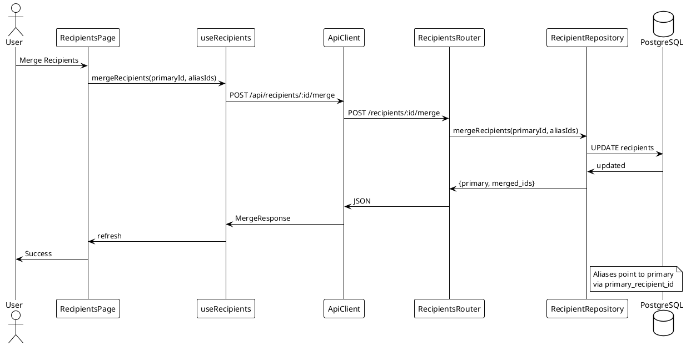
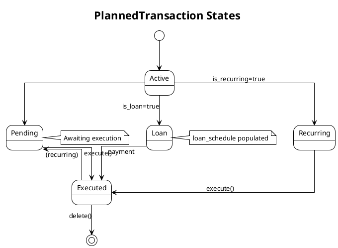

# Backend Architecture

This document contains UML diagrams for the Node.js backend application.

> **Note**: These diagrams are generated from the codebase and should be regenerated when significant changes are made.

## Startup Sequence Ordering (Fixed 2026-04-25; Backend DB Polling 2026-04-27)

### Database Connection (2026-04-27)

Backend now owns DB readiness polling via `checkConnection()` loop in `apps/node-backend/src/main.js`:
- **40 attempts** with exponential backoff (50ms → 1s)
- Non-blocking: Bun process starts immediately instead of blocking behind entrypoint
- On cold boots, this allows Bun initialization to overlap with postgres data-dir creation (~1s saved)
- Prior approach: entrypoint `pg_isready` loop (60 attempts × 0.2s = up to 12s serial wait)

### Initialization Dependency Chain

Once DB is ready, initialization respects dependency ordering to prevent cache and snapshot jobs from running before FX data is populated:

1. **Database connection** — `checkConnection()` poll (40 attempts, exponential backoff)
2. **Database migrations** — Alembic schema upgrade via JS runner
3. **Network reachability probe** — Single `isInternetReachable()` call via [[apps/node-backend/src/lib/network.js]]
   - TCP probe to 1.1.1.1:443 with 1.5s timeout (manual timer for SYN bind-off)
   - Result cached for 30s; concurrent callers share in-flight promise
   - If offline: skips all external data fetches; snapshots/info use DB/cache only
   - If online: proceeds with external warmups as normal
4. **Exchange rate cache warmup** — `warmExchangeRateCache()` (online only; captured as promise)
5. **Portfolio historical FX backfill** — `backfillPortfolioHistoricalRates()` (online only; captured as promise)
6. **Snapshot computation** — `computeAndStoreSnapshots` waits via `Promise.all([exchangeRateWarmPromise, fxBackfillPromise])` before proceeding
7. **Live price refresh** — Investment prices refreshed after snapshots (online only)
8. **Info caches** — `warmInfoCaches` runs after snapshot completion

**Prior issue (2026-04-25):** FX cache and backfill were fire-and-forget, causing snapshot/cache work to run before historical FX was available, producing "Historical FX missing" warnings during startup.

**Offline resilience (2026-05-03):** When the host has no internet connectivity, external data fetches (ECB rates, Yahoo quotes, Kinesis trendlines, historical backfills) would each burn 5–15 seconds on per-call timeouts before falling back to cached/DB data, delaying readiness and flooding logs with warnings. The reachability probe detects this early and skips these fetches entirely; the app reaches `/health/detailed` ready status ~15 seconds sooner when offline. Graceful degradation fallbacks remain intact: snapshots compute from stale/empty FX rows, info caches use existing DB data, and portfolio endpoints serve cached historical prices.

## Network Reachability Module (2026-05-03)

New module: [[apps/node-backend/src/lib/network.js]] — detects internet connectivity at startup and during scheduled tasks.

**Usage in main.js:**

- **Startup probe** (line ~522): Single async call `const online = await isInternetReachable()` gates all external fetches
- **Scheduled 12h FX refresh** (line ~598): `if (!(await isInternetReachable({ force: true })))` — force-refreshes cache every 12h to detect connectivity changes; skips fetch if still offline
- **Scheduled hourly quote refresh** (line ~616): `if (!(await isInternetReachable({ force: true })))` — force-refreshes cache hourly; skips fetch if still offline

**Implementation:**

```javascript
isInternetReachable({ 
  force?: boolean,      // Bypass cache and probe immediately
  host?: string,        // Probe target (default 1.1.1.1)
  port?: number,        // Probe port (default 443)
  timeoutMs?: number    // Probe timeout in ms (default 1500)
}): Promise<boolean>
```

- TCP connection attempt to public host within timeout
- **Caching**: Result cached for 30s (reduces probe load during rapid startup calls)
- **Concurrent deduplication**: Multiple callers share in-flight promise to avoid redundant probes
- **Force refresh**: `force: true` bypasses cache, used by scheduled intervals to detect connectivity changes over time

**Fallback behavior when offline:**

All external APIs fall back to cached or database data:

- **Exchange rates**: In-memory cache (24h TTL) + database → hardcoded rates
- **Investment prices**: Cached current prices + historical DB → fallback to previous close
- **Portfolio snapshots**: Computed from existing FX rows (may be stale)
- **Info endpoints**: Aggregated from database only, no external calls

Users see no errors; data is simply older.

## Graceful Shutdown (2026-04-29)

SIGTERM handler in `apps/node-backend/src/main.js` clears all background timers to enable clean process exit:

1. **Three background intervals** — cleared via `clearInterval()`:
   - `exchangeRateRefreshInterval` (existing; clears hourly FX refresh)
   - `quotesRefreshInterval` (added 2026-04-29; clears hourly active-holding quotes refresh)
   - `cashflowForecastRefreshInterval` (added 2026-04-29; clears 24h cashflow forecast refresh)

2. **Debounced aggregation refresh** — cleared via `cancelPendingAggregationRefresh()` from [[apps/node-backend/src/services/aggregationRefresh.js]]:
   - All `setTimeout` calls in aggregationRefresh are `.unref()`-ed (added 2026-04-29) so they don't block exit
   - Pending debounce timer explicitly cancelled on shutdown

**Outcome:** SIGTERM causes clean shutdown within ~1s even with pending background work. No "process still running after 10s" warnings or orphaned Bun processes.

## Monetary Precision (Phase 9)

All repositories and services handling monetary values enforce [[docs/adr/021-decimal-arithmetic-for-monetary-values|Decimal.js precision]] to eliminate IEEE 754 floating-point drift. When reading NUMERIC/DECIMAL columns from the database, all values are wrapped with `toNumber(toDecimal(value))` at the repository layer. This ensures precise monetary calculations across splits, aggregations, currency conversions, and portfolio valuations.

## Domain Model

The core entities and their relationships.



Source diagram: [[docs/diagrams/backend-api-layer.puml]]

## Repository Layer

Data access layer showing repositories and their dependencies.

```plantuml
@startuml
!theme plain
skinparam linetype ortho
skinparam nodesep 40
skinparam ranksep 60

package "Database" {
  class "connection.js" as DB {
    +query(sql, params)
    +getClient()
  }
}

package "Repositories" {
  class TransactionRepository {
    +getAll(opts)
    +getCount(opts)
    +getAllWithCount(opts)
    +getById(id)
    +create(data)
    +update(id, fields)
  }

  class RecipientRepository {
    +getAll(opts)
    +getById(id)
    +createOrGet(data)
    +update(id, fields)
    +mergeRecipients(primaryId, aliasIds)
  }

  class CategoryRepository {
    +getAll(opts)
    +getById(id)
    +createOrGet(data)
    +update(id, fields)
  }

  class PlannedTransactionRepository {
    +getAll(opts)
    +getById(id)
    +create(data)
    +update(id, fields)
    +addExecution(id, txId, date)
  }

  class InvestmentRepository {
    +getAll(opts)
    +getById(id)
    +create(data)
    +update(id, fields)
  }

  class PortfolioTransactionRepository {
    +getAll(opts)
    +getByInvestment(investmentId)
    +create(data)
  }

  class WatchlistRepository
  class RecipientBankAccountRepository
  class SplitRepository
  class SettingsRepository
  class SavedChartsRepository
  class RawTransactionRepository
  
  package "infoRepository (Phase 3: Composite)" {
    class InfoBarrel {
      +export all sub-repos
      +clearMvCache()
    }
    class StatisticsRepo {
      +getStatistics()
      +getCategoryBreakdown()
      +getBanks()
    }
    class MonthlyRepo {
      +getMonthlyFinancialSummary()
      +getAverageVsCurrentSpending()
      +getCashflowComparison()
    }
    class BanksRepo {
      +getBankBalances()
    }
    class NetWorthRepo {
      +getNetWorthFromSnapshots()
    }
    class PlannedRepo {
      +getPlannedExpensesNextMonth()
    }
    class RecipientsRepo {
      +getRecipientInsights()
    }
    class Helpers {
      +mvCache
      +roundToCents()
      +formatDateToYmd()
    }
  }
}

' Relationships
DB <.. TransactionRepository
DB <.. RecipientRepository
DB <.. CategoryRepository
DB <.. PlannedTransactionRepository
DB <.. InvestmentRepository
DB <.. PortfolioTransactionRepository
DB <.. StatisticsRepo
DB <.. MonthlyRepo
DB <.. BanksRepo
DB <.. NetWorthRepo
DB <.. PlannedRepo
DB <.. RecipientsRepo

InfoBarrel <.. StatisticsRepo
InfoBarrel <.. MonthlyRepo
InfoBarrel <.. BanksRepo
InfoBarrel <.. NetWorthRepo
InfoBarrel <.. PlannedRepo
InfoBarrel <.. RecipientsRepo
InfoBarrel <.. Helpers

StatisticsRepo <.. Helpers
MonthlyRepo <.. Helpers
BanksRepo <.. Helpers
NetWorthRepo <.. Helpers
PlannedRepo <.. Helpers
RecipientsRepo <.. Helpers

@enduml
```



**Phase 3 Refactoring Note (2026-04-23):**
- Original `infoRepository.js` monolith (1445 lines) was split into 7 domain-specific sub-modules
- Barrel re-export in main `infoRepository.js` (37 lines) maintains backward compatibility
- All 9 consumer files import unchanged; internal organization is transparent to callers
- Shared utilities in `infoRepositoryHelpers.js` reduce code duplication across aggregation patterns

## Service Layer

Business logic services and their interactions.



## Utility Libraries

### SSE Writer (Phase 3.2)

**File:** [[apps/node-backend/src/lib/sse.js]]

Backpressure-aware Server-Sent Events utilities for streaming responses (AI chat, CSV import).

**Exports:**

| Export | Purpose |
|--------|---------|
| `drainIfNeeded(res)` | Returns resolved promise immediately if `res.writableNeedDrain` is false; otherwise awaits `res.once('drain', ...)` to pause writes until buffer drains |
| `createSseWriter(req, res)` | Factory returning `{ closed, write(event, data), end() }`. `write()` is async and calls `drainIfNeeded()` after each frame to propagate backpressure into the caller's loop |

**Why it matters:**
Without backpressure, streaming a large number of events (or import progress frames) faster than a slow client can consume them causes unbounded TCP buffer growth and memory exhaustion. The `drainIfNeeded()` pattern pauses the server loop whenever Node.js signals that its internal write buffer is full, giving the kernel and network time to drain before the next write.

**Usage in routes:** Both `POST /api/ai/chat/stream` and `POST /api/import/csv/stream` now use `createSseWriter()` to manage client lifecycle (track disconnects) and provide backpressure-aware `write()` callbacks.

---

## Aggregation Calculation Layer (Phase 2)

Pure computation modules for transaction aggregations, organized under `services/calculations/aggregation/`.

**Envelope Standard:**

All aggregation endpoints return:

```json
{
  "data": { /* calculation-specific result */ },
  "meta": {
    "source": "mv" | "live",
    "computedAt": "ISO 8601 timestamp"
  }
}
```

**Source Heuristic:**
- `'mv'` — Unfiltered request served from materialized view (fast, stale)
- `'live'` — Exclusions force dynamic transaction scan (slower, current)

**Modules:**

| Module | Function | Endpoint |
|--------|----------|----------|
| `_envelope.js` | `buildEnvelope(data, { source, computedAt })` | All endpoints |
| `monthly.js` | `computeMonthlySummary({ targetCurrency, excludedCategoryIds, excludedRecipientIds })` | `/monthly-summary` |
| `category.js` | `computeCategoryBreakdown({ targetCurrency })` | `/category-breakdown` |
| `recipient.js` | `computeRecipientInsights({ targetCurrency })` | `/recipient-insights` |
| `cashflow.js` | `computeCashflowComparison({ targetCurrency, excludedCategoryIds, excludedRecipientIds })` | `/cashflow-comparison` |
| `averageVsCurrent.js` | `computeAverageVsCurrent({ targetCurrency })` | `/average-vs-current` (always live) |
| `bankBalances.js` | `computeBankBalances({ targetCurrency })` | `/bank-balances` |

**Repository Integration:**

- `getMonthlyFinancialSummary()` now accepts 3rd positional parameter `excludedRecipientIds` (defaults `[]`)
- `getCashflowComparison()` already carries both exclusion lists
- Other reads use existing repository interfaces; no breaking changes

**Contract Tests:**

- `apps/node-backend/tests/services/aggregationCalcs.test.js` — 13 tests covering envelope shape, argument forwarding, and source heuristic

Source code: [[apps/node-backend/src/services/calculations/aggregation]]

---

## API Layer

Express routes and their connections to repositories and services.



Recent update note (2026-04-10):
- Optional admin bearer-auth middleware was added in main app wiring: when `ADMIN_AUTH_TOKEN` is configured, `/api/admin/*` routes require `Authorization: Bearer <token>`; when unset, behavior remains backward-compatible ([[apps/node-backend/src/main.js]], [[apps/node-backend/src/config/config.js]]).
- `POST /api/info/refresh-views` now uses `adminRateLimiter` for additional protection of expensive refresh operations ([[apps/node-backend/src/routes/info.js]]).
- Error responses for selected admin/import/transaction paths are now sanitized to avoid leaking internal exception details ([[apps/node-backend/src/routes/admin.js]], [[apps/node-backend/src/routes/importRoutes.js]], [[apps/node-backend/src/routes/transactions.js]]).
- Settings route validation paths are now regression-covered for single-key and bulk upsert constraints (max key length, required `value`, `dashboard_settings` exclusion validation, DELETE not-found semantics) in [[apps/node-backend/tests/routes/settings.test.js]] against [[apps/node-backend/src/routes/settings.js]].
- Database connection/pool resilience paths are now regression-covered in [[apps/node-backend/tests/connection.test.js]] for [[apps/node-backend/src/database/connection.js]] (idle pool error handler, transient retry/backoff, non-transient fail-fast, helper methods and pool stats).
- Validation middleware id-param coercion and error semantics are explicitly covered in [[apps/node-backend/tests/validation.test.js]] for [[apps/node-backend/src/middleware/validation.js]].

## Database Schema

ERD showing all tables and their relationships.

```plantuml
@startuml
!theme plain
skinparam linetype ortho
skinparam nodesep 25
skinparam ranksep 40
hide circle

entity "categories" as categories {
  * id : serial <<PK>>
  * general : text
  * detail : text
  description : text
  is_active : boolean
}

entity "recipients" as recipients {
  * id : serial <<PK>>
  * name : text
  * normalized_name : text <<UQ>>
  default_category_id : integer <<FK>>
  primary_recipient_id : integer <<FK>>
  notes : text
  is_active : boolean
}

entity "recipient_bank_accounts" as rba {
  * id : serial <<PK>>
  * recipient_id : integer <<FK>>
  * account_number : varchar(34) <<UQ>>
  bank_name : text
  is_primary : boolean
  is_active : boolean
}

entity "transactions" as transactions {
  * id : serial <<PK>>
  * date : date
  * amount : numeric(15,2)
  currency : varchar(3)
  memo : text
  comment : text
  * recipient_id : integer <<FK>>
  recipient_bank_account_id : integer <<FK>>
  category_id : integer <<FK>>
  is_active : boolean
}

entity "planned_transactions" as pt {
  * id : serial <<PK>>
  * planned_date : date
  * amount : numeric(15,2)
  recipient_id : integer <<FK>>
  category_id : integer <<FK>>
  is_recurring : boolean
  is_loan : boolean
  is_executed : boolean
  is_active : boolean
}

entity "planned_transaction_executions" as pte {
  * id : serial <<PK>>
  * planned_transaction_id : integer <<FK>>
  * executed_transaction_id : integer <<FK>>
  * execution_date : date
}

entity "investments_base" as investments_base {
  * id : serial <<PK>>
  * name : varchar(200)
  currency : varchar(10)
  is_active : boolean
}

entity "stock_investments" as stock_investments {
  * id : integer <<PK>>
  symbol : varchar(20)
  current_price : numeric(18,6)
}

entity "etf_investments" as etf_investments {
  * id : integer <<PK>>
  symbol : varchar(20)
  current_price : numeric(18,6)
}

entity "crypto_investments" as crypto_investments {
  * id : integer <<PK>>
  symbol : varchar(50)
  current_price : numeric(18,6)
}

entity "metals_investments" as metals_investments {
  * id : integer <<PK>>
  symbol : varchar(20)
  current_price : numeric(18,6)
}

entity "real_estate_investments" as real_estate_investments {
  * id : integer <<PK>>
  current_price : numeric(18,6)
  location : varchar(300)
  municipality : varchar(200)
  cadastral_income : numeric(12,2)
  municipality_tax_rate : numeric(8,4)
}

entity "savings_investments" as savings_investments {
  * id : integer <<PK>>
  current_price : numeric(18,6)
  interest_rate : numeric(8,4)
}

entity "bond_investments" as bond_investments {
  * id : integer <<PK>>
  current_price : numeric(18,6)
  interest_rate : numeric(8,4)
  maturity_date : date
}

entity "portfolio_transactions_base" as portfolio_transactions_base {
  * id : serial <<PK>>
  * investment_id : integer
  * type : portfolio_txn_type
  * date : date
  * amount : numeric(18,4)
  currency : varchar(10)
  fx_rate_to_eur : numeric(20,10)
}

entity "stock_transactions" as stock_transactions {
  * id : integer <<PK>>
  * investment_id : integer
  units : numeric(18,8)
}

entity "etf_transactions" as etf_transactions {
  * id : integer <<PK>>
  * investment_id : integer
  units : numeric(18,8)
}

entity "crypto_transactions" as crypto_transactions {
  * id : integer <<PK>>
  * investment_id : integer
  units : numeric(18,8)
}

entity "metals_transactions" as metals_transactions {
  * id : integer <<PK>>
  * investment_id : integer
  units : numeric(18,8)
}

entity "real_estate_transactions" as real_estate_transactions {
  * id : integer <<PK>>
  * investment_id : integer
}

entity "savings_transactions" as savings_transactions {
  * id : integer <<PK>>
  * investment_id : integer
}

entity "bond_transactions" as bond_transactions {
  * id : integer <<PK>>
  * investment_id : integer
}

entity "watchlist" as watchlist {
  * id : serial <<PK>>
  * name : varchar(200)
  symbol : varchar(20)
  * asset_class : asset_class
  * target_price : numeric(18,6)
  currency : varchar(10)
}

entity "exchange_rates" as er {
  * id : serial <<PK>>
  * currency_code : varchar(3)
  * rate_to_eur : numeric(20,10)
  * rate_date : date
  is_latest : boolean
}

recipients }|--|| categories : default_category_id
recipients }|--|| recipients : primary_recipient_id
rba }|--|| recipients
transactions }|--|| recipients
transactions }|---|| rba
transactions }|---|| categories
pt }|---|| recipients
pt }|---|| categories
pte }|--|| pt
pte }|--|| transactions
investments_base ||--|| stock_investments : inherits
investments_base ||--|| etf_investments : inherits
investments_base ||--|| crypto_investments : inherits
investments_base ||--|| metals_investments : inherits
investments_base ||--|| real_estate_investments : inherits
investments_base ||--|| savings_investments : inherits
investments_base ||--|| bond_investments : inherits

portfolio_transactions_base ||--|| stock_transactions : inherits
portfolio_transactions_base ||--|| etf_transactions : inherits
portfolio_transactions_base ||--|| crypto_transactions : inherits
portfolio_transactions_base ||--|| metals_transactions : inherits
portfolio_transactions_base ||--|| real_estate_transactions : inherits
portfolio_transactions_base ||--|| savings_transactions : inherits
portfolio_transactions_base ||--|| bond_transactions : inherits

stock_investments ||--o{ stock_transactions
etf_investments ||--o{ etf_transactions
crypto_investments ||--o{ crypto_transactions
metals_investments ||--o{ metals_transactions
real_estate_investments ||--o{ real_estate_transactions
savings_investments ||--o{ savings_transactions
bond_investments ||--o{ bond_transactions

@enduml
```



## Import Pipeline

End-to-end flow showing how CSV files are imported, parsed, deduplicated, and stored.



## System Architecture

High-level view of the complete system architecture.

```plantuml
@startuml
!theme plain
skinparam linetype ortho
skinparam nodesep 35
skinparam ranksep 60

actor "User" as User

package "Client" {
  rectangle "Browser (React App)" {
    node "React 18 + TypeScript" as ReactApp
    node "Vite" as Vite
    node "Tailwind CSS + Radix UI" as UI
    node "React Router v7" as Router
    node "TanStack Query" as ReactQuery
    node "React Context" as Context
  }
}

cloud "HTTP/JSON" as Network

package "Server" {
  rectangle "Node.js Backend" {
    node "Express.js" as Express
    node "Middleware" as Middleware {
      CORS, Compression, Rate Limiter
    }
    node "Routes" as Routes
    node "Services" as Services
    node "Repositories" as Repos
  }
}

database "PostgreSQL 18" as DB {
  node "Tables"
  node "Materialized Views"
  node "Indexes"
  node "Triggers"
}

cloud "External Services" as External {
  node "ECB (Exchange Rates)"
  node "Binance (Crypto)"
  node "Yahoo Finance (Stocks)"
  node "Kinesis (US Stocks)"
  node "Statbel/Eurostat (Belgian Inflation)"
}

User --> ReactApp : HTTPS
ReactApp --> Express : REST API
Express --> Middleware
Middleware --> Routes
Routes --> Services
Services --> Repos
Repos --> DB : SQL
Services --> External : API Calls

@enduml
```

## Deployment Architecture

Development, production (Docker), and desktop deployment models.

```plantuml
@startuml
!theme plain
skinparam linetype ortho
skinparam nodesep 35
skinparam ranksep 50

package "Development" {
  node "Local Machine" as Dev {
    component "Frontend (Vite)" as FrontendDev
    component "Node.js (Bun)" as BackendDev
    component "PostgreSQL" as PostgresDev
  }
}

package "Production (Docker)" {
  node "Docker Host" as DockerHost {
    container "app" as AppContainer {
      node "Node.js Server"
      node "Static Files"
    }
    container "db" as DBContainer {
      node "PostgreSQL 18"
    }
  }
}

package "Desktop (Electron)" as Desktop {
  node "Electron Main"
  node "Electron Renderer"
}

actor "User" as User

User --> Dev : Dev Access
User --> DockerHost : HTTPS
User --> Desktop : Desktop App

Dev --> PostgresDev
AppContainer --> DBContainer
Desktop --> AppContainer

@enduml
```

## Startup Sequence

The application startup is orchestrated to respect critical dependencies between warming caches and backfilling data:

1. **Database connection** — exponential backoff with up to 40 attempts (max 1 second each)
2. **Alembic migrations** — all schema DDL (single source of truth)
3. **Materialized views** — create, index, and refresh after schema is ready
4. **Express server listening** — immediately accept connections on configured port/host
5. **Exchange rate warm (captured promise) + FX backfill (captured promise)** — both run concurrently but promises are captured
6. **Portfolio snapshots + Info caches** — wait for both exchange rates and FX backfill via `Promise.all([exchangeRateWarmPromise, fxBackfillPromise])` before running, ensuring `exchange_rates` table is populated before queries try to fetch "historical FX" rows (2026-04-25 fix)
7. **Investment price refresh** — immediate/deferred split (Kinesis with valid stored price deferred to background)
8. **Scheduled tasks** — exchange rate refresh (12h), quote refresh (1h), cashflow forecast MC cache (24h)

**Key fix (2026-04-25):** `warmExchangeRateCache` and `backfillPortfolioHistoricalRates` are now properly awaited before `computeAndStoreSnapshots` (and subsequently `warmInfoCaches`), eliminating race condition where info caches would query `exchange_rates` before today's rates were written, producing spurious WARN logs.

## Currency Conversion Flow

How exchange rates are fetched, cached, and used for currency normalization.

```plantuml
@startuml
!theme plain
skinparam linetype ortho
skinparam nodesep 30
skinparam ranksep 40

actor "User" as User

package "Frontend" {
  class TransactionPage
  class ApiClient
}

package "Backend Services" {
  class CurrencyConversionService {
    +convert(amount, from, to)
    +getExchangeRate(from, to)
  }
  class ExchangeRateRepository
}

cloud "ECB API" as ECB
database "PostgreSQL" as DB {
  table "exchange_rates"
}

User --> TransactionPage : View EUR
TransactionPage --> ApiClient : GET /transactions?normalize_to_eur=true
ApiClient --> CurrencyConversionService : convert(100, USD, EUR)
CurrencyConversionService --> ExchangeRateRepository : getExchangeRate(USD, EUR)

alt Cache hit
  ExchangeRateRepository --> DB : SELECT
  DB --> ExchangeRateRepository : rate
else Cache miss
  ExchangeRateRepository --> ECB : GET /rates
  ECB --> ExchangeRateRepository : rates
  ExchangeRateRepository --> DB : INSERT
end

ExchangeRateRepository --> CurrencyConversionService : rate
CurrencyConversionService --> ApiClient : converted
ApiClient --> TransactionPage : EUR amount
TransactionPage --> User : display

@enduml
```

## Price Provider Flow

Automatic price updates for investments from external providers.

Migration compatibility note:
- `0017_investment_custom_provider_history` updates inheritance compatibility for custom-provider latest/history fields and metals view/trigger wiring ([[alembic/versions/0017_investment_custom_provider_history.py]]).
- `0019_asset_price_history_cache` adds persisted historical quote cache (`asset_price_history`) used by read-through provider history fetches and startup backfill for held assets ([[alembic/versions/0019_asset_price_history_cache.py]]).

```plantuml
@startuml
!theme plain
skinparam linetype ortho
skinparam nodesep 30
skinparam ranksep 40

package "Backend Services" {
  class PriceProviderService {
    +updateInvestmentPrices()
  }
  class InvestmentRepository
}

cloud "Providers" as Providers {
  Binance
  YahooFinance
  Kinesis
  CustomJSON
}

database "PostgreSQL" as DB

PriceProviderService --> InvestmentRepository : getActiveInvestments()
InvestmentRepository --> DB : SELECT

loop For each investment
  alt provider = 'binance'
    PriceProviderService --> Binance : GET price
  else provider = 'yahoo'
    PriceProviderService --> YahooFinance : GET price
  else provider = 'kinesis'
    PriceProviderService --> Kinesis : GET trendline
  else provider = 'custom'
    PriceProviderService --> CustomJSON : GET latest/history
  end
  Providers --> PriceProviderService : price
  PriceProviderService --> InvestmentRepository : update price
  InvestmentRepository --> DB : UPDATE current_price
end

@enduml
```

Source diagram: [[docs/diagrams/price-provider-flow.puml]]

Database addition note:
- Historical quote persistence table: `asset_price_history` (`investment_id`, `price_date`, `close_price`, `source`, `fetched_at`, `updated_at`) created by schema init and Alembic migration.

## Recurring Detection Flow

Automatic detection of recurring transactions from transaction history.

```plantuml
@startuml
!theme plain
skinparam linetype ortho
skinparam nodesep 30
skinparam ranksep 40

package "Backend Services" {
  class RecurringDetectionService {
    +detectRecurring()
  }
  class TransactionRepository
  class PlannedTransactionRepository
}

database "PostgreSQL" as DB {
  table "transactions"
  table "planned_transactions"
}

RecurringDetectionService --> TransactionRepository : getLastN(1000)
TransactionRepository --> DB : SELECT
DB --> TransactionRepository : transactions

RecurringDetectionService --> DB : group by (recipient, amount)
DB --> RecurringDetectionService : candidate patterns

RecurringDetectionService --> PlannedTransactionRepository : create planned
PlannedTransactionRepository --> DB : INSERT
DB --> PlannedTransactionRepository : created

@enduml
```

## Materialized View Refresh Flow

How materialized views are maintained for performance.

```plantuml
@startuml
!theme plain
skinparam linetype ortho
skinparam nodesep 30
skinparam ranksep 40

package "Backend" {
  class MaterializedViewService
  class SchemaInit
}

database "PostgreSQL" as DB {
  node "Materialized Views" as MatViews {
    category_monthly_stats
    recipient_monthly_stats
    monthly_trends
  }
  node "Indexes" as Indexes
}

SchemaInit --> MaterializedViewService : check version

alt version match
  MaterializedViewService --> MatViews : REFRESH MATERIALIZED VIEW
else version mismatch
  MaterializedViewService --> MatViews : CREATE
  MaterializedViewService --> Indexes : CREATE INDEX
end

MatViews --> DB : refreshed

@enduml
```

## Cash Flow Forecast Materialization (Phase E)

How Monte Carlo forecast results are cached for daytime request efficiency.

```plantuml
@startuml
!theme plain
skinparam linetype ortho
skinparam nodesep 30
skinparam ranksep 40

participant "Frontend" as FE
participant "Forecast Router" as Router
participant "Forecast Service" as Service
participant "MC Cache Repo" as CacheRepo
participant "Accuracy Repo" as AccuracyRepo
database "PostgreSQL" as DB {
  node "Cache Table" as CacheTable {
    cashflow_forecast_mc
  }
  node "History Table" as HistoryTable {
    cashflow_forecast_accuracy
  }
}

activate FE
FE -> Router : GET /api/aggregations/cashflow-forecast-methods\n(default params)
activate Router
Router -> Service : computeCashflowForecast({_forceCache: false})
activate Service

alt Cache Read (not nightly)
  Service -> CacheRepo : get({userId, month, filterHash})
  activate CacheRepo
  CacheRepo -> DB : SELECT payload, computed_at
  DB -> CacheRepo : cache row
  deactivate CacheRepo
  
  alt Fresh cache (<6h) AND diagnostics OK
    Service -> Service : return cached payload
    Service -> Router : {source: 'cache'}
  else Cache miss or stale
    Service -> Service : compute live
  end
else Nightly Job (_forceCache: true)
  Service -> Service : skip cache read
  Service -> Service : compute live
end

Service -> Service : run 7 methods + backtest
Service -> AccuracyRepo : recordAccuracy()
activate AccuracyRepo
AccuracyRepo -> DB : UPSERT to cashflow_forecast_accuracy
deactivate AccuracyRepo

alt Using default MC params
  Service -> CacheRepo : upsert({userId, month, ..., payload})
  activate CacheRepo
  CacheRepo -> DB : INSERT ON CONFLICT UPDATE
  DB -> CacheRepo : OK
  deactivate CacheRepo
end

deactivate Service
Router -> FE : {source: 'live' | 'cache', computedAt}
deactivate Router
deactivate FE

note right of CacheRepo
  Cache TTL: 6 hours
  UNIQUE(user_id, month, filter_hash)
  Index on (user_id, month)
end note

note right of Service
  Nightly job (every 24h):
  - Fetches active user IDs
  - Computes for each user
  - _forceCache=true skips read
end note

@enduml
```

## Recipient Merge Sequence

How recipients are merged and unmerged.



## PlannedTransaction State Machine

Lifecycle states for planned transactions.



## Diagram Source Files

The raw PlantUML source files are stored in `docs/diagrams/`:

**Backend Architecture:**
- `backend-domain-model.puml` - Core domain entities
- `backend-repository-layer.puml` - Data access layer
- `backend-service-layer.puml` - Business logic services
- `backend-api-layer.puml` - API routes and controllers
- `backend-database-schema.puml` - Database ERD

**Import & Processing:**
- `import-pipeline.puml` - CSV import flow
- `import-sequence.puml` - Detailed import sequence
- `currency-conversion-flow.puml` - Exchange rate conversion
- `price-provider-flow.puml` - Investment price updates
- `recurring-detection-flow.puml` - Recurring transaction detection
- `materialized-view-flow.puml` - Materialized view refresh
- `cashflow-forecast-materialization.puml` - Phase E forecast cache with nightly job

**Sequence & State Diagrams:**
- `recipient-merge-sequence.puml` - Recipient merge workflow
- `planned-transaction-state.puml` - PlannedTransaction lifecycle
- `cashflow-forecast-cache-sequence.puml` - Phase E cache logic and nightly flow

**System-Wide:**
- `system-architecture.puml` - Full system overview
- `deployment-architecture.puml` - Deployment diagram
- `api-communication.puml` - Frontend to Backend communication
- `use-case-diagram.puml` - User interactions overview
- `transaction-state.puml` - Transaction lifecycle states

## Regenerating Diagrams

To regenerate these diagrams after code changes:

1. Review the relevant source files
2. Update the PlantUML source in the respective `.puml` file
3. The diagrams in this document will render the updated content

---

**Related Documentation**
- [[docs/api/index|API Documentation]] - API endpoint details
- [[docs/adr/002-database-schema|Database Schema]] - Detailed schema documentation
- [[docs/features/index|Features Overview]] - Feature descriptions
