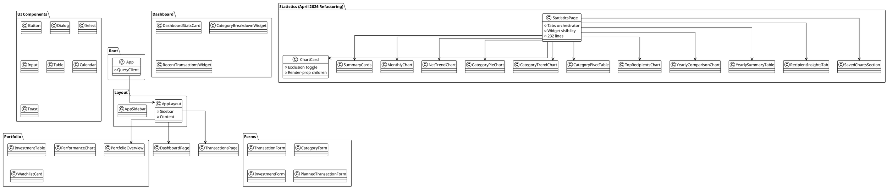
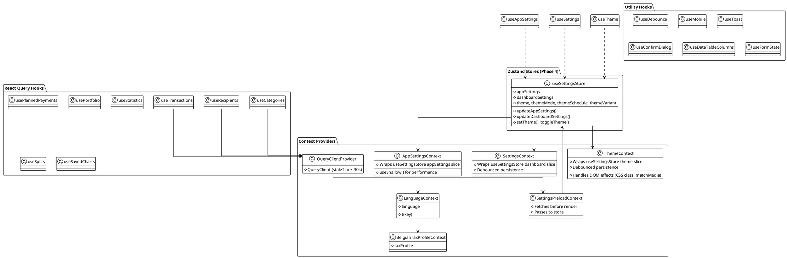
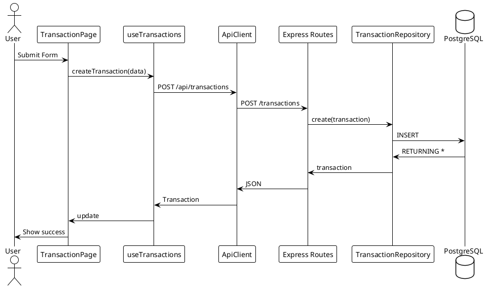
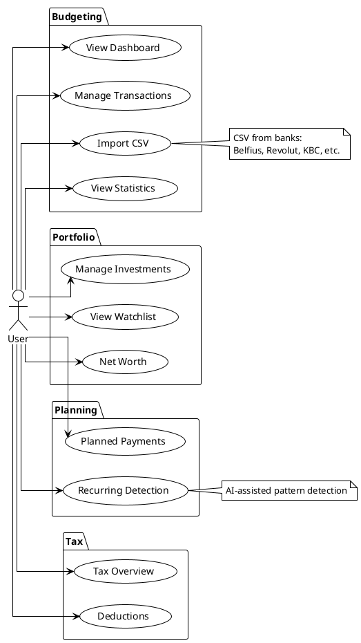
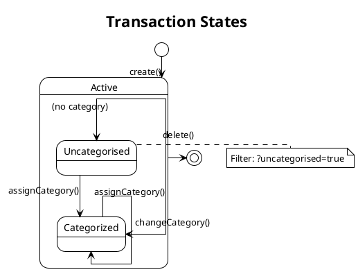

# Frontend Architecture

This document contains UML diagrams for the React frontend application.

> **Note**: These diagrams are generated from the codebase and should be regenerated when significant changes are made.

## Feature Folder Organization (Phase 6)

Dialog and form components are organized by feature in the `apps/frontend/src/features/` folder:

- **`features/recipients/`** — Recipient management dialogs (AddRecipientDialog, MergeRecipientsDialog)
- **`features/categories/`** — Category management dialogs (AddCategoryDialog)

This organization improves feature discoverability and reduces cross-cutting concerns in the shared `components/` folder. Page components import from these feature folders instead of centralized form/dialog directories.

## Technology Stack

- **Framework**: React 18 with TypeScript
- **Build Tool**: Vite
- **Styling**: Tailwind CSS + Radix UI + design tokens
- **Design System**: Liquid-glass aesthetic (emerald + champagne-gold palette)
- **Typography**: Fraunces (display) + Inter Tight (body) via `@fontsource-variable`
- **Motion**: Framer Motion with centralized motion system + reduced-motion compliance
- **Charts**: visx + d3 (replacing Recharts)
- **State Management**: React Query (server state) + React Context (client state)
- **Routing**: React Router v7
- **HTTP Client**: Axios (custom ApiClient)

## Component Architecture



## State Management (Phase 4)

Zustand for client state (settings) + React Context wrappers for hydration/persistence + React Query for server state.

### Zustand Settings Store

Unified store at `[[apps/frontend/src/stores/settingsStore.ts|settingsStore.ts]]` consolidates three previously separate contexts:
- AppSettingsContext (app settings)
- SettingsContext (dashboard/exclusion settings)
- ThemeContext (theme settings)

Context Providers still exist as thin wrappers for hydration and persistence side-effects.



## Data Flow & API Layer

```plantuml
@startuml
!theme plain
skinparam linetype ortho
skinparam nodesep 35
skinparam ranksep 45

package "Pages" {
  class Pages
}

package "Custom Hooks" {
  class useTransactions
  class useCategories
  class usePortfolio
  class useStatistics
}

package "API Client" {
  class ApiClient {
    +request<T>()
    +retry()
    +cancelAll()
  }
  
  class DEFAULT_TIMEOUT_MS = 30000
  class MAX_RETRIES = 2
}

package "Types" {
  class Transaction
  class Category
  class Recipient
  class Investment
  class PlannedTransaction
}

package "Utilities" {
  class formatCurrency
  class sanitizeInput
  class categoryColors
}

package "Backend" {
  class RESTAPI
  class Express
  class Database
}

Pages --> useTransactions
useTransactions --> ApiClient
ApiClient --> Transaction
Transaction --> RESTAPI
RESTAPI --> Database

@enduml
```

## Routes & Pages

```plantuml
@startuml
!theme plain
skinparam linetype ortho
skinparam nodesep 25
skinparam ranksep 40

package "Budgeting" {
  class DashboardPage <<path: />>
  class TransactionsPage <<path: /transactions>>
  class CategoriesPage <<path: /categories>>
  class RecipientsPage <<path: /recipients>>
  class PlannedPaymentsPage <<path: /planned>>
  class StatisticsPage <<path: /statistics>>
  class ImportPage <<path: /import>>
  class OwesPage <<path: /owes>>
  class TaxOverviewPage <<path: /tax>>
}

package "Portfolio" {
  class PortfolioOverviewPage <<path: /portfolio>>
  class MarketLookupPage <<path: /portfolio/market>>
  class StocksPage <<path: /portfolio/stocks>>
  class CryptoPage <<path: /portfolio/crypto>>
  class MetalsPage <<path: /portfolio/metals>>
  class RealEstatePage <<path: /portfolio/real-estate>>
  class SavingsPage <<path: /portfolio/savings>>
  class PerformancePage <<path: /portfolio/performance>>
  class NetWorthPage <<path: /portfolio/net-worth>>
  class ExchangeRatesPage <<path: /portfolio/exchange-rates>>
  class WatchlistPage <<path: /portfolio/watchlist>>
  class PortfolioTaxPage <<path: /portfolio/tax>>
}

package "Shared" {
  class AppLayout
  class NotFound <<path: *>>
}

AppLayout --> DashboardPage
AppLayout --> TransactionsPage
AppLayout --> CategoriesPage
AppLayout --> RecipientsPage
AppLayout --> PlannedPaymentsPage
AppLayout --> StatisticsPage
AppLayout --> ImportPage
AppLayout --> OwesPage
AppLayout --> TaxOverviewPage

AppLayout --> PortfolioOverviewPage
PortfolioOverviewPage --> StocksPage
PortfolioOverviewPage --> CryptoPage
PortfolioOverviewPage --> MetalsPage
PortfolioOverviewPage --> RealEstatePage
PortfolioOverviewPage --> SavingsPage
PortfolioOverviewPage --> PerformancePage
PortfolioOverviewPage --> NetWorthPage
PortfolioOverviewPage --> ExchangeRatesPage
PortfolioOverviewPage --> WatchlistPage
PortfolioOverviewPage --> MarketLookupPage
PortfolioOverviewPage --> PortfolioTaxPage

@enduml
```



## Design System: Emerald + Gold Aesthetic (Phase 9 + Performance Optimization)

The frontend implements a premium emerald + champagne-gold aesthetic with performance-optimized surface patterns:

### Color Palette

- **Primary**: Emerald (`oklch(54% 0.15 161)`)
- **Accent**: Champagne gold (`oklch(74% 0.09 73)`)
- **Background**: Deep charcoal (`oklch(14% 0 0)`)
- **Neutral**: Supporting grays for hierarchy

All colors defined in `apps/frontend/src/styles/tokens.css` and consumed via Tailwind theme extension.

### Material Hierarchy (Performance-Optimized)

Selective glass system with reduced blur (Electron M1 GPU optimization):

| Class | Purpose | Blur | Usage |
|-------|---------|------|-------|
| `glass-thin` | Subtle interactive elements | 6px | Rarely used |
| `glass-regular` | Standard overlays (default) | 8px | Popover, Tooltip |
| `glass-thick` | Modal dialogs | 12px | Dialog, AlertDialog, Sheet |
| `glass-chrome` | Navigation chrome | 8px | Sidebar, AppLayout |
| `bg-card/95` | Dense surfaces (default) | none | Card, Input, Button, Tabs, etc. |

**Rationale**: Glass blur filtered removed from frequently-occluded surfaces (Card, Input, Textarea, Tabs, Select, DropdownMenu, etc.) to eliminate Electron M1 GPU regression. Blur retained only on modal overlays + navigation chrome.

Additional utilities:

- `surface-elevated` — non-glass elevated cards with premium depth (shadow only)
- `premium-frame` — elevated depth without blur (multi-layer shadows)
- `micro-lift` — subtle hover elevation (transform: translateY, GPU-safe)
- **Removed**: `liquid-canvas` animated background (static grain overlay retained)

See [[docs/adr/020-glass-system-downgrade-liquid-canvas-removal|ADR-020]] for performance optimization details.

### Typography

- **Display**: Fraunces (static weights: 400/600/700, latin subset) — headlines, hero text, stats
- **Body**: Inter (static weights: 400/500/600, latin subset) — copy, labels, form inputs
- **Self-hosted**: Fonts loaded via `@fontsource/fraunces` + `@fontsource/inter` (smaller files)

Previous variable fonts superseded by static weight selection for performance.

### Motion System

Centralized in `apps/frontend/src/lib/motion.ts`:

- **Durations**: fast (150ms), normal (300ms), slow (500ms)
- **Easings**: cubic-bezier variants (out-expo, out-cubic, in-quad)
- **Spring configs**: SPRING_BOUNCE, SPRING_SMOOTH, SPRING_SNAPPY
- **Reduced-motion**: `useReducedMotion()` hook ensures `prefers-reduced-motion: reduce` compliance
- **Page transitions**: Removed (`PageTransition.tsx` deleted; instant route transitions)
- **Dialog/Popover entry**: Retained spring + fade animations (low GPU impact on modals)
- **Chart animations**: Stagger + fade entry (gated by `useReducedMotion()`)

### Charts

Migrated from Recharts to visx + d3 primitives in `apps/frontend/src/components/charts/`:

- `AreaChart.tsx` — time-series area stacks
- `BarChart.tsx`, `StackedBarChart.tsx` — category/recipient breakdown
- `PieChart.tsx`, `DonutChart.tsx` — distributions
- `LineChart.tsx` — multi-line trends
- `Sparkline.tsx` — mini inline charts for cards
- `Candlestick.tsx` — OHLC price action
- `TreemapChart.tsx` — hierarchical spending

All charts consume design tokens directly and respect reduced-motion via Framer Motion integration.

### Related Documentation

- [[docs/adr/017-liquid-glass-aesthetic-design-system|ADR-017: Liquid Glass Aesthetic]]
- [[docs/adr/018-visx-d3-chart-migration|ADR-018: visx/d3 Chart Migration]]
- [[docs/adr/019-framer-motion-adoption|ADR-019: Framer Motion Adoption]]
- [[docs/adr/020-glass-system-downgrade-liquid-canvas-removal|ADR-020: Glass System Downgrade & Liquid Canvas Removal]] (Performance optimization)
- [[docs/components/ui-components|UI Components]]

## Component Hierarchy

```
App
├── QueryClientProvider
│   └── QueryClient
├── SettingsPreloadProvider
│   └── ThemeProvider
│       └── ThemeContext
│       └── SettingsProvider
│           └── AppSettingsProvider
│               └── BelgianTaxProfileProvider
│                   └── LanguageBridge
│                       └── TooltipProvider
│                           └── ErrorBoundary
│                               ├── Sonner
│                               └── BrowserRouter
│                                   └── AppLayout
│                                       ├── Sidebar (navigation)
│                                       └── Routes
│                                           ├── Budgeting (/, /transactions, etc.)
│                                           └── Portfolio (/portfolio/*)
```

## Key Patterns

### 1. Code Splitting
All pages are lazy-loaded for optimal bundle size:
```typescript
const DashboardPage = lazy(() => import("./pages/DashboardPage"));
```

### 2. React Query Configuration
```typescript
const queryClient = new QueryClient({
  defaultOptions: {
    queries: {
      staleTime: 30_000,
      gcTime: 5 * 60_000,
      refetchOnWindowFocus: false,
      retry: 1,
    },
  },
});
```

### 3. API Client Pattern
- Automatic retry with exponential backoff
- Request cancellation support
- Timeout handling (30s default)
- Error transformation

## API Communication

Frontend to Backend request/response flow with React Query integration.

```plantuml
@startuml
!theme plain
skinparam linetype ortho
skinparam nodesep 40
skinparam ranksep 60

actor "User" as User

package "Frontend (React)" {
  class Browser
  class useTransactions
  class useCategories
  class ApiClient {
    +timeout: 30s
    +retry: 2 attempts
  }
}

cloud "HTTP/JSON" as Network

package "Backend (Express)" {
  class ExpressRoutes
  class TransactionRoutes
  class CategoryRoutes
}

database "PostgreSQL" as DB

User --> Browser : Action
Browser --> ApiClient : API Call
ApiClient --> Network : HTTP
Network --> ExpressRoutes : Request
ExpressRoutes --> TransactionRoutes : Route
TransactionRoutes --> DB : SQL
DB --> TransactionRoutes : Result
TransactionRoutes --> Network : JSON
Network --> ApiClient : Response
ApiClient --> Browser : Data
Browser --> User : UI Update

note right of ApiClient
  Request timeout: 30s
  Max retries: 2
  Exponential backoff
end note

@enduml
```

## Transaction Creation Flow

Sequence diagram showing how a transaction is created from frontend to database.



## Use Case Diagram

Overview of all user interactions with the system.



## Transaction State Diagram

Transaction lifecycle and categorization states.



## Chart Library Architecture (Phase 9)

The frontend implements a low-level chart library using **visx + d3** primitives, replacing Recharts.

### Chart Components

Located in `apps/frontend/src/components/charts/`:

**Primitive Chart Components:**
- `AreaChart.tsx` — Stacked time-series areas (DashboardPage, StatisticsPage)
- `BarChart.tsx` — Grouped or stacked bars (StatisticsPage, DashboardPage)
- `StackedBarChart.tsx` — Multi-series bar stacks (PerformancePage)
- `PieChart.tsx` — Basic pie distribution (StatisticsPage)
- `DonutChart.tsx` — Donut/ring distribution (StatisticsPage)
- `LineChart.tsx` — Multi-line trends (PerformancePage, WatchlistPage)
- `Sparkline.tsx` — Mini inline sparklines (StatCard, tables)
- `Candlestick.tsx` — OHLC price action (StocksPage, CryptoPage)
- `TreemapChart.tsx` — Hierarchical spending breakdown (StatisticsPage)

**Shared Chart Components:**
- `ChartTooltip.tsx` — Shared tooltip renderer (design-token colors)
- `ChartLegend.tsx` — Shared legend component (keyboard accessible)
- `ChartAxis.tsx` — Shared axis renderer (x, y with token-based styling)

### Design Token Integration

All charts consume `apps/frontend/src/styles/tokens.css`:

- **Colors**: Emerald + gold + supporting palette (semantic, not hardcoded)
- **Typography**: Fraunces (display), Inter Tight (body)
- **Spacing**: Clamp-based responsive margins from token system
- **Motion**: Framer Motion animations check `useReducedMotion()` and disable if needed

### Accessibility

- SVG `role="img"` + `aria-label` for chart purpose
- Tooltips & legends keyboard-accessible (tab, arrow keys)
- Color-blind palette support (deuteranopia, protanopia)
- Reduced-motion fully honored: no animation if `prefers-reduced-motion: reduce`

### Performance

For large datasets (>1000 points), the backend provides pre-downsampled data via LTTB algorithm (see [[docs/adr/008-performance-page-server-computed-response|ADR-008: Performance Page Server-Computed Response]]).

### Migration Impact

- **Bundle savings**: ~35kb gzipped (Recharts ~50kb → visx ~15kb)
- **Visual cohesion**: Charts inherit liquid-glass aesthetic tokens
- **Implementation effort**: All chart consumers rewritten to use new primitives
- **No data model changes**: API contracts unchanged; chart data format preserved

See [[docs/adr/018-visx-d3-chart-migration|ADR-018: visx/d3 Chart Migration]] and [[docs/components/charts|Chart Primitives]] for details.

## Diagram Source Files

The raw PlantUML source files are stored in `docs/diagrams/`:

**Frontend Architecture:**
- `frontend-component-structure.puml` - UI components and features
- `frontend-state-management.puml` - Context providers and hooks
- `frontend-data-flow.puml` - API layer and data flow
- `frontend-pages-routes.puml` - Route structure and pages
- `transaction-creation-sequence.puml` - Transaction create flow
- `use-case-diagram.puml` - User interactions overview
- `transaction-state.puml` - Transaction lifecycle states

Recent update note (2026-04-10):
- Shared table architecture now includes extracted `ColumnFilter` and explicit source-row identity (`sourceIndex`) mapping semantics used by `DataTable` and `VirtualDataTable` ([[apps/frontend/src/components/shared/ColumnFilter.tsx]], [[apps/frontend/src/components/shared/DataTable.tsx]], [[apps/frontend/src/components/shared/VirtualDataTable.tsx]], [[apps/frontend/src/pages/TransactionsPage.tsx]], [[apps/frontend/src/pages/RecipientsPage.tsx]]).

**System-Wide:**
- `api-communication.puml` - Frontend to Backend communication
- `system-architecture.puml` - Full system overview
- `deployment-architecture.puml` - Deployment diagram

**Backend Flow Diagrams:**
- `import-pipeline.puml` - CSV import flow
- `import-sequence.puml` - Detailed import sequence
- `currency-conversion-flow.puml` - Exchange rate conversion
- `price-provider-flow.puml` - Investment price updates
- `recurring-detection-flow.puml` - Recurring transaction detection
- `materialized-view-flow.puml` - Materialized view refresh
- `recipient-merge-sequence.puml` - Recipient merge workflow
- `planned-transaction-state.puml` - PlannedTransaction lifecycle

## Regenerating Diagrams

To regenerate these diagrams after code changes:

1. Review the relevant source files
2. Update the PlantUML source in the respective `.puml` file
3. The diagrams in this document will render the updated content

---

## Design System & Theming

The frontend uses a token-based theming system with runtime color palette swapping via CSS variables.

### Tokens & Palette System

**Location**: `apps/frontend/src/styles/` with `themes.ts` as the source of truth for color values.

- **tokens.css**: HSL-component CSS variables (`--primary-h`, `--primary-s`, `--primary-l`, etc.)
- **themes.ts**: Five variant definitions with light/dark sub-palettes
  - `default` (emerald + gold) — Apple liquid glass
  - `dracula` (purple + pink) — Dark-optimized moody
  - `solarized` (yellow-green + blue) — High contrast, reading-friendly
  - `nord` (frost blue + aurora) — Arctic-inspired calm
  - `high-contrast` (navy + neon green) — WCAG AAA accessibility

### Runtime Palette Application

`applyThemePalette(variant, mode, root)` in `themes.ts` updates all CSS variables on the document root, enabling instant theme switching without CSS rebuilding.

### FOUC Prevention

`theme-flash.ts` runs before React mounts, reading user preferences from `localStorage` and applying the correct palette synchronously. This eliminates the flash of default theme on page load or refresh.

### Settings Integration

`ThemeContext` in `contexts/ThemeContext.tsx` tracks current variant and mode, applies palette to DOM on change, and persists user preference to backend `theme_settings` via 500ms debounced API calls.

**Related Diagrams & Code**:
- [[apps/frontend/src/styles/themes.ts|Theme Variants Source]]
- [[apps/frontend/src/contexts/ThemeContext.tsx|ThemeContext Implementation]]
- [[docs/adr/025-theme-variant-system|ADR-025: Theme Variant System]]
- [[docs/features/appearance|Appearance Feature]]

---

**Related Documentation**
- [[docs/adr/017-liquid-glass-aesthetic-design-system|ADR-017: Liquid Glass Aesthetic]]
- [[docs/adr/018-visx-d3-chart-migration|ADR-018: visx/d3 Chart Migration]]
- [[docs/adr/019-framer-motion-adoption|ADR-019: Framer Motion Adoption]]
- [[docs/adr/020-glass-system-downgrade-liquid-canvas-removal|ADR-020: Glass System Downgrade & Liquid Canvas Removal]]
- [[docs/adr/025-theme-variant-system|ADR-025: Theme Variant System]]
- [[docs/architecture/backend-architecture|Backend Architecture]] - Backend diagrams
- [[docs/api/index|API Documentation]] - API endpoint details
- [[docs/components/index|Components]] - Component documentation
- [[docs/components/charts|Chart Primitives]] - Chart library documentation
- [[docs/components/layout|Layout Components]] - AppLayout, AppSidebar
- [[docs/components/hooks|Hooks]] - Custom hooks reference
- [[docs/reference/code-patterns#motion-consumer-pattern-phase-9|Motion Consumer Pattern]]
- [[docs/reference/code-patterns#surface-shell-pattern-phase-9|Surface Shell Pattern]]
