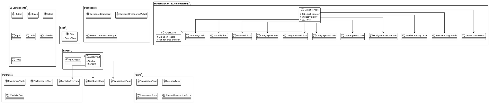
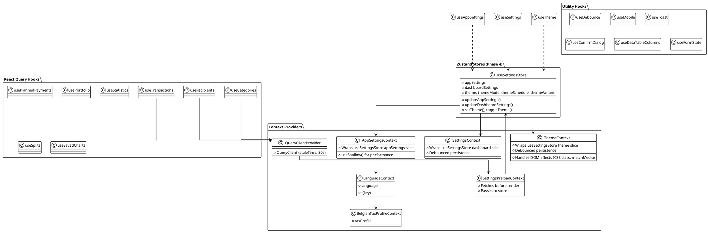
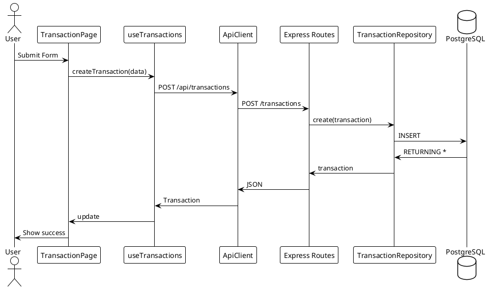
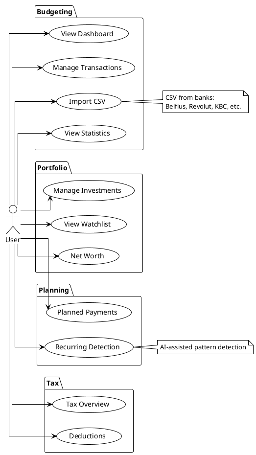
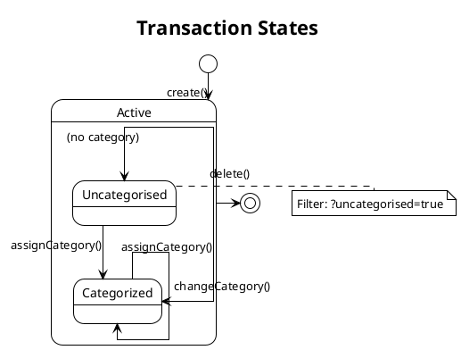

> [!info] June 2026 — Premium v3 (ADR-071)
> The second June 2026 batch adds RollingNumber/Money/DeltaPill shared components, chart scrub-to-compare and synced crosshairs, ChartSkeleton, large-title collapse (PageTitleContext), palette v2 with recents and recipient search, ShortcutsOverlay, go-to key sequences (g+key), animated tab indicator, workspace-aware aurora, ShaderAurora behind an opt-in `AppSettings.enhancedEffects` toggle (default off, gates the WebGL aurora; ADR-020 Electron M1 rationale), light-mode paper & ink token pass, per-widget dashboard hydration, and optimistic transaction CREATE. See [[docs/adr/071-premium-v3-effects-toggle|ADR-071]].

> [!info] June 2026 — Liquid Glass v2 (ADR-070)
> The design system was overhauled in June 2026. The atmosphere layer has been restored, blur tiers raised to 12–32px with saturation, the material class vocabulary simplified, `PageTransition` re-added as an enter-only spring, `CommandPalette` wired, sidebar active rail converted to a framer `layoutId` element, and `useUpdateTransaction`/`useDeleteTransaction` made optimistic. See [[docs/adr/070-liquid-glass-v2-premium-frontend|ADR-070]] for the full decision record.

# Frontend Architecture

This document contains UML diagrams for the React frontend application.

> **Note**: These diagrams are generated from the codebase and should be regenerated when significant changes are made.

## Feature Folder Organization (Phase 6)

Dialog and form components are organized by feature in the `apps/frontend/src/features/` folder:

- **`features/recipients/`** — Recipient management dialogs (AddRecipientDialog, MergeRecipientsDialog)
- **`features/categories/`** — Category management dialogs (AddCategoryDialog)

This organization improves feature discoverability and reduces cross-cutting concerns in the shared `components/` folder. Page components import from these feature folders instead of centralized form/dialog directories.

## Technology Stack

- **Framework**: React 18 with TypeScript
- **Build Tool**: Vite
- **Styling**: **Tailwind CSS v4** (4.2.4) with unified `@tailwindcss/postcss` plugin + Radix UI + design tokens
- **Design System**: Liquid-glass aesthetic (emerald + champagne-gold palette)
- **Typography**: Fraunces (display) + Inter Tight (body) via `@fontsource` static weights (400/500/600)
- **Motion**: Framer Motion with centralized motion system + reduced-motion compliance
- **Charts**: visx + d3 (primary); Recharts 3.8.1 (inactive, retained for compatibility)
- **Notifications**: Sonner 2.0.7 (improved toast API and accessibility)
- **State Management**: React Query (server state) + React Context (client state)
- **Routing**: React Router v7
- **HTTP Client**: Axios (custom ApiClient)

## Component Architecture



## State Management (Phase 4)

Zustand for client state (settings) + React Context wrappers for hydration/persistence + React Query for server state.

### Zustand Settings Store

Unified store at `[[apps/frontend/src/stores/settingsStore.ts|settingsStore.ts]]` consolidates three previously separate contexts:
- AppSettingsContext (app settings)
- SettingsContext (dashboard/exclusion settings)
- ThemeContext (theme settings)

Context Providers still exist as thin wrappers for hydration and persistence side-effects.



## Data Flow & API Layer

```plantuml
@startuml
!theme plain
skinparam linetype ortho
skinparam nodesep 35
skinparam ranksep 45

package "Pages" {
  class Pages
}

package "Custom Hooks" {
  class useTransactions
  class useCategories
  class usePortfolio
  class useStatistics
}

package "API Client" {
  class ApiClient {
    +request<T>()
    +retry()
    +cancelAll()
  }
  
  class DEFAULT_TIMEOUT_MS = 30000
  class MAX_RETRIES = 2
}

package "Types" {
  class Transaction
  class Category
  class Recipient
  class Investment
  class PlannedTransaction
}

package "Utilities" {
  class formatCurrency
  class sanitizeInput
  class categoryColors
}

package "Backend" {
  class RESTAPI
  class Express
  class Database
}

Pages --> useTransactions
useTransactions --> ApiClient
ApiClient --> Transaction
Transaction --> RESTAPI
RESTAPI --> Database

@enduml
```

## Routes & Pages

```plantuml
@startuml
!theme plain
skinparam linetype ortho
skinparam nodesep 25
skinparam ranksep 40

package "Budgeting" {
  class DashboardPage <<path: />>
  class TransactionsPage <<path: /transactions>>
  class CategoriesPage <<path: /categories>>
  class RecipientsPage <<path: /recipients>>
  class PlannedPaymentsPage <<path: /planned>>
  class StatisticsPage <<path: /statistics>>
  class ImportPage <<path: /import>>
  class OwesPage <<path: /owes>>
  class TaxOverviewPage <<path: /tax>>
}

package "Portfolio" {
  class PortfolioOverviewPage <<path: /portfolio>>
  class MarketLookupPage <<path: /portfolio/market>>
  class StocksPage <<path: /portfolio/stocks>>
  class CryptoPage <<path: /portfolio/crypto>>
  class MetalsPage <<path: /portfolio/metals>>
  class RealEstatePage <<path: /portfolio/real-estate>>
  class SavingsPage <<path: /portfolio/savings>>
  class PerformancePage <<path: /portfolio/performance>>
  class NetWorthPage <<path: /portfolio/net-worth>>
  class ExchangeRatesPage <<path: /portfolio/exchange-rates>>
  class WatchlistPage <<path: /portfolio/watchlist>>
  class PortfolioTaxPage <<path: /portfolio/tax>>
}

package "Shared" {
  class AppLayout
  class NotFound <<path: *>>
}

AppLayout --> DashboardPage
AppLayout --> TransactionsPage
AppLayout --> CategoriesPage
AppLayout --> RecipientsPage
AppLayout --> PlannedPaymentsPage
AppLayout --> StatisticsPage
AppLayout --> ImportPage
AppLayout --> OwesPage
AppLayout --> TaxOverviewPage

AppLayout --> PortfolioOverviewPage
PortfolioOverviewPage --> StocksPage
PortfolioOverviewPage --> CryptoPage
PortfolioOverviewPage --> MetalsPage
PortfolioOverviewPage --> RealEstatePage
PortfolioOverviewPage --> SavingsPage
PortfolioOverviewPage --> PerformancePage
PortfolioOverviewPage --> NetWorthPage
PortfolioOverviewPage --> ExchangeRatesPage
PortfolioOverviewPage --> WatchlistPage
PortfolioOverviewPage --> MarketLookupPage
PortfolioOverviewPage --> PortfolioTaxPage

@enduml
```



## Design System: Emerald + Gold Aesthetic (Liquid Glass v2, June 2026)

The frontend implements a premium emerald + champagne-gold aesthetic. The June 2026 Liquid Glass v2 pass ([[docs/adr/070-liquid-glass-v2-premium-frontend|ADR-070]]) restored the atmosphere layer and simplified the material vocabulary.

### Color Palette

- **Primary**: Emerald (`oklch(54% 0.15 161)`)
- **Accent**: Champagne gold (`oklch(74% 0.09 73)`)
- **Background**: Deep charcoal (`oklch(14% 0 0)`)
- **Neutral**: Supporting grays for hierarchy

All colors defined in `apps/frontend/src/styles/tokens.css` and consumed via Tailwind theme extension. Aurora blob colors derive from `--primary` / `--accent`, so all five theme variants work without changes to `themes.ts`.

### Atmosphere Layer

`AppLayout` renders a `position: fixed; z-index: -1` liquid canvas layer (`liquid-canvas` class) containing:

- Two slow-drifting aurora blobs animated via compositor-only `transform` (64s / 76s alternating cycles) — drift pauses under `prefers-reduced-motion`.
- A static radial wash behind the blobs.
- An SVG `feTurbulence` film-grain overlay child.
- New CSS tokens: `--aurora-one-alpha`, `--aurora-two-alpha`, `--grain-alpha` (higher in dark mode for luminosity).

With real background content behind glass surfaces, `backdrop-filter` now produces a visible refraction effect instead of tinted-card appearance.

### Material Hierarchy (Liquid Glass v2)

Five saturated blur tiers (blur + `saturate(var(--glass-saturate))`):

| Class | Blur | Saturate | Usage |
|-------|------|---------|-------|
| `glass-thin` | 12px | 180%/150% | Subtle interactive elements |
| `glass-regular` | 20px | 180%/150% | KPI cards, chart cards, AI-chat panes |
| `glass-chrome` | 24px | 180%/150% | Sidebar, AppLayout topbar |
| `glass-thick` | 28px | 180%/150% | Modal dialogs (Dialog, AlertDialog, Sheet), toasts |
| `glass-elevated` | 32px | 180%/150% | Dashboard hero cards |

Saturate: 180% in light mode, 150% in dark (tokens `--glass-saturate`).

Thick and elevated materials gain lensing edges (inset top specular + bottom concave shade + long soft drop shadow).

**Opaque surfaces (deliberate perf budget — ~6 backdrop-filter surfaces per viewport):**
- `DataTable`, `VirtualDataTable`, Watchlist grid — intentionally opaque for render performance.
- `Input`, `Textarea`, `Button`, `Tabs`, `Select`, `DropdownMenu`, `ContextMenu` — no blur.

Additional layout utilities:
- `premium-frame` — baked into the base `Card` component; provides the primary-tinted hover outline universally (previously had to be applied per-callsite). Both `premium-frame` and `micro-lift` animate border-color, box-shadow, and transform identically so either class wins the cascade safely.
- `micro-lift` — subtle hover elevation (`translateY(-2px)`, GPU-safe).
- `liquid-canvas` — fixed-position atmosphere wrapper rendered by `AppLayout`.
- `liquid-canvas-grain` — SVG grain child of the atmosphere layer.

### A11y Correction (Liquid Glass v2)

`backdrop-filter` stripping was previously gated on `prefers-reduced-motion` (incorrect — blur is static). As of ADR-070 it is gated on `prefers-reduced-transparency`, with near-opaque fallbacks. Aurora drift still pauses under `prefers-reduced-motion`.

See [[docs/adr/070-liquid-glass-v2-premium-frontend|ADR-070]] for the full material decision and [[docs/adr/020-glass-system-downgrade-liquid-canvas-removal|ADR-020]] for the prior downgrade context.

### Typography

- **Display**: Fraunces (static weights: 400/600/700, latin subset) — headlines, hero text, stats
- **Body**: Inter (static weights: 400/500/600, latin subset) — copy, labels, form inputs
- **Self-hosted**: Fonts loaded via `@fontsource/fraunces` + `@fontsource/inter` (smaller files)

Previous variable fonts superseded by static weight selection for performance.

### Motion System (Liquid Glass v2)

Centralized in `apps/frontend/src/lib/motion.ts`:

- **Durations**: fast (150ms), normal (300ms), slow (500ms)
- **Easings**: cubic-bezier variants (out-expo, out-cubic, in-quad)
- **Spring configs**: SPRING_BOUNCE, SPRING_SMOOTH, SPRING_SNAPPY
- **Reduced-motion**: `useReducedMotion()` hook ensures `prefers-reduced-motion: reduce` compliance
- **Page transitions**: `PageTransition.tsx` (re-added June 2026) — enter-only spring keyed on pathname; no `AnimatePresence` exit to avoid double-rendering Suspense boundaries around lazy routes.
- **Route loading**: 2px top hairline shimmer replaces the old `PageLoader` full-screen spinner.
- **Dialog/alert-dialog**: `dialog-in` / `dialog-out` CSS keyframes with overshoot bezier (`cubic-bezier(0.34, 1.45, 0.64, 1)`); `motion-reduce` disables both. Fixes Tailwind v4 `translate`-property double-offset bug from the prior shadcn recipe.
- **Sidebar active rail**: framer-motion `layoutId="active-rail"` (`ActiveRail` component) that glides between nav items on route change; instant under reduced motion.
- **Chart animations**: Stagger + fade entry (extended to 12 children, was 8); gated by `useReducedMotion()`.
- **Theme crossfade**: `ThemeContext` wraps the dark-class flip in `document.startViewTransition` (degrades gracefully on unsupported browsers / reduced-motion).

### Charts

Migrated from Recharts to visx + d3 primitives in `apps/frontend/src/components/charts/`:

- `AreaChart.tsx` — time-series area stacks
- `BarChart.tsx`, `StackedBarChart.tsx` — category/recipient breakdown
- `PieChart.tsx`, `DonutChart.tsx` — distributions
- `LineChart.tsx` — multi-line trends
- `Sparkline.tsx` — mini inline charts for cards
- `Candlestick.tsx` — OHLC price action
- `TreemapChart.tsx` — hierarchical spending

All charts consume design tokens directly and respect reduced-motion via Framer Motion integration.

### CSS Architecture: Tailwind v4 (May 2026)

Upgraded to Tailwind CSS v4 (4.2.4) with unified build system:

**PostCSS Configuration** (`apps/frontend/postcss.config.cjs`):
```js
module.exports = {
    plugins: {
        '@tailwindcss/postcss': {},
        autoprefixer: {},
    },
};
```

Replaced v3's plugin-based config with v4's unified `@tailwindcss/postcss` single plugin. Config resolution automatic.

**CSS Entry Point** (`apps/frontend/src/index.css`):
```css
@import "tailwindcss";
@config '../tailwind.config.ts';
```

The `@import "tailwindcss"` loads entire Tailwind v4 layer system; explicit `@config` ensures deterministic config resolution.

**@apply Restrictions (v4)**:
- Tailwind v4 restricts `@apply` to registered utilities only
- Custom glass/surface class aliases declare full CSS rules instead of @apply
- All `.glass*` variants in `@layer utilities` are now complete declarations

**Typography Optimization**:
- Static font weights (400/500/600) via `@fontsource/*` instead of variable fonts
- Reduces payload; no visual regression for current design

See [[docs/adr/047-tailwind-v4-migration-dependency-upgrades|ADR-047: Tailwind v4 Migration]] for full migration details.

### Command Palette (Liquid Glass v2)

`components/shared/CommandPalette.tsx` — new ⌘K / Ctrl+K palette (built on `cmdk`):

- Covers all budgeting and portfolio pages, admin pages (when enabled), theme and settings actions.
- Mounted by `AppLayout` with a topbar `⌘K` trigger button.
- Cross-workspace jumps sync the sidebar workspace automatically.
- 5 new i18n keys: `commandPalette.*` (en + nl).

### Route Preload (Liquid Glass v2)

`lib/routePreload.ts` — route → `import()` loader map shared by `App.tsx` `lazy()` calls and `AppSidebar` hover handlers:

- Sidebar item `onMouseEnter` triggers `routePreload(path)`, warming the chunk before click.
- `App.tsx` reuses the same loaders for `React.lazy()` so there is no separate dynamic import per call site.
- Errors fall through to the normal lazy path (no UI impact on failure).
- De-duplicated via a `Set` — repeated hover events do not fire multiple fetches.

### Premium v3 (ADR-071, June 2026)

A second June 2026 batch with 18 items. See [[docs/adr/071-premium-v3-effects-toggle|ADR-071]] for the full decision record.

#### Shared Components (new)

| Component | Location | Purpose |
|-----------|----------|---------|
| `RollingNumber` | `components/shared/RollingNumber.tsx` | Odometer digit reels (per-digit 0–9 strips, em-based transforms, keyed from right); reduced-motion → plain span. Replaces `useCountUp` in StatCard/NetSummaryCard hero values. |
| `Money` | `components/shared/Money.tsx` | `Intl.NumberFormat.formatToParts`-based micro-typography: raised small currency symbol (~0.65em), de-emphasized fraction+separator. Adopted in transactions table amount cell and dashboard recent-transactions. Dashboard negatives now show an explicit "−" (was color-only). |
| `DeltaPill` | `components/shared/DeltaPill.tsx` | Standardized tinted change chip (success/destructive/muted, `invert` prop for spend-down-is-good). Adopted in StatCard `change` prop. |
| `ShortcutsOverlay` | `components/shared/ShortcutsOverlay.tsx` | `?` key opens a glass dialog listing real shortcuts (⌘K, ?, Esc, chart scrub). Mounted in AppLayout. i18n keys: `shortcuts.*`. |
| `ChartSkeleton` | `components/charts/ChartSkeleton.tsx` | Ghost waveform + shimmer; replaces rectangle skeletons for charts in DashboardPage. |

#### Chart Interactions (new)

- **Scrub-to-compare**: `scrub.tsx` exports `useChartScrub` + `formatScrubDelta`. AreaChart/LineChart accept a `scrubbable` prop. Pointer-drag selects a range, shows a glass Δ pill (abs + %), suppresses the tooltip while scrubbing. Enabled on: CashFlowComparisonChart, ForecastInner(+Rolling), BankBalancesWidget, PerformancePage (2×), NetWorthChart.
- **Synced crosshairs**: `ChartSyncContext.tsx` exports `ChartSyncProvider` + `useChartSync`. Charts sharing a `syncId` under one provider mirror hover (nearest point, with a domain guard so disjoint timelines don't pin to edges). Dashboard time-series share `syncId="dashboard-timeline"`. `ChartSyncProvider` wraps `DashboardPage`. BarChart (MonthlyTrends) excluded — categorical band scale.
- **Sweep reveal**: AreaChart animates a clipPath on mount.

#### Navigation Additions

- **Large-title collapse**: `PageTitleContext` in `contexts/PageTitleContext.tsx`. `PageHeader` registers its title; the topbar shows it (fade/slide) past 96px scroll (separate `titleVisible` state).
- **Palette v2**: Recents track last ~5 visited routes in `localStorage` (`LOCAL_STORAGE_KEYS.PALETTE_RECENTS = 'vision.palette.recents'`, registered in `lib/localStorage-keys.ts` and added to `LOCAL_STORAGE_EXCLUDED_KEYS` — not backed up). Debounced recipient search (≥2 chars, 250ms) deep-links to `/transactions?recipient_id=…&filter_label=…`. "Search transactions for X" action navigates to `/transactions?search=…`; `TransactionsPage` seeds and syncs its search state from that URL param.
- **Animated tab indicator**: `tabs.tsx` rewritten — `Tabs` mirrors active value via React context (both controlled and uncontrolled); `TabsTrigger` renders a framer `layoutId` pill scoped per-tablist via `useId`. Static active background/ring removed in favor of pill. New Tabs consumers must route through the wrapper; existing consumers already do.

#### Materials & Atmosphere (Premium v3)

- **Go-to key sequences**: `hooks/useGoToShortcuts.ts` — `g` then a destination key (900 ms window, inert in inputs); route table shared with ShortcutsOverlay so the help sheet stays truthful. (A cursor-specular sheen was implemented and removed same-day at user request.)
- **Workspace-aware aurora**: `AppLayout` reads `useWorkspace()` (route-derived, no provider), sets `data-workspace` on `.liquid-canvas`. CSS swaps blob hue emphasis (portfolio = gold-led, budgeting = emerald-led).
- **Light-mode paper & ink**: Conservative token deltas in `tokens.css` light block (warmer paper background `oklch(40 36% 96%)`, deeper ink foreground, warmed border/muted). `premium-frame` gains an embossed bottom hairline. `styles/themes.ts` `defaultLight` palette kept mirrored; `themes.test.ts` 4/4 green.
- **`ShaderAurora`** (`components/layout/ShaderAurora.tsx`): Raw WebGL (no external dependency), one fullscreen triangle, 4-octave value-noise fbm tinted from `--primary`/`--accent` CSS vars (re-resolved on theme change via `MutationObserver`). Renders at 0.25× resolution upscaled, ~30 fps cap, single static frame under `prefers-reduced-motion`, rAF-paused when `document.hidden`. Any WebGL creation failure silently leaves the CSS blobs (always rendered underneath) as the fallback. Rendered in `AppLayout` only when `appSettings.enhancedEffects === true`.

#### Enhanced-Effects Toggle

`AppSettings.enhancedEffects: boolean` (default **false**) persisted in the settings store. A `Switch` in **Settings → General** (`GeneralTab.tsx`) with id `enhanced-effects`. This is the gate for `ShaderAurora`. See [[docs/adr/020-glass-system-downgrade-liquid-canvas-removal|ADR-020]] for the GPU-budget rationale that makes default-off mandatory.

i18n keys: `settings.general.enhancedEffects`, `settings.general.enhancedEffectsHint`.

#### Perceived Speed (Premium v3)

- **Per-widget dashboard hydration**: The all-queries loading gate in `DashboardPage` is gone. Each section (stats, chart widgets, recent table) renders its own skeleton keyed to its own query's loading state. `ChartSkeleton` replaces rectangle placeholders for chart cards.
- **Optimistic CREATE**: `useCreateTransaction` in `hooks/useTransactions.ts` inserts a temp negative-id row (`id: -Date.now()`) at the head of plain `['transactions']` caches on `onMutate`; swaps temp→server row on `onSuccess`; removes row and rolls back on `onError`; calls `onSettled` invalidation to restore true ordering and filtering. `['transactions-virtual']` is still deliberately excluded (virtual list mirrors first-page cache into local state). 6 tests total in `useOptimisticTransactions.test.tsx`.

#### Component Hierarchy (updated)

```
AppLayout
├── LiquidCanvas (fixed atmosphere layer)
│   ├── CSS aurora blobs (always rendered)
│   └── ShaderAurora (WebGL, only when enhancedEffects=true)
├── Topbar (scroll-linked ::before + ⌘K trigger + page title collapse)
├── CommandPalette (⌘K, all pages + theme/settings + palette v2 recents+search)
├── ShortcutsOverlay (? key, glass dialog)
├── AppSidebar (ActiveRail layoutId)
├── PageTransition (enter-only spring)
└── Routes (each page wrapped in per-widget skeleton pattern)
```

### Related Documentation

- [[docs/adr/071-premium-v3-effects-toggle|ADR-071: Premium v3 — Numbers, Chart Interactions, and Enhanced-Effects Toggle]] (June 2026)
- [[docs/adr/070-liquid-glass-v2-premium-frontend|ADR-070: Liquid Glass v2 Premium Frontend Overhaul]] (June 2026)
- [[docs/adr/017-liquid-glass-aesthetic-design-system|ADR-017: Liquid Glass Aesthetic]]
- [[docs/adr/018-visx-d3-chart-migration|ADR-018: visx/d3 Chart Migration]]
- [[docs/adr/019-framer-motion-adoption|ADR-019: Framer Motion Adoption]]
- [[docs/adr/020-glass-system-downgrade-liquid-canvas-removal|ADR-020: Glass System Downgrade & Liquid Canvas Removal]] (superseded in implementation by ADR-070)
- [[docs/adr/047-tailwind-v4-migration-dependency-upgrades|ADR-047: Tailwind v4 Migration & Dependency Upgrades]]
- [[docs/components/ui-components|UI Components]]

## Component Hierarchy

```
App
├── QueryClientProvider
│   └── QueryClient
├── SettingsPreloadProvider
│   └── ThemeProvider
│       └── ThemeContext
│       └── SettingsProvider
│           └── AppSettingsProvider
│               └── BelgianTaxProfileProvider
│                   └── LanguageBridge
│                       └── TooltipProvider
│                           └── ErrorBoundary
│                               ├── Sonner
│                               └── BrowserRouter
│                                   └── AppLayout
│                                       ├── LiquidCanvas (fixed atmosphere layer)
│                                       ├── Topbar (scroll-linked ::before + ⌘K trigger)
│                                       ├── CommandPalette (⌘K, all pages + theme/settings)
│                                       ├── AppSidebar (ActiveRail layoutId)
│                                       ├── PageTransition (enter-only spring)
│                                       └── Routes
│                                           ├── Budgeting (/, /transactions, etc.)
│                                           └── Portfolio (/portfolio/*)
```

## Key Patterns

### 1. Code Splitting with Route Preload
All pages are lazy-loaded using the shared route loader map:
```typescript
// lib/routePreload.ts — shared map; used by App.tsx lazy() AND AppSidebar hover
const routeLoaders = { '/': () => import('./pages/DashboardPage'), ... };
const DashboardPage = lazy(routeLoaders['/']);
// AppSidebar onMouseEnter: routePreload('/') — warms chunk before click
```

### 2. React Query Configuration
```typescript
const queryClient = new QueryClient({
  defaultOptions: {
    queries: {
      staleTime: 30_000,
      gcTime: 5 * 60_000,
      refetchOnWindowFocus: false,
      retry: 1,
    },
  },
});
```

### 3. API Client Pattern
- Automatic retry with exponential backoff
- Request cancellation support
- Timeout handling (30s default)
- Error transformation

## API Communication

Frontend to Backend request/response flow with React Query integration.

```plantuml
@startuml
!theme plain
skinparam linetype ortho
skinparam nodesep 40
skinparam ranksep 60

actor "User" as User

package "Frontend (React)" {
  class Browser
  class useTransactions
  class useCategories
  class ApiClient {
    +timeout: 30s
    +retry: 2 attempts
  }
}

cloud "HTTP/JSON" as Network

package "Backend (Express)" {
  class ExpressRoutes
  class TransactionRoutes
  class CategoryRoutes
}

database "PostgreSQL" as DB

User --> Browser : Action
Browser --> ApiClient : API Call
ApiClient --> Network : HTTP
Network --> ExpressRoutes : Request
ExpressRoutes --> TransactionRoutes : Route
TransactionRoutes --> DB : SQL
DB --> TransactionRoutes : Result
TransactionRoutes --> Network : JSON
Network --> ApiClient : Response
ApiClient --> Browser : Data
Browser --> User : UI Update

note right of ApiClient
  Request timeout: 30s
  Max retries: 2
  Exponential backoff
end note

@enduml
```

## Transaction Creation Flow

Sequence diagram showing how a transaction is created from frontend to database.



## Use Case Diagram

Overview of all user interactions with the system.



## Transaction State Diagram

Transaction lifecycle and categorization states.



## Chart Library Architecture (Phase 9)

The frontend implements a low-level chart library using **visx + d3** primitives, replacing Recharts.

### Chart Components

Located in `apps/frontend/src/components/charts/`:

**Primitive Chart Components:**
- `AreaChart.tsx` — Stacked time-series areas (DashboardPage, StatisticsPage)
- `BarChart.tsx` — Grouped or stacked bars (StatisticsPage, DashboardPage)
- `StackedBarChart.tsx` — Multi-series bar stacks (PerformancePage)
- `PieChart.tsx` — Basic pie distribution (StatisticsPage)
- `DonutChart.tsx` — Donut/ring distribution (StatisticsPage)
- `LineChart.tsx` — Multi-line trends (PerformancePage, WatchlistPage)
- `Sparkline.tsx` — Mini inline sparklines (StatCard, tables)
- `Candlestick.tsx` — OHLC price action (StocksPage, CryptoPage)
- `TreemapChart.tsx` — Hierarchical spending breakdown (StatisticsPage)

**Shared Chart Components:**
- `ChartTooltip.tsx` — Shared tooltip renderer (design-token colors)
- `ChartLegend.tsx` — Shared legend component (keyboard accessible)
- `ChartAxis.tsx` — Shared axis renderer (x, y with token-based styling)

### Design Token Integration

All charts consume `apps/frontend/src/styles/tokens.css`:

- **Colors**: Emerald + gold + supporting palette (semantic, not hardcoded)
- **Typography**: Fraunces (display), Inter Tight (body)
- **Spacing**: Clamp-based responsive margins from token system
- **Motion**: Framer Motion animations check `useReducedMotion()` and disable if needed

### Accessibility

- SVG `role="img"` + `aria-label` for chart purpose
- Tooltips & legends keyboard-accessible (tab, arrow keys)
- Color-blind palette support (deuteranopia, protanopia)
- Reduced-motion fully honored: no animation if `prefers-reduced-motion: reduce`

### Performance

For large datasets (>1000 points), the backend provides pre-downsampled data via LTTB algorithm (see [[docs/adr/008-performance-page-server-computed-response|ADR-008: Performance Page Server-Computed Response]]).

### Migration Impact

- **Bundle savings**: ~35kb gzipped (Recharts ~50kb → visx ~15kb)
- **Visual cohesion**: Charts inherit liquid-glass aesthetic tokens
- **Implementation effort**: All chart consumers rewritten to use new primitives
- **No data model changes**: API contracts unchanged; chart data format preserved

See [[docs/adr/018-visx-d3-chart-migration|ADR-018: visx/d3 Chart Migration]] and [[docs/components/charts|Chart Primitives]] for details.

## Diagram Source Files

The raw PlantUML source files are stored in `docs/diagrams/`:

**Frontend Architecture:**
- `frontend-component-structure.puml` - UI components and features
- `frontend-state-management.puml` - Context providers and hooks
- `frontend-data-flow.puml` - API layer and data flow
- `frontend-pages-routes.puml` - Route structure and pages
- `transaction-creation-sequence.puml` - Transaction create flow
- `use-case-diagram.puml` - User interactions overview
- `transaction-state.puml` - Transaction lifecycle states

Recent update note (2026-04-10):
- Shared table architecture now includes extracted `ColumnFilter` and explicit source-row identity (`sourceIndex`) mapping semantics used by `DataTable` and `VirtualDataTable` ([[apps/frontend/src/components/shared/ColumnFilter.tsx]], [[apps/frontend/src/components/shared/DataTable.tsx]], [[apps/frontend/src/components/shared/VirtualDataTable.tsx]], [[apps/frontend/src/pages/TransactionsPage.tsx]], [[apps/frontend/src/pages/RecipientsPage.tsx]]).

**System-Wide:**
- `api-communication.puml` - Frontend to Backend communication
- `system-architecture.puml` - Full system overview
- `deployment-architecture.puml` - Deployment diagram

**Backend Flow Diagrams:**
- `import-pipeline.puml` - CSV import flow
- `import-sequence.puml` - Detailed import sequence
- `currency-conversion-flow.puml` - Exchange rate conversion
- `price-provider-flow.puml` - Investment price updates
- `recurring-detection-flow.puml` - Recurring transaction detection
- `materialized-view-flow.puml` - Materialized view refresh
- `recipient-merge-sequence.puml` - Recipient merge workflow
- `planned-transaction-state.puml` - PlannedTransaction lifecycle

## Regenerating Diagrams

To regenerate these diagrams after code changes:

1. Review the relevant source files
2. Update the PlantUML source in the respective `.puml` file
3. The diagrams in this document will render the updated content

---

## Design System & Theming

The frontend uses a token-based theming system with runtime color palette swapping via CSS variables.

### Tokens & Palette System

**Location**: `apps/frontend/src/styles/` with `themes.ts` as the source of truth for color values.

- **tokens.css**: HSL-component CSS variables (`--primary-h`, `--primary-s`, `--primary-l`, etc.)
- **themes.ts**: Five variant definitions with light/dark sub-palettes
  - `default` (emerald + gold) — Apple liquid glass
  - `dracula` (purple + pink) — Dark-optimized moody
  - `solarized` (yellow-green + blue) — High contrast, reading-friendly
  - `nord` (frost blue + aurora) — Arctic-inspired calm
  - `high-contrast` (navy + neon green) — WCAG AAA accessibility

### Runtime Palette Application

`applyThemePalette(variant, mode, root)` in `themes.ts` updates all CSS variables on the document root, enabling instant theme switching without CSS rebuilding.

### FOUC Prevention

`theme-flash.ts` runs before React mounts, reading user preferences from `localStorage` and applying the correct palette synchronously. This eliminates the flash of default theme on page load or refresh.

### Settings Integration

`ThemeContext` in `contexts/ThemeContext.tsx` tracks current variant and mode, applies palette to DOM on change, and persists user preference to backend `theme_settings` via 500ms debounced API calls.

**Related Diagrams & Code**:
- [[apps/frontend/src/styles/themes.ts|Theme Variants Source]]
- [[apps/frontend/src/contexts/ThemeContext.tsx|ThemeContext Implementation]]
- [[docs/adr/025-theme-variant-system|ADR-025: Theme Variant System]]
- [[docs/features/appearance|Appearance Feature]]

---

**Related Documentation**
- [[docs/adr/071-premium-v3-effects-toggle|ADR-071: Premium v3 — Numbers, Chart Interactions, and Enhanced-Effects Toggle]] (June 2026)
- [[docs/adr/070-liquid-glass-v2-premium-frontend|ADR-070: Liquid Glass v2 Premium Frontend Overhaul]] (June 2026)
- [[docs/adr/017-liquid-glass-aesthetic-design-system|ADR-017: Liquid Glass Aesthetic]]
- [[docs/adr/018-visx-d3-chart-migration|ADR-018: visx/d3 Chart Migration]]
- [[docs/adr/019-framer-motion-adoption|ADR-019: Framer Motion Adoption]]
- [[docs/adr/020-glass-system-downgrade-liquid-canvas-removal|ADR-020: Glass System Downgrade & Liquid Canvas Removal]]
- [[docs/adr/025-theme-variant-system|ADR-025: Theme Variant System]]
- [[docs/architecture/backend-architecture|Backend Architecture]] - Backend diagrams
- [[docs/api/index|API Documentation]] - API endpoint details
- [[docs/components/index|Components]] - Component documentation
- [[docs/components/charts|Chart Primitives]] - Chart library documentation
- [[docs/components/layout|Layout Components]] - AppLayout, AppSidebar, CommandPalette, PageTransition
- [[docs/components/hooks|Hooks]] - Custom hooks reference (see useTransactions optimistic mutations)
- [[docs/reference/code-patterns#motion-consumer-pattern-phase-9|Motion Consumer Pattern]]
- [[docs/reference/code-patterns#surface-shell-pattern-phase-9|Surface Shell Pattern]]
