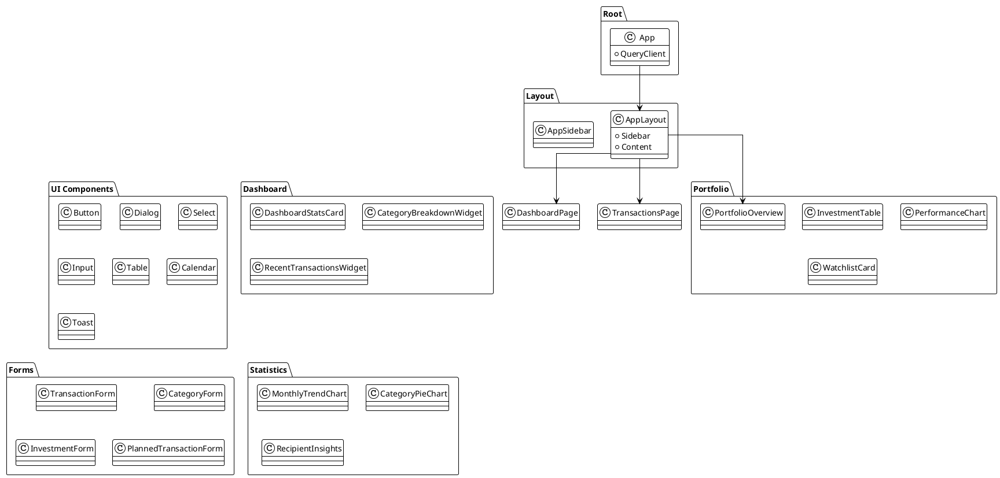
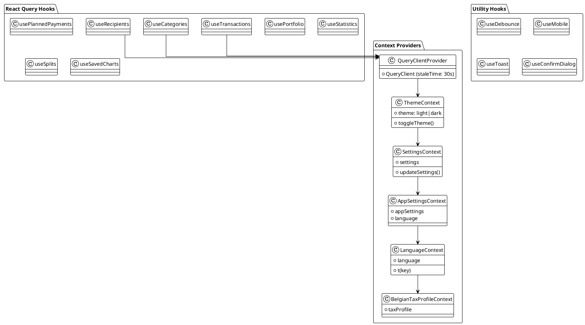
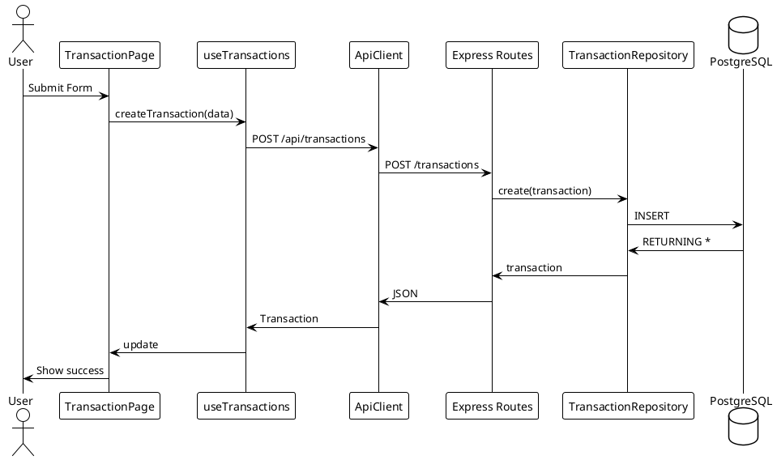
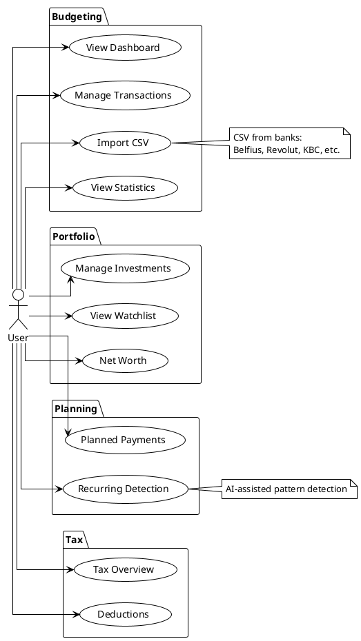
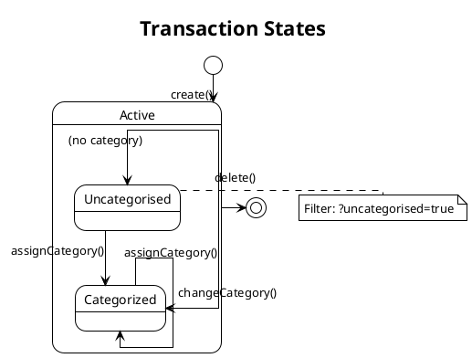

# Frontend Architecture

This document contains UML diagrams for the React frontend application.

> **Note**: These diagrams are generated from the codebase and should be regenerated when significant changes are made.

## Technology Stack

- **Framework**: React 18 with TypeScript
- **Build Tool**: Vite
- **Styling**: Tailwind CSS + Radix UI
- **State Management**: React Query (server state) + React Context (client state)
- **Routing**: React Router v7
- **HTTP Client**: Axios (custom ApiClient)

## Component Architecture



## State Management

React Context for client state + React Query for server state.



## Data Flow & API Layer

```plantuml
@startuml
!theme plain
skinparam linetype ortho
skinparam nodesep 35
skinparam ranksep 45

package "Pages" {
  class Pages
}

package "Custom Hooks" {
  class useTransactions
  class useCategories
  class usePortfolio
  class useStatistics
}

package "API Client" {
  class ApiClient {
    +request<T>()
    +retry()
    +cancelAll()
  }
  
  class DEFAULT_TIMEOUT_MS = 30000
  class MAX_RETRIES = 2
}

package "Types" {
  class Transaction
  class Category
  class Recipient
  class Investment
  class PlannedTransaction
}

package "Utilities" {
  class formatCurrency
  class sanitizeInput
  class categoryColors
}

package "Backend" {
  class RESTAPI
  class Express
  class Database
}

Pages --> useTransactions
useTransactions --> ApiClient
ApiClient --> Transaction
Transaction --> RESTAPI
RESTAPI --> Database

@enduml
```

## Routes & Pages

```plantuml
@startuml
!theme plain
skinparam linetype ortho
skinparam nodesep 25
skinparam ranksep 40

package "Budgeting" {
  class DashboardPage <<path: />>
  class TransactionsPage <<path: /transactions>>
  class CategoriesPage <<path: /categories>>
  class RecipientsPage <<path: /recipients>>
  class PlannedPaymentsPage <<path: /planned>>
  class StatisticsPage <<path: /statistics>>
  class ImportPage <<path: /import>>
  class OwesPage <<path: /owes>>
  class TaxOverviewPage <<path: /tax>>
}

package "Portfolio" {
  class PortfolioOverviewPage <<path: /portfolio>>
  class MarketLookupPage <<path: /portfolio/market>>
  class StocksPage <<path: /portfolio/stocks>>
  class CryptoPage <<path: /portfolio/crypto>>
  class RealEstatePage <<path: /portfolio/real-estate>>
  class SavingsPage <<path: /portfolio/savings>>
  class PerformancePage <<path: /portfolio/performance>>
  class NetWorthPage <<path: /portfolio/net-worth>>
  class ExchangeRatesPage <<path: /portfolio/exchange-rates>>
  class WatchlistPage <<path: /portfolio/watchlist>>
  class PortfolioTaxPage <<path: /portfolio/tax>>
}

package "Shared" {
  class AppLayout
  class NotFound <<path: *>>
}

AppLayout --> DashboardPage
AppLayout --> TransactionsPage
AppLayout --> CategoriesPage
AppLayout --> RecipientsPage
AppLayout --> PlannedPaymentsPage
AppLayout --> StatisticsPage
AppLayout --> ImportPage
AppLayout --> OwesPage
AppLayout --> TaxOverviewPage

AppLayout --> PortfolioOverviewPage
PortfolioOverviewPage --> StocksPage
PortfolioOverviewPage --> CryptoPage
PortfolioOverviewPage --> RealEstatePage
PortfolioOverviewPage --> SavingsPage
PortfolioOverviewPage --> PerformancePage
PortfolioOverviewPage --> NetWorthPage
PortfolioOverviewPage --> ExchangeRatesPage
PortfolioOverviewPage --> WatchlistPage
PortfolioOverviewPage --> MarketLookupPage
PortfolioOverviewPage --> PortfolioTaxPage

@enduml
```



## Component Hierarchy

```
App
├── QueryClientProvider
│   └── QueryClient
├── ThemeProvider
│   └── ThemeContext
├── SettingsPreloadProvider
│   └── SettingsProvider
│       └── AppSettingsProvider
│           └── BelgianTaxProfileProvider
│               └── LanguageBridge
│                   └── TooltipProvider
│                       └── ErrorBoundary
│                           ├── Toaster
│                           ├── Sonner
│                           └── BrowserRouter
│                               └── AppLayout
│                                   ├── Sidebar (navigation)
│                                   └── Routes
│                                       ├── Budgeting (/, /transactions, etc.)
│                                       └── Portfolio (/portfolio/*)
```

## Key Patterns

### 1. Code Splitting
All pages are lazy-loaded for optimal bundle size:
```typescript
const DashboardPage = lazy(() => import("./pages/DashboardPage"));
```

### 2. React Query Configuration
```typescript
const queryClient = new QueryClient({
  defaultOptions: {
    queries: {
      staleTime: 30_000,
      gcTime: 5 * 60_000,
      refetchOnWindowFocus: false,
      retry: 1,
    },
  },
});
```

### 3. API Client Pattern
- Automatic retry with exponential backoff
- Request cancellation support
- Timeout handling (30s default)
- Error transformation

@enduml
```

## API Communication

Frontend to Backend request/response flow with React Query integration.

```plantuml
@startuml
!theme plain
skinparam linetype ortho
skinparam nodesep 40
skinparam ranksep 60

actor "User" as User

package "Frontend (React)" {
  class Browser
  class useTransactions
  class useCategories
  class ApiClient {
    +timeout: 30s
    +retry: 2 attempts
  }
}

cloud "HTTP/JSON" as Network

package "Backend (Express)" {
  class ExpressRoutes
  class TransactionRoutes
  class CategoryRoutes
}

database "PostgreSQL" as DB

User --> Browser : Action
Browser --> ApiClient : API Call
ApiClient --> Network : HTTP
Network --> ExpressRoutes : Request
ExpressRoutes --> TransactionRoutes : Route
TransactionRoutes --> DB : SQL
DB --> TransactionRoutes : Result
TransactionRoutes --> Network : JSON
Network --> ApiClient : Response
ApiClient --> Browser : Data
Browser --> User : UI Update

note right of ApiClient
  Request timeout: 30s
  Max retries: 2
  Exponential backoff
end note

@enduml
```

@enduml
```

## Transaction Creation Flow

Sequence diagram showing how a transaction is created from frontend to database.



## Use Case Diagram

Overview of all user interactions with the system.



## Transaction State Diagram

Transaction lifecycle and categorization states.



## Diagram Source Files

The raw PlantUML source files are stored in `docs/diagrams/`:

**Frontend Architecture:**
- `frontend-component-structure.puml` - UI components and features
- `frontend-state-management.puml` - Context providers and hooks
- `frontend-data-flow.puml` - API layer and data flow
- `frontend-pages-routes.puml` - Route structure and pages
- `transaction-creation-sequence.puml` - Transaction create flow
- `use-case-diagram.puml` - User interactions overview
- `transaction-state.puml` - Transaction lifecycle states

**System-Wide:**
- `api-communication.puml` - Frontend to Backend communication
- `system-architecture.puml` - Full system overview
- `deployment-architecture.puml` - Deployment diagram

**Backend Flow Diagrams:**
- `import-pipeline.puml` - CSV import flow
- `import-sequence.puml` - Detailed import sequence
- `currency-conversion-flow.puml` - Exchange rate conversion
- `price-provider-flow.puml` - Investment price updates
- `recurring-detection-flow.puml` - Recurring transaction detection
- `materialized-view-flow.puml` - Materialized view refresh
- `recipient-merge-sequence.puml` - Recipient merge workflow
- `planned-transaction-state.puml` - PlannedTransaction lifecycle

## Regenerating Diagrams

To regenerate these diagrams after code changes:

1. Review the relevant source files
2. Update the PlantUML source in the respective `.puml` file
3. The diagrams in this document will render the updated content

---

**Related Documentation**
- [[Backend Architecture]] - Backend diagrams
- [[API Documentation]] - API endpoint details
- [[Components]] - Component documentation
- [[Hooks]] - Custom hooks reference