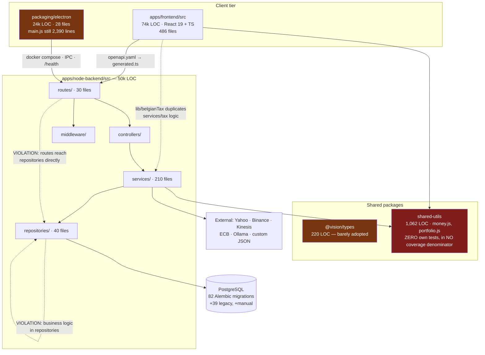
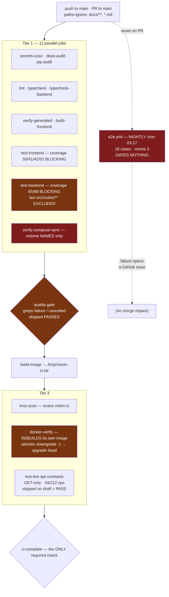
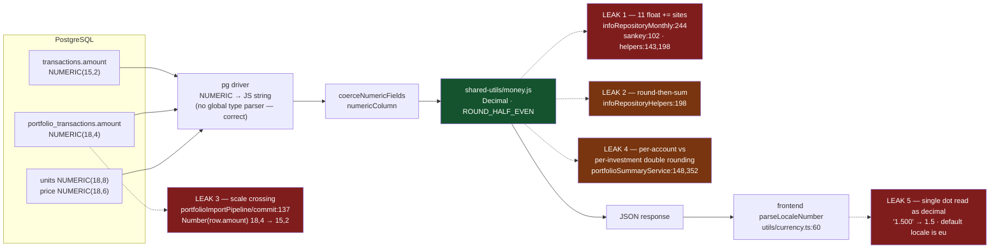
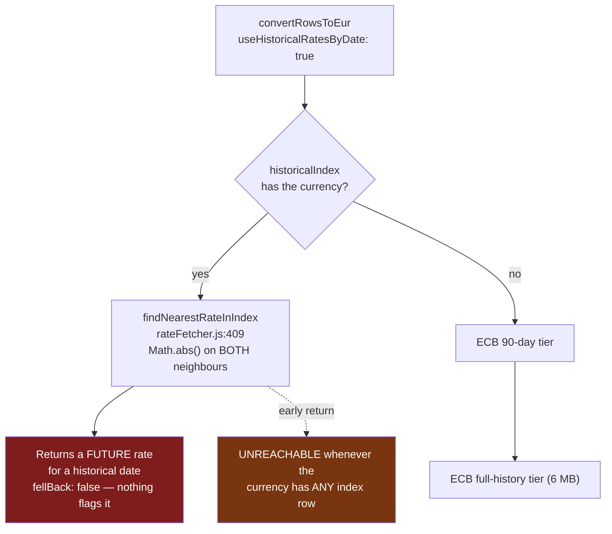
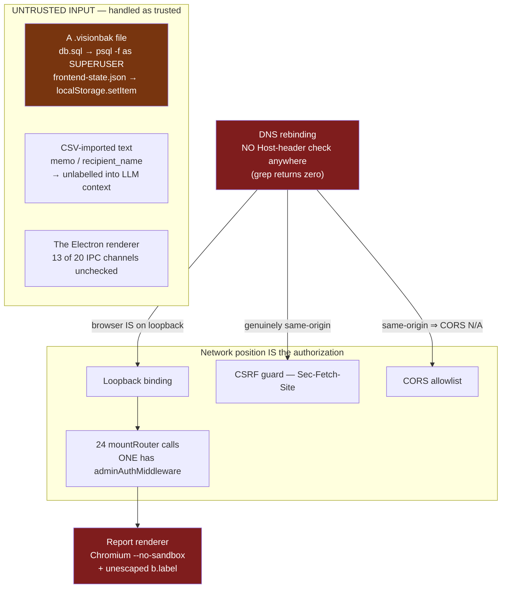
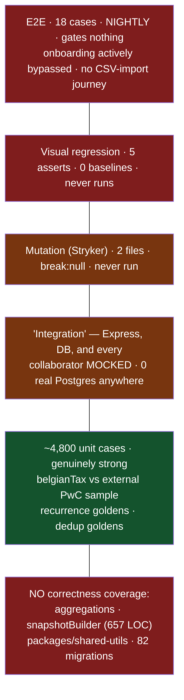
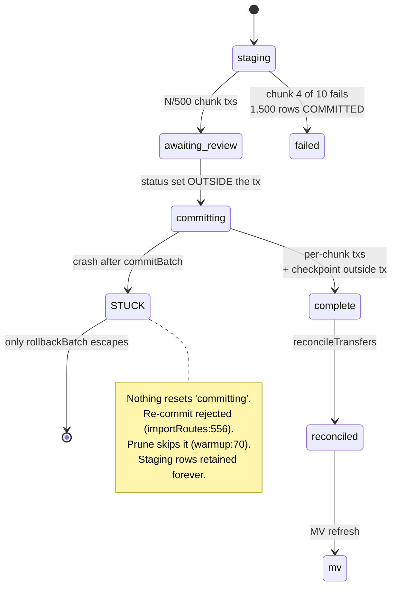

# Codebase Research Audit — 2026-07-27

**Tree audited:** `da4be60` (2026-07-23) · **Method:** 12 research streams, each given the prior-audit registers in `TODO.md` so it would not re-file dispositioned claims, plus a cross-stream de-duplication brief · **Verification:** every CRITICAL and every load-bearing HIGH below was independently re-checked against the tree before being recorded here.

---

## 1. How to read this

This repo has been swept hard already. `TODO.md` is a 6,258-line archive of ~8 prior audit passes with 685 findings marked still-present, plus explicit `## Checked clean — do NOT re-audit` and `## Refuted — do NOT re-add` registers. Raw finding volume is therefore not the value of this pass. Two things are:

1. **Fresh ground.** Every prior pass stopped at **2026-07-12**. Five PRs then landed 07-18 → 07-23 (#103, #105, #109, #110, #117, #120, #121, #122, #123): **371 files, +16,921 / −9,494**. No audit had seen any of it.
2. **Guardrail verification.** This repo builds guardrails for its own known bug classes. This pass checked whether those guardrails actually fire. Several do not — and that is the single most important result here.

Each finding is tagged **NEW** or **KNOWN-OPEN**. Findings marked ✅ *verified* were reproduced or read directly during this pass; that marker is on the specific mechanism, not on the impact estimate.

### Codebase at a glance

| Area | LOC | Files |
|---|---:|---:|
| `apps/frontend/src` | 74,279 | 486 |
| `apps/node-backend/src` | 49,913 | 302 |
| `packaging/electron` | 24,223 | 28 |
| `alembic/versions` | 7,163 | 82 |
| `packages/shared-utils/src` | 1,062 | 14 |
| `packages/types/src` | **220** | 10 |
| Tests (all layers) | 77,972 | ~340 |

---

## 2. The two headlines

### 2.0 The tax deduction classifier misfiles real categories, and the wrong figure lands on a legal filing ✅ NEW · **CRITICAL**

`apps/node-backend/src/services/tax/deductionClassifier.js`. Verified **by execution**, not by reading:

| Category | Classified as | Should be |
|---|---|---|
| `RETIREMENT:HOME` | `pensionSavings` | nothing — nursing-home fees |
| `INCOME:PENSION` | `pensionSavings` | nothing — a *received* pension |
| `SAVINGS:RETIREMENT` | `pensionSavings` | nothing |
| `GROEPSVERZEKERING:PENSIOEN` | `pensionSavings` | `groupInsurance` — 2nd vs 3rd pillar, **different boxes on the return** |
| `INSURANCE:GROUP TRAVEL` | `groupInsurance` | nothing — a generic group policy |
| `SCHENKING:KINDEREN` | `charitableDonations` | nothing — *schenking* is subject to gift tax |
| `UNION:DUES` | `null` | `unionDues` — unreachable |
| `CHILD:CARE` | `null` | `childcare` — unreachable |
| `INSURANCE:GROUP LIFE` | `groupInsurance` | ✓ correct |
| `PENSIOENSPAREN:BKCP`, `GIFTEN:OXFAM` | correct | ✓ controls |

Three distinct defects:

1. **Bare-token over-matching.** Rule #1 makes bare `PENSION` / `PENSIOEN` / `RETIREMENT` unconditional matches, even though the same file deliberately excludes bare `MORTGAGE`, `UNION`, `GIFT`, `INSURANCE` and `MAINTENANCE` as too ambiguous. `SCHENKING` sits in `CHARITY_WORDS` despite being the Belgian legal term for a *taxable* gift.
2. **Rule precedence.** The file documents its own principle — "`groupInsurance` is checked BEFORE `lifeInsurance` so an employer-scheme name lands in the more specific bucket" — and then doesn't apply it to pension. `GROUP LIFE` works; `GROUP PENSION` doesn't. **The asymmetry is the proof**: the documented case is the tested case.
3. **Phrase rules never span the `general:detail` boundary.** `hasAnyPhrase` searches `cat.general` or `cat.detail` but never the concatenation, so the most natural way to enter a two-word concept in this app is unmatchable. `unionDues` is worst: its word list is **Dutch-only**, so the phrase route is the only English path and it is unreachable.

**Why it matters more than a normal misclassification.** `DeductionCandidatesCard` Confirm writes with **SET** semantics (`{ [amountField]: group.total }`) plus an eligibility flag — it replaces a figure the user may have typed from a real certificate, with no confirmation and no undo. `pit.ts` then *caps* the displayed credit, so the on-screen tax number stays plausible while the stored field — the one the user transcribes onto their return — is wrong. A user categorising a parent's nursing home as `RETIREMENT:HOME` at €2,400/month gets "Pension savings — €28,800" offered and written.

**Fix:** require a qualifying second token for the bare pension forms; move the `groupInsurance` rule above `pensionSavings`; drop `SCHENKING`; give `hasAnyPhrase` `cat.all` as a third search target; add English `UNION`/`DUES` words. Then add negative tests for all eight rows above — the existing 30 tests encode the author's mental model, not a user's naming habits.

### 2.1 Three guardrails that report green over the bug class they exist to catch

This is the throughline of the entire audit. Fix these first, because they are why everything in §4 accumulated.

#### (a) `check-precision-drift.js` cannot detect any drift that is actually present ✅ NEW

`apps/node-backend/scripts/check-precision-drift.js` runs clean. It is structurally unable to fire:

- `ARITHMETIC_AMOUNT_RE` matches only `*` and `/` — so **no accumulation drift is visible at all**, and every real defect found in this audit is `+=`.
- It matches only the literal identifier `amount` — not `balance`, `units`, `price_per_unit`, `fees`, `taxes`, `rate_to_eur`, `total`, or `value`.
- `scanFile` requires a `*_raw_transactions` literal **in the same file within ±5 lines**, so effectively only import-staging SQL is in scope. All money math in `infoRepository*`, `snapshotBuilder`, `loanSchedule`, and `splits` is invisible.
- `SRC_ROOT` is `apps/node-backend/src`, so `packages/shared-utils/src/portfolio.js` — *all* cost-basis math — and `money.js` are never scanned.
- It never reads the migrations, so it cannot detect a precision *mismatch*.

The real asymmetric boundary in the schema is `portfolio_transactions.amount NUMERIC(18,4)` → `transactions.amount NUMERIC(15,2)`, crossed at `services/portfolioImportPipeline/commit.js:137` via `Number(row.amount)`. That file contains no `*_raw_transactions` token, so the file-level gate excludes it outright.

#### (b) The `no-raw-money-arithmetic` ESLint rule is blind to every drift site in the repo ✅ NEW

`apps/node-backend/eslint.config.js:76-104`:

- Visits only `BinaryExpression` — `+=` is an `AssignmentExpression`, so **all 11 float money-accumulation sites are unseen**.
- Matches only bare `Identifier` nodes — `row.amount_eur`, `snap.value`, `latest.netWorth` are invisible.
- `MONEY_NAME` omits `eur`, `amount_eur`, `value`, `invested`, `remaining`, `units`, `rate`, `principal`.
- Severity is `warn`, and the script is `eslint src/` with no `--max-warnings 0` — it can never fail CI.
- `files: ['src/**/*.js']` in the *node-backend* config means `packages/shared-utils/src/*.js` is linted by **nothing** (`config/eslint.config.js` covers only `**/*.{ts,tsx}`).

**Fix both:** add `AssignmentExpression` with compound operators, match `MemberExpression` property names, widen the name list, promote to `error` with `--max-warnings 0`, and extend a config over `packages/*/src/**/*.js`. For the drift script, parse the migrations into a column→precision map and flag any path moving a value between differing scales.

#### (c) Two of seven backend property tests assert against reimplementations inside the test file ✅ NEW

`apps/node-backend/tests/property/categoryTotal.property.test.js` and `monthlyYearly.property.test.js` import **only `vitest`** — nothing from `src/`. They define local reducers (`aggregate()` at `:45`, `rollupYearly()` at `:47`) and assert conservation laws against those. They are self-consistent by construction and **cannot fail for any production reason**, while `tests/golden/INVENTORY.md` records the corresponding modules as property-covered.

Compounding this: `INVENTORY.md` marks six aggregation modules as covered by an "aggregation shadow middleware" that **does not exist** — `grep -rni shadow apps/node-backend/src` returns two prose comments, and `src/backup/coverage.js:86` records its table as *"Dropped in migration 0009 — no longer exists in current schema."* And `tests/golden/__fixtures__/aggregations/` specifies a mandatory 9-variant × 6-aggregate matrix (54 fixtures) and contains **only the README**.

**Net effect: every aggregation feeding the Dashboard and Statistics pages has no correctness coverage — not golden, not property, not shadow — while the correctness gate reads fully green.**

---

## 3. Diagrams

> **Format note (NEW finding).** All 27 existing diagrams in `docs/diagrams/` are PlantUML. **PlantUML does not render natively on GitHub; Mermaid does.** Anyone browsing the repo on the web sees 27 unrenderable text files. The diagrams below are Mermaid deliberately, and a dual-track policy (Mermaid for anything a reader should see inline, PlantUML for deep formal models) is recommended.

### 3.1 Architecture as-built, with the layer violations marked

### 3.2 CI pipeline — what actually gates merge

The artifact reuse is a **no-op**: `docker-compose.yml`'s `app` service has `build:` and no `image:` key, so compose ignores `VISION_IMAGE`, ignores the loaded tag, and rebuilds uncached. Trivy therefore scans an image that is never the one `docker-verify` and the contract tests exercise — and because `Dockerfile:73` does a floating `apk upgrade --no-cache`, the two builds can genuinely differ.

### 3.3 Money and FX representation — every leak point

**Verdict:** the *foundation* is right — `money.js` is Decimal-backed with one canonical rounding mode, and no global pg type parser is registered, so NUMERIC correctly arrives as a string. The failures are all at the edges: accumulation in float, rounding before summing, one un-guarded scale crossing, and a frontend parser that guesses the locale instead of being told it.

### 3.4 FX historical-rate resolution — the future-rate path

Every other historical path in the codebase uses on-or-before (`portfolioSummaryService.js:205`, `dataFetcherTax.js:159`, `snapshotBuilder.js:222`, and the `rate_date <= pt2.date` SQL in `stampTransactionFxRates`). ADR-074 names *"the nearest-known (often current) rate as if it were historical"* as a defect it exists to remove.

### 3.5 Trust boundaries — what is treated as trusted and should not be

Three layers, **one** shared unchecked dependency: the hostname the request arrived on.

### 3.6 Test topology — a large base, no middle, no top

### 3.7 Import commit — transactionality and the stuck state

Idempotency here is genuinely protected — by `uniq_transactions_tx_hash` plus `ON CONFLICT DO NOTHING`, a real constraint rather than a check-then-act. The **portfolio** pipeline has no such constraint (verified: no unique on `portfolio_transactions` in any migration), so concurrent commits duplicate lots.

---

## 4. Findings

Severity counts: **12 CRITICAL · 45 HIGH · 55 MEDIUM · 20 LOW**. Every CRITICAL below was re-verified against the tree.

### 4.1 CRITICAL

| # | Finding | Location | Tag |
|---|---|---|---|
| C1 | **`docker:clean:reset` destroys the real DB and attachments.** Project name is `vision`; the clean override redirects only the `db` volume; `app` still mounts `attachments_data`. `down -v` removes every named volume in the merged config → `vision_postgres_data` + `vision_attachments_data`. `troubleshooting.md:216` already names this as the cause of the **2026-07-06 data wipe**; README:212 still advertises it as safe. | `package.json:51`, `docker-compose.clean.yml` | ✅ NEW |
| C2 | **The packaged desktop app cannot boot.** Root compose pairs `SERVER_HOST: 0.0.0.0` with `ADMIN_ALLOW_TOKENLESS_NONLOOPBACK: "true"`; both embedded composes set the former and neither the latter nor a token. `main.js` `start()` → `process.exit(1)`. No CI job boots either embedded compose. | `packaging/electron/resources/docker-compose.yml:63`, `resources-demo:74` | ✅ NEW |
| C3 | **DNS rebinding defeats all three security layers at once.** No `Host`/`hostname` check exists anywhere in the backend. Rebinding satisfies loopback, passes `Sec-Fetch-Site: same-origin`, and bypasses CORS (same-origin isn't subject to it). ~10-line fix. | `main.js:92-127`, `middleware/csrfGuard.js:36` | ✅ NEW |
| C4 | **The entire data plane is unauthenticated.** 24 `mountRouter` calls; exactly one (`/api/admin`) has auth, and that check is opt-in on an unset `ADMIN_AUTH_TOKEN`. No session, cookie, JWT, or password hashing anywhere. | `main.js:317-353`, `middleware/adminAuth.js:52-67` | ✅ NEW |
| C5 | **`parseLocaleNumber` reads a single dot as a decimal point** — `"1.500"` → **1.5**, `"2.750"` → **2.75**, while `"1.500,00"` → 1500 correctly. Default config is `numberFormat: 'eu'` (renders `1.500,00`), so retyping a displayed round amount books 1/1000 of it. Feeds every money input via `parseDecimal`. | `apps/frontend/src/utils/currency.ts:60-73` | ✅ NEW |
| C6 | **`parseAmountField`: a single comma with a 3-digit tail is read as a decimal.** Guard is `tail === 3 && s.indexOf(',') !== lastComma`, so one comma falls through: `"1,234"` → **1.234**. And there is no dot-thousands branch at all: `"1.234"` → 1.234, `"1.234.567"` → `NaN` → row silently dropped. | `importPipeline/adapters/_shared.js:179-194` | ✅ NEW |
| C7 | **`skip_rows > 0` imports ZERO rows and reports success.** Uses `from:` (skips *records*) with `columns: true` (header from physical line 1) where `from_line:` is required. Every row → `skipped`, `rows_total = 0`, "successful import". | `adapters/generic.js:79`, `portfolioGenericAdapter.js:69` | ✅ NEW |
| C8 | **Three of four UI encoding options crash the import.** `parseCsvFile` passes the value straight to `readFile` with no allowlist; `dataImportService.js:26`'s allowlist itself contains Node-invalid names. `latin-1`, `iso-8859-1`, `windows-1252` all throw `ERR_INVALID_ARG_VALUE` — exactly what a Belgian user picks for a cp1252 export. | `adapters/_shared.js:258`, `importRoutes.js:138` (`z.unknown()`) | ✅ NEW |
| C9 | **Historical FX uses a *bidirectional* nearest rate**, so future rates are applied as history and `fellBack: false` hides it; the ECB tiers become unreachable whenever the currency has any index row. | `currencyConversionService.js:297-300`, `rateFetcher.js:409-418` | ✅ NEW |
| C10 | **`warmCache` replaces the rate map with only the surviving source's currencies.** If er-api fails but ECB succeeds, `mergedRates` is ECB-only; static `FALLBACK_RATES` is not merged in, and this shadows correct DB rows for 24 h. A 1,000 AED expense reports as 1,000 EUR (~4× overstatement). | `currencyConversionService.js:233-235` | ✅ NEW |
| C11 | **The only `fetch()` without a timeout permanently kills two scheduled jobs.** Every other call site has `AbortSignal.timeout`. It loops up to 30 serial pages; `withInFlightGuard` clears `running` only in `finally`, which never runs. Hourly quote refresh and daily gap-fill are dead until restart. | `priceProviderService.js:212` | ✅ NEW |

### 4.2 HIGH — selected

**Money / correctness**

- **Dividend withholding tax is recorded, shown in the tax report, and silently excluded from gain/loss.** The `isUnitBased` branch subtracts only standalone `tax`/`fee` *transaction types*; the per-row `taxes` column is read by the cost-basis calculators only for `buy`/`gift`/`sell` — never `dividend`. A €100 dividend with €30 RV shows €30 in `totalTaxes` and +€100 in `gainLoss`. `packages/shared-utils/src/portfolio.js:570-572` — NEW.
- **Effective-category resolution is 3-level in lists, 2-level on every money aggregate.** `transactionRepository.js:26-29` states the invariant; six aggregation sites (including both materialized views) never got `pr.default_category_id`. A merged-recipient transaction shows categorised in the list, UNCATEGORISED in the breakdown, and is **dropped entirely** from the pivot. NEW.
- **Internal transfers are not excluded from forecast training data.** Ten repositories apply `is_transfer = false`; `infoRepositoryForecast.js` does not. A €5,000 monthly savings sweep with skewed value dates puts ±5,000 into the daily-net history, driving a p10 near −11,400 for that day. NEW.
- **`GET /api/transactions?uncategorised=true` counts `total` over a different filter set than `items`** — 40 rows returned with `total: 12000`; clients paginate to 240 empty pages. `transactionRepository.js:305-320` — NEW.
- **`addDaysUtc` breaks daily/weekly recurrence across DST.** Reproduced with `Europe/Brussels`: weekly from 2025-10-22 becomes permanently Tuesday after the fall-back and skips 10-29; daily emits 2025-10-26 **twice** and drops 10-31. `lib/calculations/recurrence.js:26-31` — NEW.
- **`transfers.js` compares a local-midnight pg `Date` against a UTC-midnight parsed string** — identical 3-calendar-day gaps accept or reject depending on which representation each leg arrived in. `services/calculations/transfers.js:13` — NEW.
- **Sankey: three defects in one function** — `NULL != ALL()` drops every uncategorised transaction when any exclusion is set; no transfer filter; node value ≠ link sum in a deficit year. `aggregation/sankey.js:51,56,74,131` — NEW.
- **`tx_hash` collides for statements with no reference and no balance column** (SABB has neither), so two genuinely distinct same-day purchases → one is marked duplicate and permanently lost. `importPipeline/validate.js:113-121` — NEW.
- **A mid-stream export failure sends a truncated CSV with HTTP 200.** `transactionExport.js:188-194` — NEW.
- **Statistical methods transcribed without regard to conditioning.** `prophetLite`'s ridge λ is ~6 orders of magnitude too small on an unstandardised design matrix (reproduced: +63,751 EUR over 90 days against a true −392 run-rate); Holt-Winters extrapolates `h·trend` undamped over 90 days (59% of a projected deficit was a slope fitted to noise); `mape` is unbounded near break-even (5,000,000% into the API and the persisted accuracy row). All produce finite values that pass the `Number.isFinite` guards. NEW.

**Concurrency**

- **Lost update in `executePlanned`.** The planned row is read unlocked, `execution_count+1` and the next `planned_date` are computed from that stale read, then handed to a transaction that never re-reads. Two executions against different transactions → both recorded, recurrence advances **one** period, `max_occurrences` overshoots. `plannedExecutionService.js:29-70` — NEW.
- **`user_settings` writes are whole-JSONB read-modify-write with no version token.** Two tabs, or one tab plus the AI chat tool, silently discards sibling fields. The mechanism to fix it already exists — `dbEditor.js:383-399` is the codebase's one correct optimistic-locking implementation (`xmin` compare + `ConflictError`). NEW.
- **`mergeRecipients` locks the primary but never the aliases**, so two concurrent merges produce a depth-2 alias chain the one-level read layer cannot resolve — the exact failure the grandchildren fix exists to prevent. `accountMergeService.js:84` already does this correctly. NEW.
- **Portfolio import has no unique constraint** (verified across all migrations), and brokerage cash rows are inserted without `tx_hash` despite a comment claiming they dedup via it. Concurrent commits duplicate lots. NEW.
- **Zero advisory locks in the entire backend** (verified: 0 hits). Every job guard is a module-level JS boolean, so a two-instance deployment runs every job twice, including two concurrent `alembic upgrade head` on boot. Intervals are anchored to process start, so a container restarting more often than 24 h **never runs the daily jobs at all**. NEW.
- **`SAVEPOINT` per row is never released on the catch path** → up to 1,000 live subtransactions in one backend; past 64, every concurrent backend pays `pg_subtrans` SLRU lookups. `importPipeline/commit.js:227` — NEW.

**Security**

- **Unauthenticated HTML injection into a `--no-sandbox` Chromium.** `reports.js:74` declares `label: z.string().optional()` (free-form, from the body); it reaches `belgianRulesSummary.js:82` as `<td>${b.label}</td>` with no `escapeHtml`, then `page.setContent()` in a browser launched with `--no-sandbox --disable-setuid-sandbox`. `escapeHtml` is used correctly almost everywhere else in the same directory. NEW.
- **Restoring an untrusted backup executes attacker-chosen SQL as a Postgres superuser.** `db.sql` → `psql -f` with no content validation, and **no passphrase is required** for an unencrypted bundle. Default backup dir is an iCloud folder. NEW.
- **Legacy v1 backup format is unauthenticated AES-CBC keyed from a global static salt** (`'vision-backup-v1'`, default scrypt cost). One precomputed table attacks every user; CBC malleability + predictable `pg_dump` plaintext allows SQL injection into C-tier restore **without the passphrase**. Format is selected from the file's own header. NEW.
- **`backup:set-passphrase('')` silently deletes the passphrase**, downgrading every future backup — including the automatic quit-time backup — to a plaintext `pg_dump` synced to iCloud, signalled only by a `console.warn`. One of 13 IPC channels with no sender check. NEW.
- **Vite dev server binds `host: "::"` and proxies `/api`**, defeating the loopback binding; a LAN `curl` sends no `Origin`, and `csrfGuard.js:42` treats absent Origin as trusted. NEW.

**Performance**

- **`mv_cashflow_daily` is resurrected by application code after the schema deliberately dropped it.** Migration `0045` runs `DROP MATERIALIZED VIEW IF EXISTS mv_cashflow_daily CASCADE`; `materializedViewService.js:112` recreates it with `IF NOT EXISTS` *after* migrations and refreshes it on every label edit. It is absent from `ALLOWED_MV_NAMES`, so **no code path can read it**. ~⅓ of the per-mutation refresh cost, provably wasted. ✅ NEW
- **Yahoo history cache key omits the window** (`yahoo-history:${symbol}`) while Binance's includes it, and `cacheGet` runs before `force` is honoured. Consequence: `backfillHoldingGaps` passes `force: true`, receives the cached 7-point series, compares `after > before` as false, and reports `filled: 0` — **the gap-fill job is structurally incapable of filling a gap.** ✅ NEW
- **Every single-row edit rebuilds an all-time aggregate over the whole `transactions` table**, 3 views in parallel on dedicated clients with `statement_timeout = 0` — 30% of a 10-connection pool with no kill switch. NEW.
- **Net worth issues one index probe per (day × account) over the ledger's entire history** and ships every ~99%-redundant row to Node for per-row FX. 25 years × 10 accounts = 91,000 rows per cold request. The code already forward-fills *investments* in JS. NEW.
- **Unbounded provider fan-out** — up to 2,000 concurrent sockets from one `refresh-prices`; `?symbols=` has no length cap. `forEachConcurrent(list, 6, …)` already exists in `lib/concurrency.js`. NEW.
- **`manualChunks` drags 156 lucide icons, 23 Radix packages, and date-fns into the eager first-paint graph** — the exact failure mode `vite.config.ts:74-79` documents for recharts, where the fix *was* applied. framer-motion is eager and unsplit for a single `layoutId` pill. NEW.
- **One checkbox click re-renders ~234 cells** (`selectedIds` Set identity in the `columns` memo) and each row mounts a full `SplitTransactionDialog`. NEW.
- **`CategoryPivotTable` renders an unvirtualized categories × periods table with a `backdrop-filter` per row** — 120 × 400 ≈ 49,000 `<td>` and ~400 blur layers. NEW.

**Testing / DevOps**

- **Backend coverage excludes `src/routes/**`** (30 files, 5,999 lines, 12% of the backend) on the stated grounds that Playwright covers them — but `e2e.yml` is nightly-only and gates nothing. The 85/88 figure omits the entire HTTP surface. NEW.
- **`UPDATE_GOLDENS=1` makes `runGolden` write the fixture and `return` before asserting**, so such a run is unconditionally green — with no CI guard and no `CODEOWNERS` on `__fixtures__/`. The dedup-hash backward-compatibility lock can be silently rebaselined. NEW.
- **No test executes SQL against a real Postgres** (`TEST_DATABASE_URL` appears in zero workflows and zero scripts; `ci.yml` has no `services:` block), so all 82 migrations are untested and repository "correctness" is asserted by string-matching generated SQL. ✅ NEW
- **Mutation contracts are validated only against hand-written mocks**; the one real-backend suite is GET-only, 34/212 operations, and `skipped` counts as pass on draft PRs. NEW.
- **"Migrations are user-applied, not auto-run"** is asserted in REVIEW.md, the PR template, CONTRIBUTING, and three ADRs — but `main.js:487` runs `alembic upgrade head` on every boot, and `alembic/versions/0055` documents the resulting incident. `docs/guides/migrations.md` contradicts itself at `:76` vs `:94`. NEW.
- **`verify-compose-sync` — "the v1.0.2 data-loss guard" — diffs only top-level volume names**, missing C2's boot-blocking env var, a missing `TZ: UTC` (ADR-009 says storage is UTC), and the absent `postgres-init` mount that makes the documented `ftm_app` least-privilege role unreachable for packaged installs. NEW.
- **Electron auto-update is dead code** — `updater.js` only accepts `vision-source-launcher-*-arm64.zip`, which `release.yml` never builds. Users see "update available → Download" and nothing happens, forever. KNOWN-OPEN (`TODO.md:3884`).
- **The runtime image installs Python deps unpinned and from a different manifest than `pip-audit` scans** (`psycopg2-binary` vs audited `psycopg2`; `python-dotenv` vs `dotenv`). The Python gate is decorative for the shipped artifact. NEW.
- **No signing, notarization, provenance, or SBOM** anywhere in the release path; the only integrity artifact is a `.sha256` published in the same release as the binary. NEW.

### 4.3 Refactor fidelity — #120 checked against its own claims

| Claim | Reality |
|---|---|
| main.js 4,075 → 2,390 | **TRUE** (exact) |
| "57 moved fns byte-identical" | **FALSE** — 37 identical, 19 `ctx.*` rewrites, 1 real behavior change (`decryptBackupV2`, the disclosed TOCTOU fix — so the commit message and TODO.md contradict each other) |
| Electron split into clean seams | **PARTIAL** — `updater.js` principled; `compose.js` leaky (main.js hand-spawns `docker compose` at 7 sites); `backup/*` **not a seam** — ~271 main.js lines are still backup logic including `validateBackupDest` (security policy), and the ext→format dispatch and settings-resolution fallback are each duplicated |
| `packaging/electron` got smaller | **FALSE** — 4,895 → **5,097 LOC (+202)**; the 41% main.js reduction came with ~200 lines of new headers and `ctx` plumbing |
| Report catalog: "ONE ordered `[{id, render, default}]` array, RENDERERS maps DERIVED" | **FALSE** — no such array exists; the renderer maps are still hand-written literals. The *commit message* describes what shipped accurately; TODO.md does not |
| Catalog reduced touchpoints | **FALSE** — 8 → **9** hand-edit sites. It is a drift-**detection** win (2 silent modes now fail loudly), not a touchpoint-reduction win |
| Catalog covers all sections | **TRUE** — all 9 parallel lists have byte-identical membership today. But `FINANCIAL_SECTION_SOURCES` (`dataFetcher.js:46-54`) bypasses the catalog with a `?? []` that silently renders an empty section, and i18n keys are outside every guard (`validate-locales` can't see `t(def.labelKey)`) |
| #120 changed IPC sender coverage | **NO** — 7/20 before and after; it became 7 in `d9b431f`. `TODO.md:3814`'s "5 of 20, no systematic wrapper" is stale in both halves, though its core criticism (validation defaults **off**) stands |
| 1,887 lines of new extracted code | **Zero tests.** Only `backup/bundle.js` (pre-existing) is tested. The seam was built and not used |

**Zod migration (#103):** all 12 named units landed, but `.partial()` is documented twice and used **zero** times; effective route coverage is 14/30 (47%); **query-param coverage is ~10% against ~78% for bodies**; 19 duplicated zod→HTTP mapping sites with **4 divergent message shapes** and no shared helper (two are byte-identical twins, a third is a same-file copy); `services/bulkSelection.js` is a fully hand-rolled validator (0 zod) guarding the largest untyped attack surface in the app. **Package adoption (#105):** 13/15 clean, PKG-01 has already drifted 109 → 1 → **2** at HEAD with no lint rule to hold it.

---

### 4.4 UI/UX and accessibility

Audited under the **binding design constraint** (ADR-105): the rich aurora/glass/jewel aesthetic is deliberate and was re-instated after a flatten redesign was reverted. Every fix below is either visually free or states its visual cost and offers a free alternative.

**Contrast — measured, not estimated.** I recomputed these from the real tokens; all match to two decimals:

| Pair | Ratio | |
|---|---:|---|
| `--gain`/`--accent` `38 58% 52%` on `--card` white | **2.60:1** | FAIL |
| same on `--background` | **2.41:1** | FAIL |
| `--warning` `38 80% 50%` on `--card` | **2.33:1** | FAIL |
| `--loss`/`--destructive` on `--card` | 5.17:1 | PASS |
| dark `--accent` on dark card | 9.87:1 | PASS |

The gold is legible only in dark mode. `colorblindGainLoss: false` is the **default**, so the shipped default palette *is* the failing pair; even the Okabe-Ito opt-in is short in light mode (gain 4.20:1, loss 3.84:1). Proposed light-mode lightness changes compute to 4.67:1 and 4.72:1. The failure is asymmetric — losses read fine, **gains vanish** — across ~200 render sites.

Theme variants are structurally worse: **nordDark `--loss` is 2.20–2.96:1** (every expense figure), and **solarizedLight's `foreground` — primary body text — is 4.39:1** with `muted-foreground` at 2.19:1, the worst pair in the app. `high-contrast` is genuinely clean (worst 4.50:1), so a compliant path exists; the defaults and palette-fidelity variants are the problem.

**Other HIGH/MEDIUM findings**

- **The accounts hub card is a `role="button"` containing two real buttons** (`AccountsPage.tsx:96-113` wrapping the drift chip at `:138` and the ⋮ menu at `:180`) — an axe `nested-interactive` **serious** violation. Its `aria-label` is name-only, so a screen reader announces "Open Checking details, button" and **never the balance** — the only reason the card exists. Notably the author *was* aware of the nesting (the `onKeyDown` comment at `:104-106` handles event bubbling correctly) — the interaction logic is careful, the ARIA semantics are the gap. Fix: plain `
` + a real `<Link>` on the account name. Visually free, and gains cmd/middle-click.
- **The drift chip fails WCAG 2.5.3 Label in Name** — `aria-label="Open reconcile"` over visible text `Drift: +€412,50`; the accessible name shares no words with the visible label and drops the amount. Same at `AccountDetailPage.tsx:371`.
- **The two heaviest new pages are outside the axe sweep.** `e2e/pages.ts` covers 10 routes; `/accounts` (490 rewritten lines) and `/accounts/:id` (584 new) are absent, as are `/tax`, `/settings`, `/portfolio/net-worth`, `/ai-chat`. The gate already fails on serious violations, so the `nested-interactive` bug would have been caught the day it landed — the route just isn't scanned. Compounded by `TODO.md:3924`: the suite has **never executed**.
- **`aria-invalid` and validation `aria-describedby` appear zero times in the entire frontend.** Money fields' `pattern="^-?[0-9]+([.,][0-9]+)?$"` also *rejects* `1.234,56` — exactly what a Dutch user pastes back — and because the field sits in a `<form>`, failure triggers Chromium's untranslated "Please match the requested format." The app's own `parseLocaleNumber` handles grouped input correctly; the `pattern` is stricter than the parser it feeds.
- **Three `aria-live` regions app-wide.** Dismissals, "Applied" swaps, load-more appends and error swap-ins are all silent; `PageError` has no `role="alert"`.
- **Both new insight surfaces render `null` on API failure** — indistinguishable from "no insights". For tax this is substantive: absence reads as "no deductions found", a wrong claim about the user's return.
- **Both new accounts pages surface raw API error strings** with no retry, bypassing the app's own `PageError` — a Dutch user gets Chromium's English `"Failed to fetch"`.
- **Bulk recategorize / reassign-recipient / activate have no confirmation** while delete and deactivate do — and in filter mode the scope is *every matching transaction*. The asymmetry teaches users the app confirms dangerous things, which here it doesn't.
- **Dismissals are permanent with no undo and no un-dismiss surface anywhere.** For deduction candidates the key is `{year, type}`, so one stray click on a ghost "Dismiss" 4px from a primary "Confirm" permanently hides a deductible group for that tax year.
- **52 raw `hsl()` chart literals** bypass `--chart-1…8`, so portfolio charts stay Tailwind-default under every theme variant *including high-contrast*. `#121` added a fresh one (`AccountDetailPage.tsx:62`) after the finding was already filed, and the identical case was fixed once before in `ToolResultCard.tsx`.
- **`sr-only` strings live untranslated in the shadcn primitives** — "Close" on all 46 dialogs and sheets (`dialog.tsx:51`, `sheet.tsx:64`), the highest-frequency SR interaction in the product. `aria-label="PK"` is worse than nothing: it spells out "P K".
- **Reduced motion stops at the custom classes** — 63 `animate-spin` and 14 hover transforms still animate.
- **The Statistics nav label silently lost truncation** when #122 appended a `Badge` (a `
`) after the label span, breaking `[&>span:last-child]:truncate`.

### 4.5 Architecture and code design

**Layering.** Import cycles: **0** in the backend, **1** in the frontend (`accountFormMapping.ts ↔ AddAccountDialog.tsx`, type-only). But the picture is inverted from the documented ideal:

- **The one enforced boundary rule guards the only clean edge.** `no-repo-direct-from-route` applies to `src/routes/**` and forbids `repositories/`/`database/` — measured `routes → repositories` = **0**. Unguarded and dirty: `services → database` **42 files** (26 with mutation SQL), `repositories → services` 7, `repositories → middleware` 4, `controllers → repositories` 2. `investmentController.js` is *specifically* outside the glob. The frontend has **zero** structural lint, no cycle check, and no `madge`/`dependency-cruiser` in any manifest — so the "madge clean" claim has no standing guard behind it.
- **#117 was a route cleanup, not a layering fix.** Its own commit message targets "zero raw SQL left in the route" — and the destination was a *service*. `transactionBulkService.js` now issues `UPDATE transactions SET`, `DELETE FROM transactions`, `INSERT INTO transaction_tags`, while `transactionRepository.js` has **no bulk methods**. Two SQL homes per hot table.
- **`noImplicitAny` ratchet measured** (closing a long-standing resume point): baseline **0** errors, with `noImplicitAny` **3,282**. 1,896 are one-line parameter annotations; **430 are TS2339 property-does-not-exist** — accesses the compiler already believes are wrong. By directory: services 1,641 / routes 665 / repositories 639 / lib 89 / middleware 63 / controllers 58. Tractable ordering: `lib` + `middleware` + `controllers` + `database` = 212 errors buys four directories.
- **Five competing "today" clocks**, with `todayAppDateString()` (Brussels) and SQL `CURRENT_DATE` (UTC, 57 sites / 11 files) coexisting **inside single functions** in six files. `Dockerfile` pins the process to UTC, so the app-tz helper is the only Brussels clock — a guaranteed one-day divergence between 00:00 and 02:00 Brussels. Two comments assert the opposite. Dev machines (local TZ = Brussels) make the skew disappear, so it is invisible in local testing.
- **The only full Belgian PIT engine lives in the frontend.** `lib/belgianTax/` is 1,940 LOC; the backend keeps a hand-copied rate table whose header says "must remain in sync" with **no test or CI gate**, and the tax PDF renders client-POSTed `precomputedPIT` next to backend-sourced rates. The tables currently agree — the risk is structural. The server cannot recompute or audit a figure the user files against.
- **Money is a bare number**: 35 money-bearing frontend types carry **no** currency field, 13 have `currency?`, only 7 require it. `formatCurrency` substitutes a module-global mutable default, so a USD row whose currency was dropped renders with € and no error.
- **`@vision/types` is 2 of 8 PG enums (25%)**, and the vocabulary has *already* forked: `'bi-weekly'` vs `'biweekly'` disagree between two backend modules. Adding one account type is a **12-file, 5-subsystem edit** with silent partial failure. #121 shipped the newest enum family the old way — the pattern is losing ground.
- **`components/` → `features/` is ~28% done and was marked complete.** Only the *symptom* cleared: #121 deleted `features/portfolio/`'s single file. `components/tax/` (36 files) is larger than any `features/` directory, and `frontend-architecture.md` now misdescribes the state in both directions.
- **`generated.ts` is not at the seam**: 9,680 LOC, **one** importer, asserting over 8 of 46 schemas via a guard that is explicitly optionality-tolerant. The consumed seam is hand-written `types/api.ts`.
- Also: `services/` flat-file count *grew* 46 → 51 across the four "refactor" commits (#122's four cohesive insight services landed flat while `services/tax/` was created in the same commit); seven info repositories import a currency service (ADR-006 rule 4); validation now has **five** competing idioms with #121 introducing Zod-in-the-service-layer; the repository not-found sentinel is an exact 21/21 `null`/`undefined` split with two repositories using both internally.

### 4.6 The #122 insights layer — semantic, not mechanical, defects

The most important framing in this audit: **#122's defects are of a different kind.** Older findings are mechanical (an off-by-one, a missing index). These compute X correctly and then *tell the user it is Y*. All pass lint, typecheck and a green suite, because the tests assert what the code computes rather than what the label claims.

- **CRITICAL — `monthEndProjected` is month-to-date net cashflow, labelled "Projected month-end balance".** ✅ Verified: `forecast/index.js:63` is `let cum = 0`, `cashForecastInsightService.js` has **zero** references to any balance source, and `en.json:981` reads *"Projected month-end balance: {amount}"* with an **"Overdraft risk"** warning at `:983`. A user with €14,000 across two accounts who is net-negative mid-month gets a false overdraft alert — and `crossesZero` is the only thing that can set `prominence: 'alert'`, so it drives a **standing badge count on every page of the app**.
- **HIGH — the confidence interval is ~√H too wide.** `monthEndLow`/`High` sum per-day p10/p90 values, which is the probability of *every* day going wrong together, not a quantile of the sum. Measured at H=20: folded p10 −6,318 vs true −2,347, **overstated 4.46×** (√20 ≈ 4.47). The MC simulation already holds per-path cumulative sums; the information is discarded. The test pins only band *ordering*, which the wrong implementation satisfies.
- **HIGH — the subscription "previous price" is the historical median, not a price ever paid.** Netflix at €8.99×6 → €10.99 → €12.99 renders "~~€8.99~~ → €12.99 +44.5%" when the real last change was +18.2%.
- **HIGH — category outliers compare days 1..N but are labelled "this month" and "usually".** On the 3rd of a month with a €260 stock-up run, the panel renders "€260.00 this month · usually €41.50" for a user whose real groceries run ~€450/month. Early in each month N is tiny and MAD ~€1, so almost any purchase is a >50σ "outlier"; the detector is simultaneously blind and hair-trigger. Iglewicz–Hoaglin is applied at n=4–6 where it requires n≥10.
- **HIGH — the nav badge runs the full digest, including a 12-month × 7-method backtest, on every page.** `InsightsNavBadge` is mounted in the always-rendered sidebar, and `aggregationRefresh` clears the MC cache on every transaction change — so the first page load after any import recomputes 1,000 MC paths plus a 7×12 walk-forward **on the event loop** and writes 7 accuracy rows under a phantom `'anonymous'` user. ADR-110 §3 explicitly promises the badge "never re-runs detection just to draw a dot".
- **MEDIUM-HIGH — the narration layer sees dismissed findings.** ADR-110 §1 states dismissal is a detection-layer concept so "the narration layer never even sees a dismissed finding". Dismissals live only in localStorage, so `dismissRecords` is always `[]` server-side: ~90 lines of backend suppression logic are **unreachable in production**, 5 tests cover that dead path, and the AI chat narrates findings the user explicitly dismissed. The two copies have also already diverged (`>=` vs `>`) in a file whose header claims to mirror the backend constants.
- **MEDIUM — the 5-item cap is applied before dismissal**, so subscriptions ranked 6+ are permanently unreachable and the panel then asserts *"you're all caught up."*
- **MEDIUM — `deviation` is emitted on two incompatible scales** (a dimensionless z-score, and 0.6745 × euros on the flat-baseline branch), then sorted against each other and compared to the same re-alert margin. On the flat branch the 14-day suppression a user asked for is defeated by the next **75-cent** purchase.
- **MEDIUM — the AI tool card renders an empty body.** `meta.renderAs: 'insightsDigest'` matches none of the four known render modes, and because it *is* set the `??` fallback never fires. Setting an unrecognised value is strictly worse than omitting it. This deletes the user's ability to check the model's prose against the tool payload — the mitigation that made the narration path acceptable.
- **MEDIUM — `invalidateTransactionData` misses both of #122's new query families**, so with a 3-min `staleTime` *and* a 3-min backend TTL the panel can assert a deleted €900 overspend for ~6 minutes.
- **MEDIUM — mid-year Confirm writes a year-to-date total as if annual.** In July, 7 monthly €75 transfers offer "Pension savings — €525", written as the year's figure with nothing indicating the period is incomplete.
- Also: `'FOOD' || ':' || NULL` is `NULL` in Postgres, so every general-only category collapses to the display name **"Unknown"**; `confidence` is a pattern-*regularity* score reused as newsworthiness ranking, and it **penalises** findings with a price change — pushing exactly the newsworthy ones toward truncation.

**Credit where due:** the privacy posture held. ADR-110 §5 was honoured, the new tool is read-only, the fetch-spy was extended, and no markdown renderer or outbound call was introduced — so the ceiling remains "the model says something wrong". `deductionClassifier` is the best-engineered file in the PR (pure, deterministic, frozen rule table, 30 tests) and is one rule reorder plus three word-list edits from being right.

## 5. Cross-cutting themes

1. **The correct implementation almost always exists adjacent to the defective one.** Every other `fetch` has a timeout; Binance's cache key has the window; `getNews` caps fan-out at 10; `Money` guards an empty currency code while `useCurrencyFormatter` doesn't; `AddToWatchlistDialog` documents and guards `parseDecimal`'s 0-fallback while `PlannedPaymentForm` doesn't; `useMergeRecipients` invalidates derived trees while `useUpdateRecipient` doesn't; `accountMergeService` locks all rows while `mergeRecipients` locks one. These are **consistency gaps, not knowledge gaps** — cheap to fix, and lintable.

2. **Fixes were applied at the site, not at the seam.** `NULL != ALL()` is fixed in `buildExclusionClauses` and live in `sankey.js`; the app-tz date parser exists in `recurrence.js` and is bypassed by `plannedExecutionService`; on-or-before FX is used in five places and violated in the one most callers route through; the 3-level category COALESCE landed in 2 of 8 sites; `is_transfer = false` landed in 10 repositories and missed the forecast. Each fix comment is accurate about its own site and misleading about the system.

3. **Degradation is silent and indistinguishable from success.** Missing FX rate → 1:1 with no flag; unsupported target currency → EUR values under the requested label; historical lookup fails → today's rates via a bare `catch {}`; mid-stream export failure → truncated CSV with HTTP 200; `skip_rows` misconfigured → "successful" import of nothing; `warmCache`/`refreshMaterializedViews` fail → success response. In a finance app a plausible wrong number is worse than an error. `dataFetcherTax.js`'s `unconvertedCurrencies` shows the right pattern already exists — it just isn't the default.

4. **Fast path and slow path compute different numbers.** MV vs live in `getMonthlyFinancialSummary` (Decimal vs float `+=`, plus a 500-row cap on one side only); per-account vs per-investment rounding; three definitions of `totalInvested` across three surfaces; cached vs live forecast splits. An optimisation was added beside the original with no differential test pinning them, so toggling an unrelated filter visibly moves a money figure.

5. **Refs used as reactive state** is the most productive frontend bug family — `hasMoreRef` read during render, `isEditingRef` gating a data-sync effect, `loadRequestedForLengthRef` as a load latch, `cachedVisibility` as a module singleton. Each dodged a re-render and now hides a state transition from React.

6. **Defence-in-depth built on top of a missing primitive.** The container hardening, SSRF guard, SQL parameterization, and Electron renderer isolation are genuinely high quality — better than most codebases this size. They sit on an authentication model that is purely positional, so one Host-header check and one real credential would make all that work pay off.

7. **The newest code fails semantically, not mechanically — and that is harder to catch.** Everything in §4.6 computes correctly and then mislabels the result: month-to-date cashflow called a "balance", a three-day median called "usually", a historical median called a "previous price", nursing-home fees called "pension savings". Every one passes lint, typecheck and a green test suite, because the tests assert what the code computes rather than what the label claims. The root cause is a missing contract: findings carry bare numbers with no units, no currency, no window and no provenance, and the i18n layer then supplies the semantics from a translator's guess. One shape change fixes the class — every emitted figure gets `{ value, currency, periodFrom, periodTo, basis }` and the strings render those fields instead of asserting a period. Note the craftsmanship here is visibly *high* (Iglewicz–Hoaglin cited by name, Decimal used consistently, like-for-like windowing reasoned through), which is exactly what makes it dangerous: the code reads as reviewed. Nobody audited the seam between computation and presentation, and #122 introduced more of those seams than any prior commit.

8. **Two defences hold only by accident.** Prompt injection is contained to social engineering *solely* because no markdown renderer exists anywhere in the tree — add one with `rehype-raw` and it becomes live exfiltration. SVG upload is blocked only because `fileSniff.js` happens not to recognise it, while `ALLOWED_MIME_PREFIXES` includes `image/` and downloads serve `Content-Disposition: inline`. Neither is documented or tested.

---

## 6. Recommended sequence

**Now — data-loss and boot blockers**
1. `COMPOSE_PROJECT_NAME=vision_clean` on the three `docker:clean:*` scripts + `*_clean` overrides for `attachments_data`/`vision_cache_data`; fix README:212 and README:112 (C1).
2. Add `ADMIN_ALLOW_TOKENLESS_NONLOOPBACK` to both embedded composes; extend `verify-compose-sync` to diff whole `environment` maps; add a CI job that boots the embedded compose and polls `/health` (C2).
3. `signal: AbortSignal.timeout(10_000)` at `priceProviderService.js:212`; make `withInFlightGuard` race a deadline (C11).

**This week — silent-corruption class**
4. Give `parseLocaleNumber` an explicit locale from `appSettings.numberFormat` and reject genuinely ambiguous input; fix `parseAmountField`'s comma guard and add a dot-thousands branch (C5, C6).
5. `from:` → `from_line:` and normalise the encoding allowlist (C7, C8).
6. `findNearestRateInIndex` → on-or-before with a bounded lookback; merge rather than replace in `warmCache` (C9, C10).
7. Host-header allowlist middleware; `escapeHtml` the two report interpolations and drop `--no-sandbox` (C3, the Chromium HIGH).

**Then — make the guardrails real** (§2). Fix the lint rule and the drift script, de-tautologise the two property tests, correct `INVENTORY.md`, and add a Postgres service to `test-backend` with a migration round-trip. Without this, §4 refills.

**Then** — lock + re-read in `executePlanned`; unique constraint on `portfolio_transactions`; lock aliases in `mergeRecipients`; `xmin` token on `user_settings`; `pg_try_advisory_lock` + persisted last-run markers on jobs.

---

## 7. Coverage and limits

**Stream coverage.** Twelve research streams ran in total. Four were terminated by a session limit on the first pass and were **re-run to completion**: UI/UX and accessibility (§4.4), architecture and code design (§4.5), and the #122 insights depth pass (§4.6). The **documentation drift audit** is the one area still outstanding — diagram coverage and format are addressed (§3, and the PlantUML/GitHub finding), but a systematic doc-claim-vs-code drift register across the 292 `docs/` files and 112 ADRs is not in this document. Known doc drift found incidentally by other streams *is* recorded (the auto-migration claim, the venv path, `db:revision` autogenerate, the `down -v` and `docker:clean:reset` README items, and the reports endpoints being materially wrong in `openapi.yaml`).

**One correction to a sibling stream, worth recording.** The package-adoption verification reported PKG-01 (the `cn()` sweep) as having "drifted 109 → 1 → 2, with no lint rule, so it will keep re-accumulating." That is wrong. Both remaining sites (`AccountsPage.tsx:143`, `AccountDetailPage.tsx:370`) are the *same deliberate pattern*, and `AccountsPage.tsx:140-142` carries an explicit comment explaining it: `badgeVariants` sets `text-[11px]`, the appended `text-xs` intentionally overrides it, and `cn()`'s tailwind-merge would resolve the font-size differently. It is a documented exception, not drift. It also interlocks with §4.4's type-scale finding — defining a real `fontSize` scale would let `cn()` merge correctly and remove the need for the exception.

**Claims that need a populated environment before action.** All bundle-size figures are estimates from module counts — `node_modules` is absent from this checkout, so add `rollup-plugin-visualizer` before acting. Sequential-scan and index-redundancy claims derive from reading migrations against predicate shapes, not `EXPLAIN (ANALYZE, BUFFERS)`; `scripts/index-stats.js` — whose own header describes a follow-up drop migration that was never written — has **never been run against real data**, so run it before dropping any index. Frontend re-render counts are derived from `maxHeight`/`rowHeight`/`overscan` arithmetic, not a Profiler trace.

**Not audited at all:** dependency CVE status of the `overrides`/`resolutions` block (14 stale-looking pins, several apparently resolved CVE floors, and `postcss` resolving *below* the floor the frontend declares); real-bank-export fixtures (none exist in the repo — every adapter test uses inline synthetic strings, so encoding and status-vocabulary claims for BNP/SABB/Belfius/KBC remain unconfirmable without user-provided exports).

---

## 8. Verified-good — do not regress these

Recorded because several are load-bearing and one bad refactor would silently remove them.

- **SQL injection: no exploitable instance exists.** A sweep of ~40 repositories plus `filterBuilder`, `sqlClauses`, `pagination`, `dbEditor`, and `materializedViewService` found every dynamic fragment resolving to a `$n` placeholder, module constant, boolean ternary, static-map lookup, or catalog-validated identifier. `dbEditor.js` validates tables against live `pg_stat_user_tables` with `Set.has()`.
- **`lib/urlSafety.js` is a textbook SSRF guard** — strips IPv6 brackets before `net.isIP` (a commonly-missed bypass), covers the full private/metadata range set, resolves DNS and checks **every** returned address, and revalidates **per redirect hop**.
- **`withTransaction` and its `AsyncLocalStorage` ambient design are correct** — release in `finally`, client destroyed if ROLLBACK throws, retries restricted to read-only statements and disabled inside transactions, store nulled on exit.
- **`openingBalanceService` and `reconcileService` are reference implementations** — `FOR UPDATE` first, then read, then a single atomic CTE upsert backed by a partial unique index. `accountMergeService.mergeAccounts` is the best-written multi-statement op in the repo.
- **`shared-utils/money.js`** — Decimal-backed, one canonical rounding mode, no global pg type parser registered, `numericColumn`/`coerceNumericFields` correctly preserve SQL NULL vs `undefined`.
- **Zip extraction defends slip, bomb, and symlink**, with the byte cap enforced against **bytes actually written** rather than the header's claim.
- **Zero shell interpolation in the entire tree** — `execFile`/`spawn` with argv arrays throughout, and subprocess env is *allowlisted* rather than inherited, so API keys never reach child processes.
- **Frontend XSS surface is empty** — no `dangerouslySetInnerHTML`, `innerHTML`, `eval`, `srcdoc`, or `iframe` in `apps/frontend/src`. All 2,541 i18n keys resolve with zero interpolation-variable mismatches.
- **`belgianTax` is the strongest-tested area in the repo** — validated end-to-end against an external **PwC AY 2026 worked sample**, plus statutory TOB caps, the post-2022 CSSS reform, and joint-filing tables. The only place tests are anchored to an authority outside the codebase.
- **Recurrence and dedup goldens are real regression assets** — DST spring-forward, Jan-31 → Feb-28/29 clamp, unicode and null-collapse in the dedup hash.
- **CI supply-chain hygiene** — every third-party action SHA-pinned, `permissions: {}` at workflow level with per-job opt-in, no `pull_request_target`, no `github.event.*` interpolated into any `run:`, and the one `workflow_dispatch` input format-validated then routed through `env:`.
- **`install.sh` refuses to pipe curl into bash by default**, downloads Homebrew's installer to a temp file, and gates on a checksum or explicit consent.
- **Logging is privacy-clean** — SQL truncated to 100 chars with parameters **never** logged, CR/LF/U+2028 stripped to prevent log forgery, route *patterns* only in metrics, 5xx masked in production.
- **`dbEditor.js:383-399` is the codebase's one correct optimistic-locking implementation** (`xmin` compare → `ConflictError`, all-or-nothing, audit row per change). Apply this pattern to `user_settings`.
