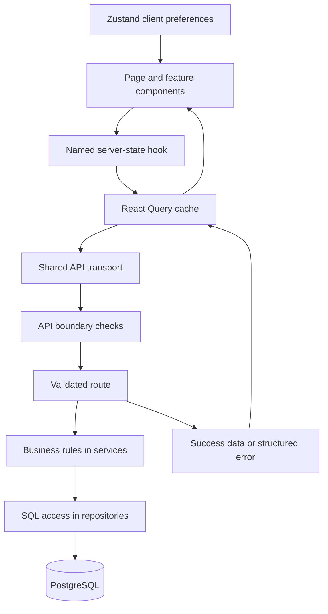
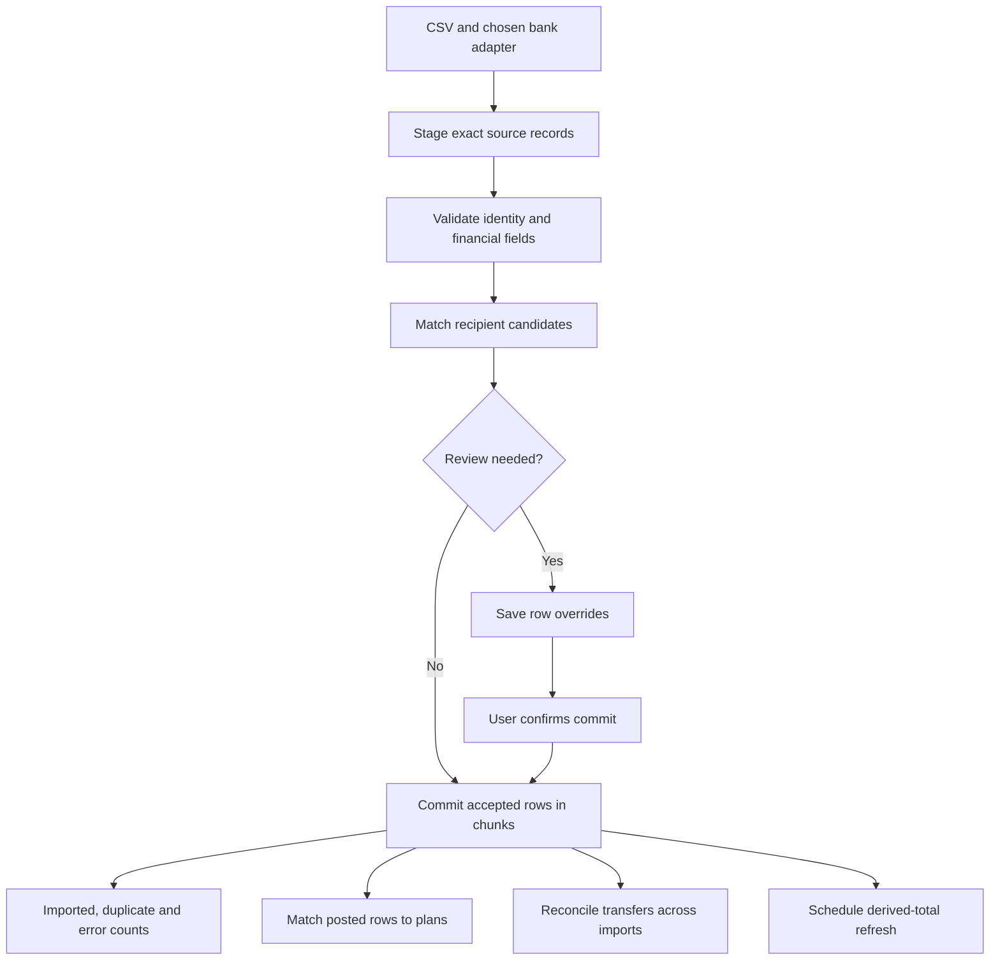
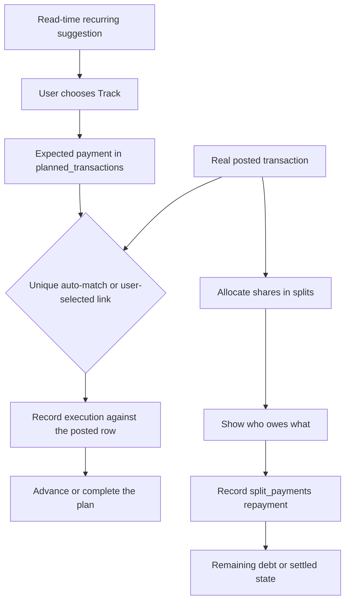
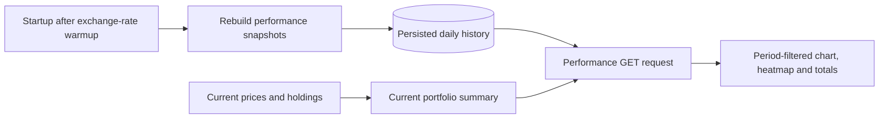
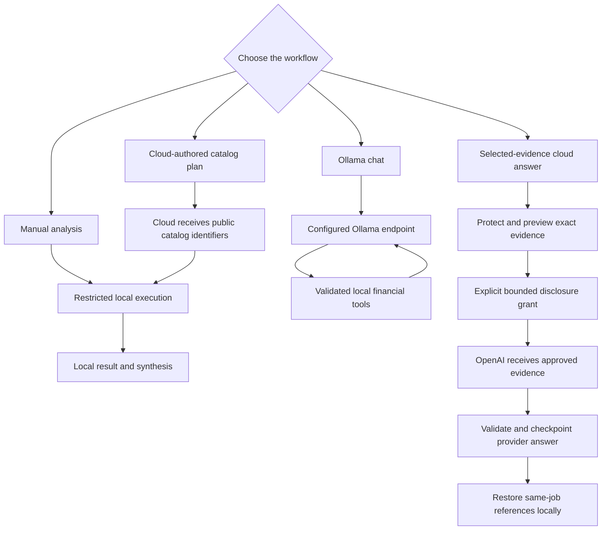
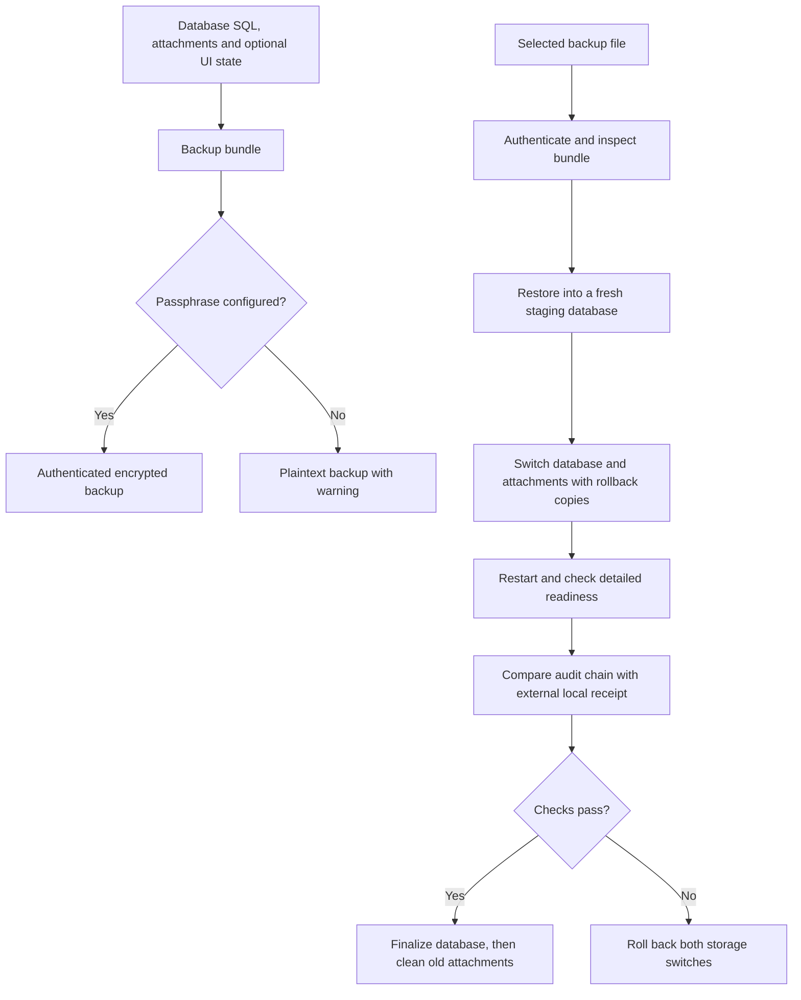

# Understand Vision Visually

Start with a small diagram, then follow its interactive journey. Open
[the flow visualizer](../flow-visualizer.html#api-request) in a browser. It works as a standalone
file, without a build or network calls.

**Journey** shows ordered handoffs between components. Select a card to inspect that step.
**Architecture map** places the same handoffs in the full system. Payloads and source details
are folded into the right panel. Each flow links to its fuller notes.

Use the **Learning path** selector to narrow the list and follow its suggested order. The paths
cover the most important concepts; **All flows** also includes specialist and experimental flows.

| Learning path          | Start with                                                                                                                                                                                                                                                                                | What to understand                                                           |
| ---------------------- | ----------------------------------------------------------------------------------------------------------------------------------------------------------------------------------------------------------------------------------------------------------------------------------------- | ---------------------------------------------------------------------------- |
| Start here             | [Page request](../flow-visualizer.html#api-request), [dashboard totals](../flow-visualizer.html#dashboard-summary), [desktop startup](../flow-visualizer.html#native-startup)                                                                                                             | Where data lives and which layer does what                                   |
| Everyday money         | [Import](../flow-visualizer.html#csv-import), [review](../flow-visualizer.html#import-commit), [transfers](../flow-visualizer.html#internal-transfer-reconciliation), [splits](../flow-visualizer.html#split-shared-expense), [plans](../flow-visualizer.html#planned-payment-completion) | Posted records, debt and expectations have different meanings                |
| Portfolio and planning | [Prices](../flow-visualizer.html#refresh-prices), [performance](../flow-visualizer.html#portfolio-valuation), [cash commitments](../flow-visualizer.html#commitment-aware-cash)                                                                                                           | Current prices, historical snapshots and future projections are separate     |
| Research and AI        | [Manual analysis](../flow-visualizer.html#manual-analysis), [Ollama chat](../flow-visualizer.html#ai-chat), [catalog plans](../flow-visualizer.html#cloud-catalog-analysis), [evidence disclosure](../flow-visualizer.html#cloud-evidence-disclosure)                                     | Which calculations are local and which selected information can leave Vision |
| Backup and trust       | [Backup](../flow-visualizer.html#backup-create), [restore](../flow-visualizer.html#backup-restore), [audit receipt](../flow-visualizer.html#native-audit-receipt)                                                                                                                         | Backup coverage, rollback and external continuity checks                     |

## How a page gets data

React Query owns cached server data. Zustand owns client preferences. A mutation can invalidate
several query families because one record affects more than one screen. For example, changing a
transaction can affect account balances and dashboard totals.

The dashboard resolves hidden-category and recipient exclusions before fetching a monthly
summary. Matching consumers share one query. Its raw transaction count is a separate query and
does not apply those exclusions. See [[docs/architecture/frontend-architecture|Frontend Architecture]], [[docs/architecture/backend-architecture|Backend Architecture]], and
[[docs/features/statistics|Statistics]].

## How imported records become usable money data

Exact source provenance and duplicate identity answer different questions. Provenance explains
where a record came from. Identity helps decide whether it already exists. Successful chunks
remain committed even when other rows fail. See [[docs/features/import|Import]] and
[[docs/reference/provider-neutral-transaction-provenance|Transaction Provenance]].

## Posted money, plans and shared debt

A due date does not create a transaction. Plan execution links a real posted row. Recording a
split repayment changes debt tracking; it does not post another ledger transaction.

An internal transfer has two real account movements. An unambiguous same-currency pair can be
marked automatically across imports. Marked transfers still affect account balances, while
income and spending summaries omit them. Ambiguous or cross-currency pairs can be resolved through
the transfer API; the current frontend has no dedicated transfer controls.

See [[docs/features/plannedTransactions|Planned Transactions]], [[docs/features/splits|Splits & Owes]], and [[docs/features/transfers|Internal Transfers]].

## Portfolio reads and historical snapshots

Reading Performance does not insert snapshot rows. Historical charts and current totals are
combined in one response but represent different time views. The latest plotted snapshot is
provisional. Cash projections and rebalancing estimates add assumptions about future commitments;
they do not change posted holdings or cash. See [[docs/features/portfolio|Portfolio]] and
[[docs/features/cash-flow-forecast|Cash Flow Forecast]].

## AI and provider boundaries

These paths have different disclosure rules. Ollama is local in the default desktop setup, but a
configured remote URL sends prompts and tool results to that host. Its tool loop has at most six
iterations. Catalog-only cloud planning keeps private execution and synthesis local.
Selected-evidence cloud synthesis sends the approved evidence and skips cloud planning and Ollama
synthesis. An uncertain disclosure remains recorded as sent and is not automatically replayed.

See [[docs/security/ai-data-access|AI Data Access]], [[docs/features/ai-chat|AI Chat]], and
[[docs/features/analysis-workspace|Analysis Workspace]].

## Backup and recovery

Installation keys and audit anchors remain outside the bundle. Automated and quit-time backups
omit the current frontend-state snapshot. Restore recovery can permit one explicitly approved
audit retry after safe rollback; it preserves the external receipt. See
[[docs/features/backup-coverage-audit|Backup Coverage Audit]] and
[[docs/guides/native-macos-runtime|Native macOS Runtime]].

## Maintaining the visual documentation

The interactive data lives in the HTML's `flow-data` JSON block. Keep component IDs stable,
learning-path references valid, and source annotations tied to real code. Stable flow IDs allow
notes to link directly with `flow-visualizer.html#flow-id`. The repository check
`node --test scripts/tests/flow-visualizer.test.js` validates data references and interactions in
a Document Object Model (DOM) test environment. It does not establish browser layout or Obsidian
diagram rendering.

## Related

- [[docs/guides/index|Guides]]
- [[docs/architecture/index|Architecture Overview]]
- [[docs/diagrams/index|Diagrams Index]]
- [[docs/guides/kb-maintenance|KB Maintenance]]
- [[docs/features/views|Views and Pages]]
