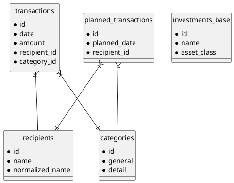

# Data Model Reference

> [!abstract] Overview
> This document provides a complete reference of all data entities in Vision's domain model. Designed for **developers** working with the database, **AI agents** understanding the domain, and **computer scientists** studying the entity relationships.

---

## Core Entities

### Transaction

**Purpose:** Core financial record representing money movement.

| Field | Type | Constraints | Description |
|-------|------|-------------|-------------|
| `id` | SERIAL | PK | Unique identifier |
| `date` | DATE | NOT NULL | Transaction date |
| `amount` | NUMERIC(15,2) | NOT NULL | Amount (negative=expense, positive=income) |
| `currency` | VARCHAR(3) | DEFAULT 'EUR' | Currency code |
| `balance` | NUMERIC(15,2) | NULLABLE | Running balance after transaction |
| `memo` | TEXT | NULLABLE | Original bank description |
| `comment` | TEXT | NULLABLE | User-added note |
| `bank_account` | TEXT | NULLABLE | Source bank account |
| `recipient_id` | INTEGER | FK → recipients | Associated recipient |
| `recipient_bank_account_id` | INTEGER | FK → recipient_bank_accounts | Specific bank account |
| `category_id` | INTEGER | FK → categories | Associated category |
| `is_active` | BOOLEAN | DEFAULT true | Soft delete |

**Indexes:** `idx_transactions_date`, `idx_transactions_recipient`, `idx_transactions_category`

**Related:** [[docs/features/transactions|Transactions Feature]], [[docs/api/transactions|Transactions API]]

---

### Recipient

**Purpose:** Person or entity associated with transactions (payee/payer).

| Field | Type | Constraints | Description |
|-------|------|-------------|-------------|
| `id` | SERIAL | PK | Unique identifier |
| `name` | TEXT | NOT NULL | Display name |
| `normalized_name` | TEXT | UNIQUE | Canonical form for matching |
| `default_category_id` | INTEGER | FK → categories | Suggested category |
| `primary_recipient_id` | INTEGER | FK → recipients | Merge target (self-referencing) |
| `notes` | TEXT | NULLABLE | User notes |
| `is_active` | BOOLEAN | DEFAULT true | Soft delete |

**Related:** [[docs/api/recipients|Recipients API]], [[docs/features/transactions#recipients|Recipient Feature]]

---

### Category

**Purpose:** Organizational label for transactions using "GENERAL:DETAIL" format.

| Field | Type | Constraints | Description |
|-------|------|-------------|-------------|
| `id` | SERIAL | PK | Unique identifier |
| `general` | TEXT | NOT NULL | General category (e.g., FOOD, TRANSPORT) |
| `detail` | TEXT | NOT NULL | Detail category (e.g., GROCERIES, GAS) |
| `description` | TEXT | NULLABLE | Optional description |
| `is_active` | BOOLEAN | DEFAULT true | Soft delete |

**Constraint:** UNIQUE(general, detail)

**Related:** [[docs/api/categories|Categories API]], [[docs/features/transactions#categories|Categories Feature]]

---

### RecipientBankAccount

**Purpose:** Bank account details for recipients (for payments).

| Field | Type | Constraints | Description |
|-------|------|-------------|-------------|
| `id` | SERIAL | PK | Unique identifier |
| `recipient_id` | INTEGER | FK → recipients | Parent recipient |
| `account_number` | VARCHAR(34) | UNIQUE | IBAN or account number |
| `bank_name` | TEXT | NULLABLE | Bank name |
| `is_primary` | BOOLEAN | DEFAULT false | Primary payment account |
| `is_active` | BOOLEAN | DEFAULT true | Soft delete |

**Related:** [[docs/api/recipientBankAccounts|Recipient Bank Accounts API]]

---

## Planning Entities

### PlannedTransaction

**Purpose:** Future or recurring transaction scheduled for execution.

| Field | Type | Constraints | Description |
|-------|------|-------------|-------------|
| `id` | SERIAL | PK | Unique identifier |
| `planned_date` | DATE | NOT NULL | Scheduled date |
| `amount` | NUMERIC(15,2) | NOT NULL | Planned amount |
| `recipient_id` | INTEGER | FK → recipients | Payee |
| `category_id` | INTEGER | FK → categories | Category |
| `is_recurring` | BOOLEAN | DEFAULT false | Recurring flag |
| `recurrence_pattern` | TEXT | NULLABLE | Pattern (daily, weekly, monthly, etc.) |
| `is_loan` | BOOLEAN | DEFAULT false | Loan flag |
| `is_executed` | BOOLEAN | DEFAULT false | Execution flag |
| `is_active` | BOOLEAN | DEFAULT true | Soft delete |

**Related:** [[docs/features/plannedTransactions|Planned Transactions Feature]], [[docs/api/plannedTransactions|API]]

---

### PlannedTransactionExecution

**Purpose:** Link between planned transaction and actual executed transaction.

| Field | Type | Constraints | Description |
|-------|------|-------------|-------------|
| `id` | SERIAL | PK | Unique identifier |
| `planned_transaction_id` | INTEGER | FK → planned_transactions | Source planned transaction |
| `executed_transaction_id` | INTEGER | FK → transactions | Executed transaction |
| `execution_date` | DATE | NOT NULL | Date of execution |

---

### PlannedTransactionLoanSchedule

**Purpose:** Amortization schedule for loan planned transactions.

| Field | Type | Constraints | Description |
|-------|------|-------------|-------------|
| `id` | SERIAL | PK | Unique identifier |
| `planned_transaction_id` | INTEGER | FK → planned_transactions | Parent loan |
| `installment_number` | INTEGER | NOT NULL | Payment sequence number |
| `due_date` | DATE | NOT NULL | Scheduled payment date |
| `payment_amount` | NUMERIC(15,2) | NOT NULL | Total payment |
| `principal_amount` | NUMERIC(15,2) | NOT NULL | Principal portion |
| `interest_amount` | NUMERIC(15,2) | NOT NULL | Interest portion |
| `remaining_principal` | NUMERIC(15,2) | NOT NULL | Outstanding principal |

**Related:** [[docs/integrations/loan-repayment-service|Loan Repayment Service]]

---

## Portfolio Entities

### Investment (Base Table)

**Purpose:** Abstract base for all investment types using PostgreSQL table inheritance.

| Field | Type | Constraints | Description |
|-------|------|-------------|-------------|
| `id` | SERIAL | PK | Unique identifier |
| `name` | VARCHAR(200) | NOT NULL | Display name |
| `asset_class` | asset_class | NOT NULL | Enum: stock, etf, crypto, metals, real_estate, savings, bond |
| `currency` | VARCHAR(10) | DEFAULT 'EUR' | Trading currency |
| `is_active` | BOOLEAN | DEFAULT true | Soft delete |

**Child Tables:**
- `stock_investments` — Stocks (symbol, current_price)
- `etf_investments` — ETFs (symbol, current_price)
- `crypto_investments` — Crypto (symbol, current_price)
- `metals_investments` — Precious metals (symbol, current_price)
- `real_estate_investments` — Real estate (location, cadastral_income, municipality_tax_rate)
- `savings_investments` — Savings accounts (interest_rate)
- `bond_investments` — Bonds (interest_rate, maturity_date)

**Related:** [[docs/features/portfolio|Portfolio Feature]], [[docs/adr/004-postgresql-table-inheritance|ADR-004]]

---

### PortfolioTransaction (Base Table)

**Purpose:** Base for investment buy/sell transactions.

| Field | Type | Constraints | Description |
|-------|------|-------------|-------------|
| `id` | SERIAL | PK | Unique identifier |
| `investment_id` | INTEGER | FK → investments_base | Associated investment |
| `type` | portfolio_txn_type | NOT NULL | Enum: buy, sell, dividend, transfer |
| `date` | DATE | NOT NULL | Transaction date |
| `amount` | NUMERIC(18,4) | NOT NULL | Total amount |
| `currency` | VARCHAR(10) | DEFAULT 'EUR' | Currency |
| `fx_rate_to_eur` | NUMERIC(20,10) | NULLABLE | FX rate to EUR |

**Child Tables** (inherit units field):
- `stock_transactions` — units NUMERIC(18,8)
- `etf_transactions` — units NUMERIC(18,8)
- `crypto_transactions` — units NUMERIC(18,8)
- `metals_transactions` — units NUMERIC(18,8)

---

### Watchlist

**Purpose:** Securities to track with target price alerts.

| Field | Type | Constraints | Description |
|-------|------|-------------|-------------|
| `id` | SERIAL | PK | Unique identifier |
| `name` | VARCHAR(200) | NOT NULL | Display name |
| `symbol` | VARCHAR(20) | NOT NULL | Trading symbol |
| `asset_class` | asset_class | NOT NULL | Asset type |
| `target_price` | NUMERIC(18,6) | NOT NULL | Target price |
| `currency` | VARCHAR(10) | NULLABLE | Currency |

**Related:** [[docs/features/watchlist|Watchlist Feature]], [[docs/api/watchlist|API]]

---

### PortfolioPerformanceSnapshot

**Purpose:** Daily cached portfolio performance for fast loading.

| Field | Type | Description |
|-------|------|-------------|
| `snapshot_date` | DATE | Date of snapshot |
| `invested_stocks_etfs` | NUMERIC(18,2) | Invested in stocks/ETFs |
| `invested_crypto` | NUMERIC(18,2) | Invested in crypto |
| `invested_metals` | NUMERIC(18,2) | Invested in metals |
| `value_stocks_etfs` | NUMERIC(18,2) | Market value of stocks/ETFs |
| `value_crypto` | NUMERIC(18,2) | Market value of crypto |
| `value_metals` | NUMERIC(18,2) | Market value of metals |
| `total_invested` | NUMERIC(18,2) | Total invested capital |
| `total_value` | NUMERIC(18,2) | Total market value |
| `inflation_adjusted_value` | NUMERIC(18,2) | Value adjusted for Belgian inflation |
| `gain_loss` | NUMERIC(18,2) | Absolute gain/loss |
| `gain_loss_pct` | NUMERIC(8,4) | Percentage gain/loss |

**Related:** [[docs/performance/caching-strategies|Caching Strategies]]

---

## Supporting Entities

### ExchangeRate

**Purpose:** Historical and latest exchange rates for currency conversion (EUR-only legacy table).

| Field | Type | Constraints | Description |
|-------|------|-------------|-------------|
| `id` | SERIAL | PK | Unique identifier |
| `currency_code` | VARCHAR(3) | NOT NULL | ISO currency code |
| `rate_to_eur` | NUMERIC(20,10) | NOT NULL | Rate to EUR |
| `rate_date` | DATE | NOT NULL | Rate date |
| `is_latest` | BOOLEAN | DEFAULT false | Latest rate flag |

**Related:** [[docs/integrations/currency-conversion|Currency Conversion]], [[docs/api/info|Info API]]

> [!note] Phase 0 Note
> See `exchange_rate_cache` below. The new table supports arbitrary currency pair caching; the legacy `exchange_rates` table is preserved for backward compatibility during Phase 0.

---

### ExchangeRateCache

**Purpose:** Cached exchange rates for any currency pair at any date. Complements `exchange_rates` (EUR-only) for full FX flexibility.

| Field | Type | Constraints | Description |
|-------|------|-------------|-------------|
| `id` | SERIAL | PK | Unique identifier |
| `from_ccy` | CHAR(3) | NOT NULL | Source currency code (ISO 4217) |
| `to_ccy` | CHAR(3) | NOT NULL | Target currency code (ISO 4217) |
| `rate_date` | DATE | NOT NULL | Date the rate applies |
| `rate` | NUMERIC(20,10) | NOT NULL | Exchange rate (from → to) |
| `fetched_at` | TIMESTAMPTZ | DEFAULT NOW() | When this rate was fetched |

**Constraints:**
- `UNIQUE(from_ccy, to_ccy, rate_date)` — No duplicate rate pairs on the same date
- `CHECK (rate > 0)` — All rates must be positive
- Indices: `idx_exchange_rate_cache_date` (for date range queries), `idx_exchange_rate_cache_from_to` (for pair lookups)

**Related:** [[docs/integrations/currency-conversion|Currency Conversion]], migration [[alembic/versions/0025_exchange_rate_cache.py|0025]]

---

### BelgianInflationRate

**Purpose:** Monthly Belgian inflation rates for portfolio adjustment.

| Field | Type | Description |
|-------|------|-------------|
| `month` | DATE | Month (first day of month) |
| `rate` | NUMERIC(8,6) | Monthly inflation rate |
| `source` | VARCHAR(50) | Statbel or Eurostat |

**Related:** [[docs/integrations/belgian-inflation|Belgian Inflation]]

---

## AI Chat Entities (Phase 10)

### AIConversation

**Purpose:** Persisted conversation with a local LLM. Stores metadata for chat thread management.

| Field | Type | Constraints | Description |
|-------|------|-------------|-------------|
| `id` | UUID | PK | Unique conversation identifier |
| `title` | TEXT | NOT NULL, ≤200 chars | User-provided title |
| `model` | TEXT | NOT NULL | Ollama model name (e.g., `llama3.2:3b`) |
| `created_at` | TIMESTAMPTZ | NOT NULL | Conversation creation time |
| `updated_at` | TIMESTAMPTZ | DEFAULT NOW() | Last message time |

**Related:** [[docs/features/ai-chat|AI Chat Feature]]

---

### AIMessage

**Purpose:** Individual messages in a conversation — user queries, LLM responses, and tool invocations.

| Field | Type | Constraints | Description |
|-------|------|-------------|-------------|
| `id` | UUID | PK | Unique message identifier |
| `conversation_id` | UUID | FK → ai_conversations | Parent conversation |
| `role` | TEXT | CHECK IN ('user', 'assistant', 'tool', 'system') | Message sender type |
| `content` | TEXT | NULLABLE | Message text (user/assistant/system) |
| `tool_name` | TEXT | NULLABLE | Tool invoked (only when role='tool') |
| `tool_args` | JSONB | NULLABLE | Tool arguments (only when role='tool') |
| `tool_result` | JSONB | NULLABLE | Tool result (only when role='tool') |
| `created_at` | TIMESTAMPTZ | NOT NULL | Message creation time |

**Indices:** `ai_messages(conversation_id, created_at)` — ordered retrieval

**Related:** [[docs/security/ai-data-access|AI Data Access Policy]], [[docs/integrations/ollama|Ollama Integration]]

---

## Aggregation Entities (Phase 1)

> [!info] Aggregation Layer
> These entities are introduced in Alembic migration 0026 as part of the Phase 1 aggregation refactor. They serve as the caching tier for dashboard and analytics endpoints, using two strategies:
> - **Materialized Views** (computed on demand, refreshed after mutations)
> - **Trigger-maintained Tables** (updated automatically via row-level triggers)
>
> See [[docs/adr/010-phase1-aggregation-strategy|ADR-010]] for the design rationale.

### mv_recipient_monthly (Materialized View)

**Purpose:** Pre-computed monthly aggregates per recipient per currency, with rollup to primary recipient.

**Scope:** Last 24 months for freshness (older totals read from `agg_recipient_totals`)

| Field | Type | Description |
|-------|------|-------------|
| `month_start` | DATE | First day of the month |
| `year` | INTEGER | Year (denormalized for querying) |
| `month` | INTEGER | Month 1–12 (denormalized for querying) |
| `recipient_id` | INTEGER | FK → recipients (rolled up via `COALESCE(r.primary_recipient_id, t.recipient_id)`) |
| `currency` | CHAR(3) | ISO currency code |
| `transaction_count` | INTEGER | Count of transactions |
| `total_income` | NUMERIC(18,2) | Sum of positive amounts |
| `total_spending` | NUMERIC(18,2) | Sum of negative amounts |
| `net_amount` | NUMERIC(18,2) | Total (income + spending) |

**Indexes:**
- Unique: `(month_start, recipient_id, currency)` — enables concurrent refresh

**Maintenance:** On-demand via `refreshAggregations()`, debounced after mutations

**Related:** [[docs/performance/materialized-views|Materialized Views]], [[docs/adr/010-phase1-aggregation-strategy|ADR-010]]

---

### agg_recipient_totals (Trigger-Maintained Table)

**Purpose:** Running all-time totals per recipient per currency. Maintained automatically via row-level triggers on `transactions`.

**PK:** `(recipient_id, currency)`

| Field | Type | Description |
|-------|------|-------------|
| `recipient_id` | INTEGER | FK → recipients (ON DELETE CASCADE) |
| `currency` | CHAR(3) | ISO currency code |
| `total_amount` | NUMERIC(18,2) | Running sum of amounts |
| `transaction_count` | INTEGER | Count of active transactions |
| `last_transaction_date` | DATE | Most recent transaction date |
| `updated_at` | TIMESTAMPTZ | Last update timestamp |

**Indexes:**
- Primary: `(recipient_id, currency)`
- Secondary: `idx_agg_recipient_totals_currency`

**Maintenance:** Real-time via triggers:
- `fn_agg_recipient_totals_sync()` on `transactions` (AFTER INSERT/UPDATE/DELETE)
- Respects `is_active` flag (inactive transactions excluded from totals)
- Uses UPSERT semantics for idempotency

**Call-site pattern:** No application code calls refresh; triggers keep this in sync.

**Related:** [[docs/adr/010-phase1-aggregation-strategy|ADR-010]]

---

### agg_split_outstanding (Trigger-Maintained Table)

**Purpose:** Outstanding balance per split, maintained automatically via triggers. Powers the owed-balance endpoints.

**PK:** `split_id`

| Field | Type | Description |
|-------|------|-------------|
| `split_id` | INTEGER | FK → transaction_splits (ON DELETE CASCADE) |
| `recipient_id` | INTEGER | FK → recipients (ON DELETE CASCADE) |
| `original_amount` | NUMERIC(15,2) | Original split amount |
| `paid_amount` | NUMERIC(15,2) | Total paid via `split_payments` |
| `outstanding_amount` | NUMERIC(15,2) | `original - paid` |
| `updated_at` | TIMESTAMPTZ | Last update timestamp |

**Indexes:**
- Primary: `split_id`
- Secondary: `idx_agg_split_outstanding_recipient`
- Partial (open only): `idx_agg_split_outstanding_open` on `outstanding_amount <> 0`

**Maintenance:** Real-time via triggers:
- `fn_trg_split_sync()` on `transaction_splits` (AFTER INSERT/UPDATE/DELETE)
- `fn_trg_split_payment_sync()` on `split_payments` (AFTER INSERT/UPDATE/DELETE)
- Syncs via `fn_agg_split_outstanding_sync(split_id)` helper (idempotent)

**Call-site pattern:** No application code calls refresh; triggers keep this in sync.

**Related:** [[docs/adr/010-phase1-aggregation-strategy|ADR-010]]

---

### UserSetting

**Purpose:** User preferences stored as JSONB.

| Field | Type | Constraints | Description |
|-------|------|-------------|-------------|
| `key` | TEXT | PK | Setting key |
| `value` | JSONB | NOT NULL | Setting value |

**Related:** [[docs/features/settings|Settings Feature]], [[docs/api/settings|Settings API]]

---

### SavedChart

**Purpose:** User-saved custom chart configurations.

| Field | Type | Description |
|-------|------|-------------|
| `id` | SERIAL | PK |
| `name` | TEXT | Chart name |
| `chart_type` | TEXT | Chart type |
| `category_ids` | INTEGER[] | Associated categories |

**Related:** [[docs/features/saved-charts|Saved Charts]], [[docs/api/savedCharts|API]]

---

### RawTransaction

**Purpose:** Bank-specific raw transaction data for audit and deduplication.

| Field | Type | Description |
|-------|------|-------------|
| `id` | SERIAL | PK |
| `bank_name` | TEXT | Bank identifier |
| `raw_data` | JSONB | Original CSV row |
| `hash` | TEXT | SHA-256 for dedup |
| `import_id` | INTEGER | FK → imports |

**Related:** [[docs/features/import|Import Feature]]

---

## Entity Relationships



---

## Query Patterns

### Transaction with Recipient and Category

```sql
SELECT t.*, r.name as recipient, c.general, c.detail
FROM transactions t
LEFT JOIN recipients r ON t.recipient_id = r.id
LEFT JOIN categories c ON t.category_id = c.id
WHERE t.is_active = true
ORDER BY t.date DESC
LIMIT 50;
```

### Portfolio Summary by Asset Class

```sql
SELECT 
  i.asset_class,
  COUNT(*) as holdings,
  SUM(pt.amount * pt.fx_rate_to_eur) as total_invested
FROM investments_base i
JOIN portfolio_transactions_base pt ON i.id = pt.investment_id
WHERE i.is_active = true
GROUP BY i.asset_class;
```

---

## Related

- [[docs/adr/002-database-schema|Database Schema ADR]]
- [[docs/adr/010-phase1-aggregation-strategy|ADR-010: Aggregation Strategy]]
- [[docs/reference/database-query-patterns|Database Query Patterns]]
- [[docs/reference/database-triggers|Database Triggers]]
- [[docs/performance/materialized-views|Materialized Views]]
- [[docs/architecture/backend-architecture|Backend Architecture]]