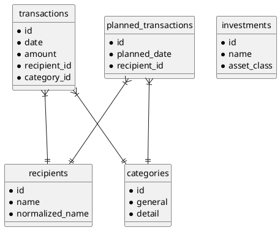

# Data Model Reference

> [!abstract] Overview
> This document provides a complete reference of all data entities in Vision's domain model. Designed for **developers** working with the database, **AI agents** understanding the domain, and **computer scientists** studying the entity relationships.

---

## Core Entities

### Transaction

**Purpose:** Core financial record representing money movement.

| Field                       | Type          | Constraints                                                          | Description                                                                                                                                                                                                                                                                                                                                                                |
| --------------------------- | ------------- | -------------------------------------------------------------------- | -------------------------------------------------------------------------------------------------------------------------------------------------------------------------------------------------------------------------------------------------------------------------------------------------------------------------------------------------------------------------- |
| `id`                        | SERIAL        | PK                                                                   | Unique identifier                                                                                                                                                                                                                                                                                                                                                          |
| `date`                      | DATE          | NOT NULL                                                             | Transaction date                                                                                                                                                                                                                                                                                                                                                           |
| `amount`                    | NUMERIC(18,4) | NOT NULL                                                             | Amount (negative=expense, positive=income). Widened from `NUMERIC(15,2)` in migration 0025 (`fix_numeric_precision`).                                                                                                                                                                                                                                                      |
| `currency`                  | VARCHAR(3)    | NOT NULL, DEFAULT 'EUR', CHECK (`currency ~ '^[A-Z]{3}$'`) NOT VALID | Currency code (migration 0046 — see note below)                                                                                                                                                                                                                                                                                                                            |
| `balance`                   | NUMERIC(18,4) | NULLABLE                                                             | Running balance after transaction; widened by migration 0088. **Written exclusively by the import pipeline** (`importPipeline/commit.js`). `NULL` on manually-created rows. `PATCH /api/transactions/:id` and `POST /api/transactions` (create) no longer accept this field. `TransactionInfoDialog` renders it read-only. See [[docs/adr/094-balance-reconciliation-drift | ADR-094 addendum (2026-06-25)]]. |
| `memo`                      | TEXT          | NULLABLE                                                             | Original bank description                                                                                                                                                                                                                                                                                                                                                  |
| `comment`                   | TEXT          | NULLABLE                                                             | User-added note                                                                                                                                                                                                                                                                                                                                                            |
| `bank_account`              | TEXT          | NULLABLE                                                             | Source bank account (string; being retired in favour of `account_id` — ADR-088)                                                                                                                                                                                                                                                                                            |
| `account_id`                | INTEGER       | FK → accounts ON DELETE RESTRICT, NULLABLE                           | Owning account (ADR-088, migration 0050); kept in sync with `bank_account` by the dual-write trigger (migration 0051)                                                                                                                                                                                                                                                      |
| `recipient_id`              | INTEGER       | FK → recipients                                                      | Associated recipient                                                                                                                                                                                                                                                                                                                                                       |
| `recipient_bank_account_id` | INTEGER       | FK → recipient_bank_accounts                                         | Specific bank account                                                                                                                                                                                                                                                                                                                                                      |
| `category_id`               | INTEGER       | FK → categories ON DELETE SET NULL, NULLABLE                         | Associated category; FK updated to ON DELETE SET NULL by migration 0048 — deleting a category un-categorizes affected rows                                                                                                                                                                                                                                                 |
| `is_active`                 | BOOLEAN       | DEFAULT true                                                         | Soft delete                                                                                                                                                                                                                                                                                                                                                                |
| `import_batch_id`           | BIGINT        | FK → import_batches ON DELETE SET NULL, NULLABLE                     | Import batch that created this transaction; NULL for manual entries and pre-pipeline rows (migration 0003)                                                                                                                                                                                                                                                                 |
| `updated_at`                | TIMESTAMPTZ   | NOT NULL, DEFAULT NOW()                                              | Last modification timestamp; NOT NULL enforced by migration 0022                                                                                                                                                                                                                                                                                                           |
| `tx_hash`                   | TEXT          | UNIQUE (partial, WHERE NOT NULL), NULLABLE                           | Import-pipeline deduplication hash; NULL for manually-entered transactions; enables race-safe `ON CONFLICT (tx_hash) DO NOTHING` (migration 0036)                                                                                                                                                                                                                          |
| `is_transfer`               | BOOLEAN       | NOT NULL, DEFAULT false                                              | Internal transfer between own accounts — excluded from cash-flow aggregates by default (ADR-083, migration 0044)                                                                                                                                                                                                                                                           |
| `transfer_peer_id`          | INTEGER       | FK → transactions ON DELETE SET NULL, NULLABLE                       | The matched transfer leg (self-referential pairing)                                                                                                                                                                                                                                                                                                                        |
| `transfer_source`           | TEXT          | NULLABLE, CHECK `auto` \| `manual`                                   | How the transfer was marked; `manual` is sticky and never overwritten by auto-detection                                                                                                                                                                                                                                                                                    |

**Indexes:** `idx_transactions_date`, `idx_transactions_recipient`, `idx_transactions_category`, `idx_transactions_amount_date` (transfer matching), `idx_transactions_transfer_peer` (partial, peer lookups)

> [!warning] Pending migrations (AUTHORED, NOT YET APPLIED unless noted)
>
> - **0046**: backfills `currency` NULL → `'EUR'`; adds ISO format CHECK (`^[A-Z]{3}$`) NOT VALID; sets `DEFAULT 'EUR' NOT NULL`. Three INSERT paths now write `'EUR'` instead of NULL (`transactionRepository.create`, `plannedTransactionService.create`, `importPipeline/commit.js`).
> - **0048**: changes `category_id` FK to `ON DELETE SET NULL` (previously implicit RESTRICT, which surfaced as 500 on category delete).
> - **0047**: adds partial unique index `uq_recipient_primary_account ON recipient_bank_accounts (recipient_id) WHERE is_primary` (see RecipientBankAccount below).
> - **0050** (ADR-088): creates the `accounts` table + nullable `account_id` FKs (`ON DELETE RESTRICT`) on transactions/planned_transactions, backfilled one account per distinct `bank_account` string.
> - **0051** (ADR-088): `BEFORE INSERT/UPDATE` trigger that keeps `account_id` in sync with `bank_account` (dual-write phase).
> - **0062** (ADR-088 addendum, 2026-06-25, AUTHORED NOT YET APPLIED): hardens `sync_account_id_from_bank_account()` to be **lookup-only on UPDATE** (INSERT still resolves-or-creates; UPDATE only resolves against existing accounts, never creates). Also adds `trg_enforce_split_within_amount` — a `BEFORE UPDATE` trigger on `transactions` that raises `check_violation` when `amount` is reduced below the sum of its splits (`SUM(transaction_splits.amount) > ABS(NEW.amount) + 0.005`). Down-revision: `0061_investments_show_in_ticker`. See [[alembic/versions/0062_trigger_lookup_only_on_update.py]] and [[docs/adr/088-account-entity|ADR-088 addendum]].

**Related:** [[docs/features/transactions|Transactions Feature]], [[docs/api/transactions|Transactions API]]

---

### Account

**Purpose:** The user's own account (ADR-088) — the spine tying budgeting cash, portfolio
holdings, and liabilities together. Distinct from `recipient_bank_accounts` (counterparty IBANs).

| Field                       | Type                    | Constraints                                        | Description                                                                                       |
| --------------------------- | ----------------------- | -------------------------------------------------- | ------------------------------------------------------------------------------------------------- |
| `id`                        | SERIAL                  | PK                                                 | Unique identifier                                                                                 |
| `name`                      | TEXT                    | NOT NULL, UNIQUE                                   | Canonical account name (backfilled from `bank_account`)                                           |
| `display_name`              | TEXT                    | NULLABLE                                           | Friendly label                                                                                    |
| `institution`               | TEXT                    | NULLABLE                                           | Bank / broker                                                                                     |
| `currency`                  | VARCHAR(3)              | NOT NULL, DEFAULT 'EUR', CHECK (`^[A-Z]{3}$`)      | ISO-4217 (ADR-086 convention)                                                                     |
| `type`                      | account_type            | NOT NULL, DEFAULT 'checking'                       | checking/savings/brokerage/crypto_exchange/wallet/pension/liability                               |
| `liquidity_class`           | account_liquidity_class | NOT NULL, DEFAULT 'liquid'                         | liquid/semi_liquid/illiquid                                                                       |
| `spendable`                 | BOOLEAN                 | NOT NULL, DEFAULT true                             | Spendable vs earmarked                                                                            |
| `in_net_worth`              | BOOLEAN                 | NOT NULL, DEFAULT true                             | Counts toward net worth                                                                           |
| `tax_wrapper`               | account_tax_wrapper     | NOT NULL, DEFAULT 'none'                           | none/pension/tax_advantaged                                                                       |
| `owner`                     | account_owner           | NOT NULL, DEFAULT 'me'                             | me/partner/joint (feeds marital quotient)                                                         |
| `multi_currency_cash`       | BOOLEAN                 | NOT NULL, DEFAULT false                            | Holds cash in multiple currencies                                                                 |
| `has_cash_sleeve`           | BOOLEAN                 | NOT NULL, DEFAULT true                             | Holds a spendable cash balance (false for holding-only wallets)                                   |
| `funding_account_id`        | INTEGER                 | FK → accounts ON DELETE SET NULL, NULLABLE         | Settlement account for sleeve-less trades                                                         |
| `statement_balance`         | NUMERIC(18,4)           | NULLABLE                                           | Declared-currency compatibility projection; authoritative data is in `account_statement_balances` |
| `statement_balance_date`    | DATE                    | NULLABLE, required when `statement_balance` is set | Date of the compatibility projection                                                              |
| `is_active`                 | BOOLEAN                 | NOT NULL, DEFAULT true                             | Archived when false                                                                               |
| `created_at` / `updated_at` | TIMESTAMPTZ             | NOT NULL, DEFAULT NOW()                            | Timestamps (`updated_at` trigger)                                                                 |

The flag columns exist from migration 0050; their semantics are activated in ADR-089. Flag enum
types: `account_type`, `account_liquidity_class`, `account_tax_wrapper`, `account_owner`.

**Related:** [[docs/api/accounts|Accounts API]], [[docs/adr/088-account-entity|ADR-088]]

### AccountStatementBalance

**Table:** `account_statement_balances` (migration 0098, ADR-089 D2)

| Field          | Type          | Constraints                         | Description                   |
| -------------- | ------------- | ----------------------------------- | ----------------------------- |
| `account_id`   | INTEGER       | PK, FK → accounts ON DELETE CASCADE | Owning account                |
| `currency`     | VARCHAR(3)    | PK, CHECK (`^[A-Z]{3}$`)            | Native statement currency     |
| `balance`      | NUMERIC(18,4) | NOT NULL                            | Bank-reported balance         |
| `balance_date` | DATE          | NOT NULL                            | Effective date of the reading |

---

### Recipient

**Purpose:** Person or entity associated with transactions (payee/payer).

| Field                  | Type    | Constraints                                  | Description                                                            |
| ---------------------- | ------- | -------------------------------------------- | ---------------------------------------------------------------------- |
| `id`                   | SERIAL  | PK                                           | Unique identifier                                                      |
| `name`                 | TEXT    | NOT NULL                                     | Display name                                                           |
| `normalized_name`      | TEXT    | UNIQUE                                       | Canonical form for matching                                            |
| `default_category_id`  | INTEGER | FK → categories ON DELETE SET NULL, NULLABLE | Suggested category; FK updated to ON DELETE SET NULL by migration 0048 |
| `primary_recipient_id` | INTEGER | FK → recipients                              | Merge target (self-referencing)                                        |
| `notes`                | TEXT    | NULLABLE                                     | User notes                                                             |
| `is_active`            | BOOLEAN | DEFAULT true                                 | Soft delete                                                            |

**Related:** [[docs/api/recipients|Recipients API]], [[docs/features/transactions#recipients|Recipient Feature]]

---

### Category

**Purpose:** Organizational label for transactions using "GENERAL:DETAIL" format.

| Field         | Type    | Constraints  | Description                              |
| ------------- | ------- | ------------ | ---------------------------------------- |
| `id`          | SERIAL  | PK           | Unique identifier                        |
| `general`     | TEXT    | NOT NULL     | General category (e.g., FOOD, TRANSPORT) |
| `detail`      | TEXT    | NOT NULL     | Detail category (e.g., GROCERIES, GAS)   |
| `description` | TEXT    | NULLABLE     | Optional description                     |
| `is_active`   | BOOLEAN | DEFAULT true | Soft delete                              |

**Constraint:** UNIQUE(general, detail)

**Related:** [[docs/api/categories|Categories API]], [[docs/features/transactions#categories|Categories Feature]]

---

### Tag (May 2026)

**Purpose:** Freeform labels for transactions and planned transactions as an orthogonal classification dimension.

| Field        | Type         | Constraints       | Description                                 |
| ------------ | ------------ | ----------------- | ------------------------------------------- |
| `id`         | SERIAL       | PK                | Unique identifier                           |
| `slug`       | VARCHAR(255) | UNIQUE, NOT NULL  | URL-safe identifier (lowercase, hyphens)    |
| `color`      | VARCHAR(7)   | DEFAULT '#4f46e5' | Hex color code for UI chips                 |
| `is_active`  | BOOLEAN      | DEFAULT true      | Soft delete; reactivation preserves history |
| `created_at` | TIMESTAMPTZ  | DEFAULT NOW()     | Creation timestamp                          |
| `updated_at` | TIMESTAMPTZ  | DEFAULT NOW()     | Last modification timestamp                 |

**Related:** [[docs/features/tags|Tags Feature]], [[docs/adr/052-transaction-tags-orthogonal-dimension|ADR-052]]

---

### TransactionTag (May 2026)

**Purpose:** Many-to-many junction for associating tags with transactions.

| Field            | Type    | Constraints           | Description                |
| ---------------- | ------- | --------------------- | -------------------------- |
| `transaction_id` | INTEGER | PK, FK → transactions | Transaction being tagged   |
| `tag_id`         | INTEGER | PK, FK → tags         | Tag applied to transaction |

**Constraint:** PRIMARY KEY(transaction_id, tag_id), ON DELETE CASCADE

**Related:** [[docs/features/tags|Tags Feature]]

---

### PlannedTransactionTag (May 2026)

**Purpose:** Many-to-many junction for associating tags with planned transactions.

| Field                    | Type    | Constraints                   | Description                        |
| ------------------------ | ------- | ----------------------------- | ---------------------------------- |
| `planned_transaction_id` | INTEGER | PK, FK → planned_transactions | Planned transaction being tagged   |
| `tag_id`                 | INTEGER | PK, FK → tags                 | Tag applied to planned transaction |

**Constraint:** PRIMARY KEY(planned_transaction_id, tag_id), ON DELETE CASCADE

**Note:** Tags are inherited by executed copies of a planned transaction via `executeAndAdvance` operation.

**Related:** [[docs/features/tags|Tags Feature]]

---

### RecipientBankAccount

**Purpose:** Bank account details for recipients (for payments).

| Field            | Type        | Constraints     | Description             |
| ---------------- | ----------- | --------------- | ----------------------- |
| `id`             | SERIAL      | PK              | Unique identifier       |
| `recipient_id`   | INTEGER     | FK → recipients | Parent recipient        |
| `account_number` | VARCHAR(34) | UNIQUE          | IBAN or account number  |
| `bank_name`      | TEXT        | NULLABLE        | Bank name               |
| `is_primary`     | BOOLEAN     | DEFAULT false   | Primary payment account |
| `is_active`      | BOOLEAN     | DEFAULT true    | Soft delete             |

**Indexes:** Partial unique index `uq_recipient_primary_account ON recipient_bank_accounts (recipient_id) WHERE is_primary` — enforces at most one primary account per recipient at the DB level (migration 0047, AUTHORED NOT YET APPLIED; previously enforced at application level only).

> [!warning] Pending migration 0047 (AUTHORED, NOT YET APPLIED)
> Pre-existing duplicate primaries are demoted (lowest `id` wins) before the index is built. Downgrade drops the index but does not restore the prior duplicates.

**Related:** [[docs/api/recipientBankAccounts|Recipient Bank Accounts API]]

---

## Planning Entities

### PlannedTransaction

**Purpose:** Future or recurring transaction scheduled for execution.

| Field                         | Type          | Constraints                                                          | Description                                                  |
| ----------------------------- | ------------- | -------------------------------------------------------------------- | ------------------------------------------------------------ |
| `id`                          | SERIAL        | PK                                                                   | Unique identifier                                            |
| `planned_date`                | DATE          | NOT NULL                                                             | Scheduled date                                               |
| `amount`                      | NUMERIC(18,4) | NOT NULL                                                             | Planned amount; widened by migration 0088                    |
| `recipient_id`                | INTEGER       | FK → recipients                                                      | Payee                                                        |
| `category_id`                 | INTEGER       | FK → categories ON DELETE SET NULL, NULLABLE                         | Category; FK updated to ON DELETE SET NULL by migration 0048 |
| `currency`                    | VARCHAR(3)    | NOT NULL, DEFAULT 'EUR', CHECK (`currency ~ '^[A-Z]{3}$'`) NOT VALID | Currency code (migration 0046, AUTHORED NOT YET APPLIED)     |
| `is_recurring`                | BOOLEAN       | DEFAULT false                                                        | Recurring flag                                               |
| `recurrence_pattern`          | TEXT          | NULLABLE                                                             | Pattern (daily, weekly, monthly, etc.)                       |
| `reminder_days_before`        | INTEGER       | NULLABLE                                                             | Days before planned_date to show reminder (Phase 6)          |
| `is_loan`                     | BOOLEAN       | DEFAULT false                                                        | Loan flag                                                    |
| `loan_principal`              | NUMERIC(18,4) | NULLABLE                                                             | Original loan principal; widened by migration 0088           |
| `loan_regular_payment_amount` | NUMERIC(18,4) | NULLABLE                                                             | Regular payment amount; widened by migration 0088            |
| `is_executed`                 | BOOLEAN       | DEFAULT false                                                        | Execution flag                                               |
| `is_active`                   | BOOLEAN       | DEFAULT true                                                         | Soft delete                                                  |

**Related:** [[docs/features/plannedTransactions|Planned Transactions Feature]], [[docs/api/plannedTransactions|API]]

---

### PlannedTransactionExecution

**Purpose:** Link between planned transaction and actual executed transaction.

| Field                     | Type    | Constraints               | Description                |
| ------------------------- | ------- | ------------------------- | -------------------------- |
| `id`                      | SERIAL  | PK                        | Unique identifier          |
| `planned_transaction_id`  | INTEGER | FK → planned_transactions | Source planned transaction |
| `executed_transaction_id` | INTEGER | FK → transactions         | Executed transaction       |
| `execution_date`          | DATE    | NOT NULL                  | Date of execution          |

---

### PlannedTransactionLoanSchedule

**Purpose:** Amortization schedule for loan planned transactions.

| Field                    | Type          | Constraints               | Description                                      |
| ------------------------ | ------------- | ------------------------- | ------------------------------------------------ |
| `id`                     | SERIAL        | PK                        | Unique identifier                                |
| `planned_transaction_id` | INTEGER       | FK → planned_transactions | Parent loan                                      |
| `installment_number`     | INTEGER       | NOT NULL                  | Payment sequence number                          |
| `due_date`               | DATE          | NOT NULL                  | Scheduled payment date                           |
| `payment_amount`         | NUMERIC(18,4) | NOT NULL                  | Total payment; widened by migration 0088         |
| `principal_amount`       | NUMERIC(18,4) | NOT NULL                  | Principal portion; widened by migration 0088     |
| `interest_amount`        | NUMERIC(18,4) | NOT NULL                  | Interest portion; widened by migration 0088      |
| `remaining_principal`    | NUMERIC(18,4) | NOT NULL                  | Outstanding principal; widened by migration 0088 |

**Related:** [[docs/integrations/loan-repayment-service|Loan Repayment Service]]

---

## Portfolio Entities

### Investment

> [!info] Canonical shape is a single flat table (ADR-109)
> Every install has **one flat `investments` table** holding every asset class — there is no base/child inheritance and no `stock_investments`/`etf_investments`/… child tables. This flat shape is the **canonical** schema per [[docs/adr/109-flat-investments-schema-canonical|ADR-109]], which **supersedes** [[docs/adr/004-postgresql-table-inheritance|ADR-004]]. Fresh installs get it from the `0001` baseline; legacy installs that carried the ADR-004 table-inheritance shape are converted by the guarded migration `0087_flat_investments_conversion`. Converted installs retain renamed `legacy_inh_*` rollback copies until an operator verifies a restorable logical backup and runs `alembic/manual/drop_adr109_legacy_relations/`. Asset-class-specific columns are NULL when not applicable.

> [!note] Legacy delete-cascade completion
> The inheritance schema could leave portfolio transactions behind after their investment was
> deleted because its transaction children had no enforceable foreign key. During conversion,
> 0087 warns with those transaction IDs and omits them from the flat copy to match the canonical
> `ON DELETE CASCADE` contract. The original rows remain in `legacy_inh_*` until the guarded
> operator cleanup; after cleanup, rollback requires restoring the verified logical backup. See
> [[docs/adr/111-complete-legacy-investment-delete-cascades|ADR-111]].

**Purpose:** All investment holdings, one row per holding, discriminated by `asset_class`.

| Field                                                                      | Type           | Constraints      | Description                                                       |
| -------------------------------------------------------------------------- | -------------- | ---------------- | ----------------------------------------------------------------- |
| `id`                                                                       | SERIAL         | PK               | Unique identifier                                                 |
| `name`                                                                     | VARCHAR(200)   | NOT NULL         | Display name                                                      |
| `symbol`                                                                   | VARCHAR(20)    | NULLABLE         | Ticker/symbol (stocks, ETFs, crypto, metals)                      |
| `asset_class`                                                              | asset_class    | NOT NULL         | Enum: stock, etf, crypto, metals, real_estate, savings, bond      |
| `currency`                                                                 | VARCHAR(10)    | DEFAULT 'EUR'    | Trading currency                                                  |
| `current_price`                                                            | NUMERIC(18,6)  | NULLABLE         | Latest unit price (unit assets)                                   |
| `interest_rate`                                                            | NUMERIC(8,4)   | NULLABLE         | Rate (savings, bonds)                                             |
| `maturity_date`                                                            | DATE           | NULLABLE         | Maturity (bonds)                                                  |
| `location` / `municipality` / `cadastral_income` / `municipality_tax_rate` | —              | NULLABLE         | Real-estate fields                                                |
| `price_provider`                                                           | price_provider | DEFAULT 'manual' | Quote source; plus the `price_provider_*` URL/path config columns |
| `is_active`                                                                | BOOLEAN        | DEFAULT true     | Soft delete                                                       |
| `created_at` / `updated_at`                                                | TIMESTAMPTZ    | NOT NULL         | Timestamps                                                        |

**Related:** [[docs/features/portfolio|Portfolio Feature]], [[docs/adr/109-flat-investments-schema-canonical|ADR-109]] (canonical), [[docs/adr/004-postgresql-table-inheritance|ADR-004]] (superseded)

---

### investment_ticker_prefs (June 2026, migration 0061)

**Purpose:** Side table that persists per-investment opt-out preferences for the Portfolio Overview ticker tape. An absent row means the holding is visible (default `true`); only explicit `false` rows need to be stored.

| Field            | Type        | Constraints             | Description                                                                                                                                    |
| ---------------- | ----------- | ----------------------- | ---------------------------------------------------------------------------------------------------------------------------------------------- |
| `investment_id`  | INTEGER     | PRIMARY KEY             | References an investment by id (no FK — historical: `investments` was a view on legacy installs when 0061 shipped; orphaned rows are harmless) |
| `show_in_ticker` | BOOLEAN     | NOT NULL, DEFAULT true  | `false` = excluded from ticker tape and not quoted from Yahoo. Absent row = `true`.                                                            |
| `updated_at`     | TIMESTAMPTZ | NOT NULL, DEFAULT NOW() | Last preference change; maintained by the shared trigger (migration 0092).                                                                     |

> [!info] Migration 0061 creates this table
> `investment_ticker_prefs` is created by migration `0061_investments_show_in_ticker` (down_revision `0060_brokerage_import_routing`) via a plain `CREATE TABLE IF NOT EXISTS`. Downgrade drops the table. Apply with `bun run db:upgrade`.
>
> A side table was chosen because, when 0061 shipped, `investments` was a plain table on fresh installs (0001 schema) but a **VIEW** over `investments_base` on legacy inheritance installs — `ALTER TABLE investments ADD COLUMN` failed on those. The two-shape era ended with the ADR-109 conversion (migration 0087), but the side table remains as-is. There is no `investments.show_in_ticker` column.

**Read path:** `investmentRepository` `getById`, `getAll`, and `getAllWithCount` each do a `LEFT JOIN investment_ticker_prefs tp ON tp.investment_id = i.id` and select `COALESCE(tp.show_in_ticker, true) AS show_in_ticker`.

**Write path:** `investmentRepository.update()` peels `show_in_ticker` out of the update body (it is **not** in the column allow-list `allowed`) and performs an `INSERT ... ON CONFLICT (investment_id) DO UPDATE` upsert into `investment_ticker_prefs`, then returns the joined read.

**Backup:** Registered in `BACKUP_COVERED_TABLES` (`apps/node-backend/src/backup/coverage.js`) so it is included in `.visionbak` exports.

**Related:** [[docs/features/portfolio|Portfolio Feature — Portfolio Overview Ticker Widget]], [[docs/api/investments|Investments API — PATCH /api/investments/:id]]

---

### PortfolioTransaction

**Purpose:** Investment trades and cash events (lots), one flat `portfolio_transactions` table on every install (ADR-109; the legacy `portfolio_transactions_base` + child-table shape converts via migration 0087, which also makes the FKs below real on former legacy installs).

| Field                        | Type               | Constraints                                                | Description                                                                                                                                                                                                                                                                                     |
| ---------------------------- | ------------------ | ---------------------------------------------------------- | ----------------------------------------------------------------------------------------------------------------------------------------------------------------------------------------------------------------------------------------------------------------------------------------------- |
| `id`                         | SERIAL             | PK                                                         | Unique identifier                                                                                                                                                                                                                                                                               |
| `investment_id`              | INTEGER            | NOT NULL, FK → investments ON DELETE CASCADE               | Associated investment                                                                                                                                                                                                                                                                           |
| `type`                       | portfolio_txn_type | NOT NULL                                                   | Enum: buy, sell, dividend, fee, tax, interest, rent_income, appreciation, gift, split, merger, spinoff, return_of_capital                                                                                                                                                                       |
| `date`                       | DATE               | NOT NULL                                                   | Transaction date                                                                                                                                                                                                                                                                                |
| `amount`                     | NUMERIC(18,4)      | NOT NULL                                                   | Total amount                                                                                                                                                                                                                                                                                    |
| `units`                      | NUMERIC(18,8)      | NULLABLE                                                   | Units traded (unit-based asset classes)                                                                                                                                                                                                                                                         |
| `price_per_unit`             | NUMERIC(18,6)      | NULLABLE                                                   | Unit price (unit-based asset classes)                                                                                                                                                                                                                                                           |
| `fees` / `taxes`             | NUMERIC(18,4)      | DEFAULT 0                                                  | Transaction costs                                                                                                                                                                                                                                                                               |
| `dividend_amount_convention` | VARCHAR(7)         | NOT NULL, DEFAULT 'unknown', CHECK gross/net/unknown       | Whether a dividend `amount` is before or after withholding tax. Migration 0097 leaves existing and unclassified rows `unknown` (ADR-126).                                                                                                                                                       |
| `currency`                   | VARCHAR(10)        | DEFAULT 'EUR'                                              | Currency                                                                                                                                                                                                                                                                                        |
| `fx_rate_to_eur`             | NUMERIC(20,10)     | NULLABLE                                                   | FX rate to EUR                                                                                                                                                                                                                                                                                  |
| `account_id`                 | INTEGER            | FK → accounts ON DELETE RESTRICT, NULLABLE                 | Owning account for the lot (ADR-091, migration 0052)                                                                                                                                                                                                                                            |
| `import_batch_id`            | BIGINT             | FK → portfolio_import_batches ON DELETE SET NULL, NULLABLE | Portfolio import batch that created this lot (migration 0086); NULL for manual entries and for lots committed before 0086 applied. Lets rollback delete a batch in one statement, mirroring `transactions.import_batch_id` (migration 0003). Partial index `WHERE import_batch_id IS NOT NULL`. |

---

### Watchlist

**Purpose:** Securities to track with target price alerts.

| Field          | Type          | Constraints | Description                                                                                                                                                                                                                       |
| -------------- | ------------- | ----------- | --------------------------------------------------------------------------------------------------------------------------------------------------------------------------------------------------------------------------------- |
| `id`           | SERIAL        | PK          | Unique identifier                                                                                                                                                                                                                 |
| `name`         | VARCHAR(200)  | NOT NULL    | Display name                                                                                                                                                                                                                      |
| `symbol`       | VARCHAR(20)   | NOT NULL    | Trading symbol                                                                                                                                                                                                                    |
| `asset_class`  | asset_class   | NOT NULL    | Asset type                                                                                                                                                                                                                        |
| `target_price` | NUMERIC(18,6) | NOT NULL    | Target price                                                                                                                                                                                                                      |
| `added_price`  | NUMERIC(18,6) | NULLABLE    | **New (ADR-097, migration 0058 — authored, not applied).** Live quote snapshotted at add time; used for the "Since added +X%" what-if backtest. `null` when no live quote was available at add time or migration not yet applied. |
| `currency`     | VARCHAR(10)   | NULLABLE    | Currency                                                                                                                                                                                                                          |

> [!info] Migration 0058 required
> `added_price` is added by migration `0058_watchlist_added_price` (authored, not applied). Existing
> rows will have `added_price = null` until set manually via `PATCH /api/watchlist/:id`.

**Related:** [[docs/features/watchlist|Watchlist Feature]], [[docs/api/watchlist|API]], [[docs/adr/097-portfolio-research-analytics|ADR-097]]

---

### PortfolioPerformanceSnapshot

**Purpose:** Daily cached portfolio performance for fast loading. Populated by `snapshotBuilder.computeAndStoreSnapshots()`.

| Field                      | Type                   | Description                                                                                                                                                                                                                                                                                                                       |
| -------------------------- | ---------------------- | --------------------------------------------------------------------------------------------------------------------------------------------------------------------------------------------------------------------------------------------------------------------------------------------------------------------------------- |
| `snapshot_date`            | DATE                   | Date of snapshot                                                                                                                                                                                                                                                                                                                  |
| `currency`                 | VARCHAR(10)            | Target currency (e.g. EUR)                                                                                                                                                                                                                                                                                                        |
| `invested`                 | NUMERIC(18,2)          | Total invested capital (all asset classes)                                                                                                                                                                                                                                                                                        |
| `value`                    | NUMERIC(18,2)          | Total portfolio value (all asset classes)                                                                                                                                                                                                                                                                                         |
| `stocks_etfs_value`        | NUMERIC(18,2)          | Market value of stocks/ETFs                                                                                                                                                                                                                                                                                                       |
| `crypto_value`             | NUMERIC(18,2)          | Market value of crypto                                                                                                                                                                                                                                                                                                            |
| `metals_value`             | NUMERIC(18,2)          | Market value of metals                                                                                                                                                                                                                                                                                                            |
| `cash_value`               | NUMERIC(18,2)          | Value of non-unit assets (savings, bonds, real estate). Since 2026-05-18 (ADR-061): `runningInvested + accruedInterest` for fixed-income; `runningInvested + cumulativeAppreciation` for real estate. Previously used flat `current_price`.                                                                                       |
| `stocks_etfs_invested`     | NUMERIC(18,2)          | Invested in stocks/ETFs                                                                                                                                                                                                                                                                                                           |
| `crypto_invested`          | NUMERIC(18,2)          | Invested in crypto                                                                                                                                                                                                                                                                                                                |
| `metals_invested`          | NUMERIC(18,2)          | Invested in metals                                                                                                                                                                                                                                                                                                                |
| `gain_loss`                | NUMERIC(18,2)          | Absolute gain/loss (`value - invested`)                                                                                                                                                                                                                                                                                           |
| `return_pct`               | NUMERIC(8,4)           | Percentage gain/loss                                                                                                                                                                                                                                                                                                              |
| `inflation_adjusted_value` | NUMERIC(18,2)          | Value adjusted for Belgian inflation                                                                                                                                                                                                                                                                                              |
| `value_fx_neutral`         | NUMERIC(18,2) NULLABLE | **New (ADR-074, migration 0039).** Portfolio value at each investment's cost-weighted average purchase-date rate. `value − value_fx_neutral` = cumulative FX effect. Absent (NULL) until migration 0039 is applied and snapshots are recomputed. Writer detects column presence and degrades gracefully on un-migrated databases. |
| `computed_at`              | TIMESTAMPTZ            | When this row was last computed                                                                                                                                                                                                                                                                                                   |

> [!info] Valuation parity (2026-05-18)
> `cash_value` (and by extension `value`) now mirrors `portfolioSummaryService` formulas exactly. The latest snapshot's `value` reconciles with `GET /api/info/portfolio-summary`. See [[docs/adr/061-snapshot-valuation-parity|ADR-061]].

> [!info] FX-neutral series (2026-06-11)
> `value_fx_neutral` is added by migration `0039_add_value_fx_neutral_to_snapshots`. Until the migration is applied and snapshots are recomputed (next startup after `bun run db:upgrade`), the column is absent and the FX-neutral performance chart toggle shows no data. See [[docs/adr/074-fx-attribution-historical-rates|ADR-074]].

**Related:** [[docs/performance/caching-strategies|Caching Strategies]], [[docs/adr/043-portfolio-snapshot-atomicity|ADR-043]], [[docs/adr/061-snapshot-valuation-parity|ADR-061]], [[docs/adr/074-fx-attribution-historical-rates|ADR-074]]

---

## Supporting Entities

### ExchangeRate

**Purpose:** Historical and latest exchange rates for currency conversion (EUR-only legacy table).

| Field           | Type           | Constraints   | Description       |
| --------------- | -------------- | ------------- | ----------------- |
| `id`            | SERIAL         | PK            | Unique identifier |
| `currency_code` | VARCHAR(3)     | NOT NULL      | ISO currency code |
| `rate_to_eur`   | NUMERIC(20,10) | NOT NULL      | Rate to EUR       |
| `rate_date`     | DATE           | NOT NULL      | Rate date         |
| `is_latest`     | BOOLEAN        | DEFAULT false | Latest rate flag  |

**Related:** [[docs/integrations/currency-conversion|Currency Conversion]], [[docs/api/info|Info API]]

---

### ExchangeRateCache (legacy installs only)

> [!warning] Legacy-only table — not in the consolidated baseline
> `exchange_rate_cache` exists **only on databases upgraded through the pre-baseline legacy migration chain** (`migrate.js` legacy list). It is **not created by the consolidated `0001` baseline**, and no current application code references the table. The columns below describe the legacy shape for reference only; treat `exchange_rates` (above) as the live FX-cache table.

**Purpose:** Cached exchange rates for any currency pair at any date. Complements `exchange_rates` (EUR-only) for full FX flexibility.

| Field        | Type           | Constraints   | Description                     |
| ------------ | -------------- | ------------- | ------------------------------- |
| `id`         | SERIAL         | PK            | Unique identifier               |
| `from_ccy`   | CHAR(3)        | NOT NULL      | Source currency code (ISO 4217) |
| `to_ccy`     | CHAR(3)        | NOT NULL      | Target currency code (ISO 4217) |
| `rate_date`  | DATE           | NOT NULL      | Date the rate applies           |
| `rate`       | NUMERIC(20,10) | NOT NULL      | Exchange rate (from → to)       |
| `fetched_at` | TIMESTAMPTZ    | DEFAULT NOW() | When this rate was fetched      |

**Constraints:**

- `UNIQUE(from_ccy, to_ccy, rate_date)` — No duplicate rate pairs on the same date
- `CHECK (rate > 0)` — All rates must be positive
- Indices: `idx_exchange_rate_cache_date` (for date range queries), `idx_exchange_rate_cache_from_to` (for pair lookups)

**Related:** [[docs/integrations/currency-conversion|Currency Conversion]] (legacy migration `exchange_rate_cache`, applied only via `migrate.js`'s legacy chain — there is no `0025_exchange_rate_cache.py` in the consolidated `alembic/versions/`)

---

### BelgianInflationRate

**Purpose:** Monthly Belgian inflation rates for portfolio adjustment.

| Field    | Type         | Description                |
| -------- | ------------ | -------------------------- |
| `month`  | DATE         | Month (first day of month) |
| `rate`   | NUMERIC(8,6) | Monthly inflation rate     |
| `source` | VARCHAR(50)  | Statbel or Eurostat        |

**Related:** [[docs/integrations/belgian-inflation|Belgian Inflation]]

---

### Attachment (Phase 5A)

**Purpose:** Receipt and document attachments for transactions.

| Field            | Type        | Constraints                  | Description                             |
| ---------------- | ----------- | ---------------------------- | --------------------------------------- |
| `id`             | SERIAL      | PK                           | Unique identifier                       |
| `transaction_id` | INTEGER     | FK → transactions ON CASCADE | Parent transaction (cascade delete)     |
| `stored_path`    | VARCHAR     | NOT NULL                     | Relative file path: `{txId}/{uuid}.ext` |
| `mime_type`      | VARCHAR     | NULLABLE                     | MIME type (e.g., "application/pdf")     |
| `size_bytes`     | INTEGER     | NULLABLE                     | File size in bytes                      |
| `created_at`     | TIMESTAMPTZ | DEFAULT NOW()                | Creation timestamp                      |

**Constraints:**

- `FOREIGN KEY (transaction_id)` references `transactions(id) ON DELETE CASCADE` — deleting transaction removes attachments
- Index on `transaction_id` for efficient listing by transaction

**Storage:**

- Files stored in `{ATTACHMENTS_DIR}/{txId}/{uuid}.ext` (e.g., `./data/attachments/123/a1b2c3d4-e5f6.pdf`)
- `ATTACHMENTS_DIR` configurable via environment (default `./data/attachments`)
- `ATTACHMENT_MAX_SIZE_MB` configurable via environment (default 10)

**Related:** [[docs/api/attachments|Attachments API]], [[docs/features/import|Import Feature (Phase 5A)]], migration [[alembic/versions/0004_attachments.py|0004]]

---

### ImportBatch

**Purpose:** Tracks each CSV import run through the pipeline from staging to completion. Each committed batch links its transactions via `transactions.import_batch_id`, enabling per-batch rollback and history.

| Field               | Type        | Constraints                 | Description                                                                                                                       |
| ------------------- | ----------- | --------------------------- | --------------------------------------------------------------------------------------------------------------------------------- |
| `id`                | BIGSERIAL   | PK                          | Unique batch identifier                                                                                                           |
| `adapter_name`      | TEXT        | NOT NULL                    | Bank adapter used (e.g., `belfius`, `revolut`)                                                                                    |
| `source_filename`   | TEXT        | NULLABLE                    | Original uploaded filename                                                                                                        |
| `source_size_bytes` | BIGINT      | NULLABLE                    | File size in bytes                                                                                                                |
| `custom_config`     | JSONB       | NULLABLE                    | Custom parser config snapshot at import time                                                                                      |
| `status`            | TEXT        | NOT NULL, DEFAULT 'pending' | Pipeline status: `pending`, `staging`, `validating`, `matching`, `committing`, `complete`, `failed`, `aborted`, `awaiting_review` |
| `rows_total`        | INTEGER     | NOT NULL, DEFAULT 0         | Total rows parsed                                                                                                                 |
| `rows_imported`     | INTEGER     | NOT NULL, DEFAULT 0         | Rows committed to `transactions`                                                                                                  |
| `rows_duplicate`    | INTEGER     | NOT NULL, DEFAULT 0         | Rows skipped as duplicates                                                                                                        |
| `rows_error`        | INTEGER     | NOT NULL, DEFAULT 0         | Rows that failed processing                                                                                                       |
| `error_summary`     | TEXT        | NULLABLE                    | Human-readable error description                                                                                                  |
| `started_at`        | TIMESTAMPTZ | NOT NULL, DEFAULT NOW()     | When the batch was created                                                                                                        |
| `completed_at`      | TIMESTAMPTZ | NULLABLE                    | When the batch reached a terminal state                                                                                           |

**Indexes:** `idx_import_batches_status` (partial, non-terminal only), `idx_import_batches_started_at`

**Related:** [[docs/features/import|Import Feature]], [[docs/api/imports|Imports API]], migration [[alembic/versions/0001_initial_database_schema.py|0001]], [[alembic/versions/0003_import_batch_id_on_transactions.py|0003]]

---

### ImportStagingRow

**Purpose:** Holds a parsed transaction-import row while it is validated, matched, reviewed, and committed. The source row remains available for correction even when a previously resolved parent is deleted.

| Field                        | Type          | Constraints                                                | Description                                                               |
| ---------------------------- | ------------- | ---------------------------------------------------------- | ------------------------------------------------------------------------- |
| `id`                         | BIGSERIAL     | PK                                                         | Unique staging-row identifier                                             |
| `batch_id`                   | BIGINT        | NOT NULL, FK → import_batches ON DELETE CASCADE            | Owning import batch                                                       |
| `row_index`                  | INTEGER       | NOT NULL                                                   | Zero-based source-row position                                            |
| `status`                     | TEXT          | NOT NULL                                                   | `pending`, `validated`, `matched`, `committed`, `duplicate`, or `error`   |
| `tx_date`                    | DATE          | NULLABLE                                                   | Parsed transaction date                                                   |
| `bank_account`               | TEXT          | NULLABLE                                                   | Source account label                                                      |
| `recipient_raw`              | TEXT          | NULLABLE                                                   | Source recipient text                                                     |
| `memo`                       | TEXT          | NULLABLE                                                   | Parsed transaction memo                                                   |
| `amount`                     | NUMERIC(20,4) | NULLABLE                                                   | Parsed transaction amount                                                 |
| `currency`                   | TEXT          | NULLABLE                                                   | Parsed source currency                                                    |
| `balance`                    | NUMERIC(20,4) | NULLABLE                                                   | Parsed running balance                                                    |
| `recipient_account`          | TEXT          | NULLABLE                                                   | Source recipient account identifier                                       |
| `recipient_address`          | TEXT          | NULLABLE                                                   | Source recipient address                                                  |
| `recipient_bank_name`        | TEXT          | NULLABLE                                                   | Source recipient bank name                                                |
| `comment`                    | TEXT          | NULLABLE                                                   | Parsed source comment                                                     |
| `raw_data`                   | TEXT          | NULLABLE                                                   | Original serialized source row                                            |
| `tx_hash`                    | TEXT          | NULLABLE                                                   | Candidate deduplication hash                                              |
| `resolved_recipient_id`      | INTEGER       | FK → recipients ON DELETE SET NULL, NULLABLE               | Recipient chosen by automatic matching                                    |
| `resolved_bank_account_id`   | INTEGER       | FK → recipient_bank_accounts ON DELETE SET NULL, NULLABLE  | Reserved resolution; currently dormant in runtime code                    |
| `matched_pattern_id`         | INTEGER       | FK → recipient_match_patterns ON DELETE SET NULL, NULLABLE | Match pattern used for automatic resolution                               |
| `match_source`               | TEXT          | NULLABLE                                                   | Match provenance                                                          |
| `match_similarity`           | REAL          | NULLABLE                                                   | Similarity score for the automatic match                                  |
| `user_override_recipient_id` | INTEGER       | FK → recipients ON DELETE SET NULL, NULLABLE               | Recipient explicitly selected during review                               |
| `override_category_id`       | INTEGER       | FK → categories ON DELETE SET NULL, NULLABLE               | Category explicitly selected during review                                |
| `error_message`              | TEXT          | NULLABLE                                                   | Validation or commit failure detail                                       |
| `created_at`                 | TIMESTAMPTZ   | NOT NULL, DEFAULT NOW()                                    | Staging timestamp                                                         |
| `updated_at`                 | TIMESTAMPTZ   | NOT NULL, DEFAULT NOW()                                    | Last matching, repair, or commit change; maintained by the shared trigger |

Migration 0091 normalizes any pre-existing dangling resolved ids to `NULL`, adds the two missing foreign keys, and adds partial covering indexes for non-null references. Parent deletion clears only the affected stored resolution. Clearing `resolved_recipient_id` returns the row to the unresolved review path unless `user_override_recipient_id` still supplies a recipient; `resolved_bank_account_id` remains a reserved, dormant field.

**Related:** [[docs/features/import|Import Feature]], migration [[alembic/versions/0091_import_staging_resolved_fks.py|0091]]

---

### TransactionSplit

**Purpose:** Tracks money owed by a recipient from a shared expense transaction. Each split records a portion of a transaction that a specific person owes back.

| Field            | Type          | Constraints                                   | Description                                         |
| ---------------- | ------------- | --------------------------------------------- | --------------------------------------------------- |
| `id`             | SERIAL        | PK                                            | Unique identifier                                   |
| `transaction_id` | INTEGER       | NOT NULL, FK → transactions ON DELETE CASCADE | Parent transaction                                  |
| `recipient_id`   | INTEGER       | NOT NULL, FK → recipients ON DELETE CASCADE   | Person who owes this amount                         |
| `amount`         | NUMERIC(18,4) | NOT NULL                                      | Amount owed; widened by migration 0088              |
| `note`           | TEXT          | NULLABLE                                      | Optional note                                       |
| `is_settled`     | BOOLEAN       | NOT NULL, DEFAULT false                       | Whether the split is fully settled                  |
| `created_at`     | TIMESTAMPTZ   | NOT NULL, DEFAULT NOW()                       | Creation timestamp                                  |
| `updated_at`     | TIMESTAMPTZ   | NOT NULL, DEFAULT NOW()                       | Last modification timestamp; auto-bumped by trigger |

**Indexes:** `idx_splits_transaction`, `idx_splits_recipient`, `idx_splits_unsettled` (partial, `is_settled = false`)

**Related:** [[docs/features/splits|Splits Feature]], migration [[alembic/versions/0019_transaction_splits_and_agg.py|0019]]

---

### SplitPayment

**Purpose:** Records an individual payment toward a split. Multiple payments can partially settle a split over time.

| Field        | Type          | Constraints                                         | Description                               |
| ------------ | ------------- | --------------------------------------------------- | ----------------------------------------- |
| `id`         | SERIAL        | PK                                                  | Unique identifier                         |
| `split_id`   | INTEGER       | NOT NULL, FK → transaction_splits ON DELETE CASCADE | Parent split                              |
| `amount`     | NUMERIC(18,4) | NOT NULL                                            | Payment amount; widened by migration 0088 |
| `paid_at`    | DATE          | NOT NULL, DEFAULT CURRENT_DATE                      | Date payment was made                     |
| `note`       | TEXT          | NULLABLE                                            | Optional note                             |
| `created_at` | TIMESTAMPTZ   | NOT NULL, DEFAULT NOW()                             | Creation timestamp                        |

**Indexes:** `idx_split_payments_split`

> [!warning] Payment writes must use the service path
> The canonical schema has no split-payment overpayment trigger. `splitService.addPayment`
> enforces the exact four-decimal cap while holding a `SELECT ... FOR UPDATE` lock on the split.
> Migration 0088 removes the weaker trigger left by pre-squash databases. Direct SQL can bypass
> this cap. See [[docs/adr/112-retire-legacy-split-overpayment-trigger|ADR-112]].

**Related:** [[docs/features/splits|Splits Feature]], migrations [[alembic/versions/0019_transaction_splits_and_agg.py|0019]] and [[alembic/versions/0088_money_precision_alignment.py|0088]]

---

### SplitAudit

**Purpose:** Audit log for split-related operations (`create`, `payment`, `settle`, `settle_all`, and `delete`). `splitService` writes it through the repository's parameterized `writeAudit()` primitive in the mutation transaction.

| Field        | Type        | Constraints                                          | Description                                        |
| ------------ | ----------- | ---------------------------------------------------- | -------------------------------------------------- |
| `id`         | BIGSERIAL   | PK                                                   | Unique audit entry identifier                      |
| `split_id`   | INTEGER     | FK → transaction_splits ON DELETE SET NULL, NULLABLE | Split being audited (SET NULL if split is deleted) |
| `action`     | VARCHAR(50) | NOT NULL                                             | Action name (e.g., `create`, `payment`, `settle`)  |
| `actor`      | TEXT        | NULLABLE                                             | Who performed the action                           |
| `payload`    | JSONB       | NULLABLE                                             | Action-specific data                               |
| `created_at` | TIMESTAMPTZ | NOT NULL, DEFAULT NOW()                              | When the action occurred                           |

**Indexes:** `idx_split_audit_split_id`

**Related:** migration [[alembic/versions/0021_split_audit.py|0021]]

---

### ProviderHealth

**Purpose:** Tracks per-provider health state for the admin observability hub. Stores last success/error timestamps and consecutive failure count.

| Field                  | Type        | Constraints             | Description                                      |
| ---------------------- | ----------- | ----------------------- | ------------------------------------------------ |
| `provider`             | TEXT        | PK                      | Provider identifier (e.g., `binance`, `yahoo`)   |
| `kind`                 | TEXT        | NOT NULL                | Provider kind (e.g., `price`, `exchange_rate`)   |
| `last_success_at`      | TIMESTAMPTZ | NULLABLE                | Timestamp of last successful call                |
| `last_error_at`        | TIMESTAMPTZ | NULLABLE                | Timestamp of last error                          |
| `last_error`           | TEXT        | NULLABLE                | Last error message                               |
| `consecutive_failures` | INTEGER     | NOT NULL, DEFAULT 0     | Count of consecutive failures since last success |
| `updated_at`           | TIMESTAMPTZ | NOT NULL, DEFAULT NOW() | Last update timestamp                            |

**Indexes:** `idx_ph_kind`

**Related:** [[docs/architecture/backend-architecture|Backend Architecture]], migration [[alembic/versions/0010_add_provider_health.py|0010]]

---

### db_editor_audit (June 2026, migration 0059)

**Purpose:** Audit log for the admin DB data-editor (ADR-101). Every committed insert/update/delete made through the JetBrains-style raw table editor is recorded here — table, operation, before/after row images, and the exact SQL executed — inside the same transaction as the mutation, so the audit trail is atomic with the change.

| Field         | Type        | Constraints                                              | Description                                  |
| ------------- | ----------- | -------------------------------------------------------- | -------------------------------------------- |
| `id`          | BIGSERIAL   | PK                                                       | Unique audit entry identifier                |
| `table_name`  | TEXT        | NOT NULL                                                 | Table the change was applied to              |
| `op`          | TEXT        | NOT NULL, CHECK (`op IN ('insert', 'update', 'delete')`) | Operation type                               |
| `pk_json`     | JSONB       | NULLABLE                                                 | Primary key of the affected row              |
| `before_json` | JSONB       | NULLABLE                                                 | Row image before the change (NULL on insert) |
| `after_json`  | JSONB       | NULLABLE                                                 | Row image after the change (NULL on delete)  |
| `statement`   | TEXT        | NOT NULL                                                 | The SQL statement that was executed          |
| `created_at`  | TIMESTAMPTZ | NOT NULL, DEFAULT NOW()                                  | When the change was committed                |

**Indexes:** `idx_db_editor_audit_table_time` on `(table_name, created_at DESC)` — renamed from `db_editor_audit_table_time_idx` by migration 0090. Its CHECK constraint (`db_editor_audit_op_check`) was left as-is by 0090 (already named per convention).

**Note:** The table is itself browsable (and editable) through the data editor — an edit to `db_editor_audit` writes its own audit row.

**Related:** [[docs/features/database-maintenance|Database Maintenance UI]], [[docs/api/admin|Admin API]], [[docs/adr/101-db-data-editor|ADR-101]], migration [[alembic/versions/0059_db_editor_audit.py|0059]]

---

### provider_api_keys (June 2026, ADR-079, migration 0043)

**Purpose:** User-managed API keys for the multi-provider Research section, settable from the in-app Settings UI instead of (or as an override to) the environment / root `.env` (ADR-080). Key resolution prefers a stored value over the env var.

| Field        | Type        | Constraints             | Description                                                                                                                                      |
| ------------ | ----------- | ----------------------- | ------------------------------------------------------------------------------------------------------------------------------------------------ |
| `provider`   | TEXT        | PK                      | Provider identifier                                                                                                                              |
| `api_key`    | TEXT        | NOT NULL                | Stored key, plaintext (single-user self-hosted threat model, same as `.env`); masked in API responses and never returned in full to the frontend |
| `updated_at` | TIMESTAMPTZ | NOT NULL, DEFAULT NOW() | Last modification; maintained by the shared `update_updated_at_column()` trigger                                                                 |

**Backup:** Registered in `BACKUP_COVERED_TABLES` (`apps/node-backend/src/backup/coverage.js`) — user-configured data worth preserving.

**Related:** [[docs/features/research|Research Feature]], [[docs/adr/079-multi-provider-research-aggregation|ADR-079]], [[docs/adr/080-layered-env-loading-shared-secrets|ADR-080]], migration [[alembic/versions/0043_add_provider_api_keys.py|0043]]

---

### instrument_provider_map (June 2026, ADR-079, migration 0042)

**Purpose:** User-confirmed cross-provider symbol map — the anchor against silent wrong-instrument merges when resolving the same instrument across multiple research providers. One row per `(instrument_key, key_type, provider)`.

| Field             | Type        | Constraints                                                                     | Description                                                                                                                  |
| ----------------- | ----------- | ------------------------------------------------------------------------------- | ---------------------------------------------------------------------------------------------------------------------------- |
| `id`              | SERIAL      | PK                                                                              | Unique identifier                                                                                                            |
| `instrument_key`  | TEXT        | NOT NULL                                                                        | ISIN for stocks/ETFs/bonds (`key_type='isin'`) or a Vision-internal id for crypto/metals/custom (`key_type='internal'`)      |
| `key_type`        | TEXT        | NOT NULL, DEFAULT `'isin'`, CHECK (`key_type IN ('isin', 'internal')`)          | Kind of `instrument_key`                                                                                                     |
| `provider`        | TEXT        | NOT NULL                                                                        | Research provider name                                                                                                       |
| `provider_symbol` | TEXT        | NULLABLE                                                                        | Symbol as known to that provider                                                                                             |
| `resolved_name`   | TEXT        | NULLABLE                                                                        | Instrument name captured from the provider's search result                                                                   |
| `exchange`        | TEXT        | NULLABLE                                                                        | Exchange captured from the provider's search result                                                                          |
| `currency`        | TEXT        | NULLABLE                                                                        | Currency captured from the provider's search result (feeds the cross-provider currency self-audit)                           |
| `status`          | TEXT        | NOT NULL, DEFAULT `'auto'`, CHECK (`status IN ('confirmed', 'auto', 'failed')`) | `confirmed` = user-verified; `auto` = system-proposed; `failed` = remembered failed lookup (avoids re-searching every visit) |
| `verified_at`     | TIMESTAMPTZ | NULLABLE                                                                        | Last successful cross-provider sanity check                                                                                  |
| `created_at`      | TIMESTAMPTZ | NOT NULL, DEFAULT NOW()                                                         | Creation timestamp                                                                                                           |
| `updated_at`      | TIMESTAMPTZ | NOT NULL, DEFAULT NOW()                                                         | Last modification; maintained by the shared `update_updated_at_column()` trigger                                             |

**Constraints:** `ck_instrument_provider_map_key_type`, `ck_instrument_provider_map_status` — renamed `chk_instrument_provider_map_key_type` / `chk_instrument_provider_map_status` by migration 0090.

**Indexes:** Unique `uq_instrument_provider_map_key_provider` on `(instrument_key, key_type, provider)`; `idx_instrument_provider_map_provider_symbol` on `(provider, provider_symbol)` for reverse lookup / self-audit — renamed from `ix_instrument_provider_map_provider_symbol` by migration 0090.

**Related:** [[docs/features/research|Research Feature]], [[docs/adr/079-multi-provider-research-aggregation|ADR-079]], migration [[alembic/versions/0042_add_research_provider_mapping_and_quota.py|0042]]

---

### provider_quota (June 2026, ADR-079, migration 0042)

**Purpose:** Per-provider, per-UTC-day request counters for the research quota governor. The governor's per-minute buckets live in memory only; the per-day counters persist here so a frequently-restarted backend cannot blow a small daily cap (e.g. Alpha Vantage's ~25/day).

| Field         | Type        | Constraints                               | Description                                                                      |
| ------------- | ----------- | ----------------------------------------- | -------------------------------------------------------------------------------- |
| `provider`    | TEXT        | PK (part 1)                               | Provider identifier                                                              |
| `window_date` | DATE        | PK (part 2)                               | UTC day the counter applies to                                                   |
| `count`       | INTEGER     | NOT NULL, DEFAULT 0, CHECK (`count >= 0`) | Requests made so far that day                                                    |
| `updated_at`  | TIMESTAMPTZ | NOT NULL, DEFAULT NOW()                   | Last modification; maintained by the shared `update_updated_at_column()` trigger |

**Constraint:** `PRIMARY KEY (provider, window_date)` is the `ON CONFLICT` upsert target for the governor's `spend()` path. `ck_provider_quota_count_nonneg` renamed `chk_provider_quota_count_nonneg` by migration 0090.

**Related:** [[docs/features/research|Research Feature]], [[docs/adr/079-multi-provider-research-aggregation|ADR-079]], migration [[alembic/versions/0042_add_research_provider_mapping_and_quota.py|0042]]

---

### RecipientMatchPattern

**Purpose:** User-editable patterns bound to a recipient for import pipeline matching. The pattern phase runs before fuzzy matching, normalizing variable bank descriptions (embedded dates, references) to a canonical recipient.

| Field            | Type        | Constraints                                 | Description                                         |
| ---------------- | ----------- | ------------------------------------------- | --------------------------------------------------- |
| `id`             | SERIAL      | PK                                          | Unique identifier                                   |
| `recipient_id`   | INTEGER     | NOT NULL, FK → recipients ON DELETE CASCADE | Recipient this pattern resolves to                  |
| `pattern`        | TEXT        | NOT NULL                                    | The pattern string                                  |
| `pattern_kind`   | TEXT        | NOT NULL, DEFAULT 'literal_prefix'          | One of: `regex`, `glob`, `literal_prefix`           |
| `case_sensitive` | BOOLEAN     | NOT NULL, DEFAULT false                     | Whether matching is case-sensitive                  |
| `priority`       | INTEGER     | NOT NULL, DEFAULT 100                       | Lower number = higher priority                      |
| `is_active`      | BOOLEAN     | NOT NULL, DEFAULT true                      | Soft delete                                         |
| `source`         | TEXT        | NOT NULL, DEFAULT 'user'                    | One of: `user`, `suggested`, `system`               |
| `notes`          | TEXT        | NULLABLE                                    | Optional notes                                      |
| `created_at`     | TIMESTAMPTZ | NOT NULL, DEFAULT NOW()                     | Creation timestamp                                  |
| `updated_at`     | TIMESTAMPTZ | NOT NULL, DEFAULT NOW()                     | Last modification timestamp; auto-bumped by trigger |

**Indexes:** `idx_rmp_active_priority` (partial, `is_active = true`), `idx_rmp_recipient`

**Related:** [[docs/features/import|Import Feature]], migration [[alembic/versions/0015_recipient_match_patterns.py|0015]]

---

### AssetPriceHistory

**Purpose:** Historical daily close prices for investments, sourced from price providers or entered manually.

| Field           | Type          | Constraints                                                         | Description                                                      |
| --------------- | ------------- | ------------------------------------------------------------------- | ---------------------------------------------------------------- |
| `id`            | SERIAL        | PK                                                                  | Unique identifier                                                |
| `investment_id` | INTEGER       | NOT NULL, FK → investments ON DELETE CASCADE (added migration 0026) | Parent investment                                                |
| `price_date`    | DATE          | NOT NULL                                                            | Date the price applies                                           |
| `close_price`   | NUMERIC(18,6) | NOT NULL                                                            | Closing price on that date                                       |
| `source`        | VARCHAR(50)   | NOT NULL, DEFAULT 'provider'                                        | Source of the price data                                         |
| `fetched_at`    | TIMESTAMPTZ   | NOT NULL, DEFAULT NOW()                                             | When the price was fetched                                       |
| `updated_at`    | TIMESTAMPTZ   | NOT NULL, DEFAULT NOW()                                             | Last modification timestamp; enforced NOT NULL by migration 0022 |

**Constraints:** `UNIQUE(investment_id, price_date)`

**Indexes:** `idx_asset_price_history_investment_date`, `idx_asset_price_history_date`

**Related:** [[docs/features/portfolio|Portfolio Feature]], migration [[alembic/versions/0001_initial_database_schema.py|0001]], FK added [[alembic/versions/0026_asset_price_history_fk.py|0026]]

---

### cashflow_forecast_accuracy (migration 0012)

**Purpose:** Per-method backtest accuracy persistence for the cash-flow forecast feature (Phase 10). Each nightly backtest run upserts one row per `(user_id, method_id, as_of_month)`; the ensemble method's inverse-MSE weighting reads from this table.

| Field         | Type             | Constraints                     | Description                                                                            |
| ------------- | ---------------- | ------------------------------- | -------------------------------------------------------------------------------------- |
| `id`          | SERIAL           | PK                              | Unique identifier                                                                      |
| `user_id`     | TEXT             | NOT NULL, DEFAULT `'anonymous'` | Logical cache namespace used by repositories and the nightly pre-warm job              |
| `method_id`   | TEXT             | NOT NULL                        | Forecast method identifier                                                             |
| `as_of_month` | DATE             | NOT NULL                        | First day of the month evaluated as-of; repository projects `YYYY-MM` (migration 0093) |
| `mae`         | DOUBLE PRECISION | NULLABLE                        | Mean absolute error                                                                    |
| `rmse`        | DOUBLE PRECISION | NULLABLE                        | Root mean squared error                                                                |
| `mape`        | DOUBLE PRECISION | NULLABLE                        | Mean absolute percentage error                                                         |
| `sample_days` | INTEGER          | NULLABLE                        | Number of days in the backtest sample                                                  |
| `recorded_at` | TIMESTAMPTZ      | NOT NULL, DEFAULT NOW()         | When the row was recorded                                                              |

**Constraint:** Unique `uq_cfa_user_method_month` on `(user_id, method_id, as_of_month)`

**Indexes:** `idx_cfa_user_method` on `(user_id, method_id)`, `idx_cfa_as_of_month` on `(as_of_month)`

**Related:** [[docs/features/cash-flow-forecast|Cash Flow Forecast Feature]], migration [[alembic/versions/0012_cashflow_forecast_accuracy.py|0012]]

---

### cashflow_forecast_mc (migration 0013)

**Purpose:** Nightly-precomputed (and lazy-cached) Monte Carlo + point-estimate forecast payloads keyed by `(user_id, month, filter_hash)`, so daytime requests can skip the expensive MC simulation. Rows are upserted on every fresh compute; expiry (~6 hours) is enforced by the application layer, not the DB.

| Field         | Type        | Constraints                     | Description                                                                |
| ------------- | ----------- | ------------------------------- | -------------------------------------------------------------------------- |
| `id`          | SERIAL      | PK                              | Unique identifier                                                          |
| `user_id`     | TEXT        | NOT NULL, DEFAULT `'anonymous'` | Logical cache namespace                                                    |
| `month`       | DATE        | NOT NULL                        | First day of forecast month; repository accepts `YYYY-MM` (migration 0093) |
| `filter_hash` | TEXT        | NOT NULL                        | Hash of the request's filter parameters                                    |
| `mc_paths`    | INTEGER     | NOT NULL, DEFAULT 1000          | Number of Monte Carlo simulation paths                                     |
| `payload`     | JSONB       | NOT NULL                        | Cached forecast response payload                                           |
| `computed_at` | TIMESTAMPTZ | NOT NULL, DEFAULT NOW()         | When the payload was computed                                              |

**Constraint:** `UNIQUE (user_id, month, filter_hash)` (unnamed/auto-generated — not touched by migration 0090's renaming pass)

**Indexes:** `idx_cfmc_user_month` on `(user_id, month)`

**Related:** [[docs/features/cash-flow-forecast|Cash Flow Forecast Feature]], migration [[alembic/versions/0013_cashflow_forecast_mc.py|0013]]

---

### cashflow_forecast_mc_rolling (migration 0016)

**Purpose:** Monte Carlo cache for the rolling-window forecast view (as opposed to the calendar-month view above), keyed by `(user_id, today_iso, days_back, days_forward, filter_hash)`. Row expires after ~6 hours (application-layer TTL).

| Field          | Type        | Constraints                     | Description                                                                                        |
| -------------- | ----------- | ------------------------------- | -------------------------------------------------------------------------------------------------- |
| `id`           | SERIAL      | PK                              | Unique identifier                                                                                  |
| `user_id`      | TEXT        | NOT NULL, DEFAULT `'anonymous'` | Logical cache namespace                                                                            |
| `today_iso`    | DATE        | NOT NULL                        | The "today" the rolling window was computed from; repository accepts `YYYY-MM-DD` (migration 0093) |
| `days_back`    | INTEGER     | NOT NULL                        | Days of history included                                                                           |
| `days_forward` | INTEGER     | NOT NULL                        | Days of forecast included                                                                          |
| `filter_hash`  | TEXT        | NOT NULL                        | Hash of the request's filter parameters                                                            |
| `mc_paths`     | INTEGER     | NOT NULL, DEFAULT 1000          | Number of Monte Carlo simulation paths                                                             |
| `payload`      | JSONB       | NOT NULL                        | Cached forecast response payload                                                                   |
| `computed_at`  | TIMESTAMPTZ | NOT NULL, DEFAULT NOW()         | When the payload was computed                                                                      |

**Constraint:** `UNIQUE (user_id, today_iso, days_back, days_forward, filter_hash)` (unnamed/auto-generated)

**Indexes:** `idx_cfmcr_user_today` on `(user_id, today_iso)`

**Related:** [[docs/features/cash-flow-forecast|Cash Flow Forecast Feature]], migration [[alembic/versions/0016_cashflow_forecast_mc_rolling.py|0016]]

---

## AI Chat Entities (Phase 10)

### AIConversation

**Purpose:** Persisted conversation with a local LLM. Stores metadata for chat thread management.

| Field        | Type        | Constraints          | Description                             |
| ------------ | ----------- | -------------------- | --------------------------------------- |
| `id`         | UUID        | PK                   | Unique conversation identifier          |
| `title`      | TEXT        | NOT NULL, ≤200 chars | User-provided title                     |
| `model`      | TEXT        | NOT NULL             | Ollama model name (e.g., `llama3.2:3b`) |
| `created_at` | TIMESTAMPTZ | NOT NULL             | Conversation creation time              |
| `updated_at` | TIMESTAMPTZ | DEFAULT NOW()        | Last message time                       |

**Related:** [[docs/features/ai-chat|AI Chat Feature]]

---

### AIMessage

**Purpose:** Individual messages in a conversation — user queries, LLM responses, and tool invocations.

| Field             | Type        | Constraints                                      | Description                            |
| ----------------- | ----------- | ------------------------------------------------ | -------------------------------------- |
| `id`              | UUID        | PK                                               | Unique message identifier              |
| `conversation_id` | UUID        | FK → ai_conversations                            | Parent conversation                    |
| `role`            | TEXT        | CHECK IN ('user', 'assistant', 'tool', 'system') | Message sender type                    |
| `content`         | TEXT        | NULLABLE                                         | Message text (user/assistant/system)   |
| `tool_name`       | TEXT        | NULLABLE                                         | Tool invoked (only when role='tool')   |
| `tool_args`       | JSONB       | NULLABLE                                         | Tool arguments (only when role='tool') |
| `tool_result`     | JSONB       | NULLABLE                                         | Tool result (only when role='tool')    |
| `created_at`      | TIMESTAMPTZ | NOT NULL                                         | Message creation time                  |

**Indices:** `ai_messages(conversation_id, created_at)` — ordered retrieval

**Related:** [[docs/security/ai-data-access|AI Data Access Policy]], [[docs/integrations/ollama|Ollama Integration]]

---

## Aggregation Entities (Phase 1)

> [!info] Aggregation Layer
> These entities are introduced in Alembic migrations 0026 (legacy, archived) and **0035** (consolidated baseline) as part of the Phase 1 aggregation refactor. They serve as the caching tier for dashboard and analytics endpoints, using two strategies:
>
> - **Materialized Views** (computed on demand, refreshed after mutations)
> - **Trigger-maintained Tables** (updated automatically via row-level triggers)
>
> Migration 0035 (`add_recipient_aggregations`) added `mv_recipient_monthly` and `agg_recipient_totals`. **Both have since been dropped** — see the two sections below — because the recipient-insight endpoints run live scans instead. The only trigger-maintained aggregate still live is `agg_split_outstanding`.
>
> Separately, two **runtime-managed** materialized views — `mv_monthly_summary` and `mv_category_totals` — predate migration 0035 (the `0001` baseline explicitly excludes them: "Materialized views — managed at runtime by `apps/node-backend/src/services/materializedViewService.js`"). No Alembic migration creates them; migrations 0045/0084/0085 instead **drop** them to force a same-boot rebuild whenever their SQL definition changes, because `CREATE MATERIALIZED VIEW IF NOT EXISTS` never redefines an existing view. Three other runtime projections were removed after their last reader disappeared: `mv_recipient_monthly` in 0038, `mv_bank_balances` in 0082, and `mv_cashflow_daily` in 0094.
>
> See [[docs/adr/010-phase1-aggregation-strategy|ADR-010]] for the design rationale.

### mv_recipient_monthly (Materialized View — DROPPED in 0038)

> [!warning] Removed
> Dropped in migration [[alembic/versions/0038_drop_mv_recipient_monthly.py|0038]]: the MV was refreshed on every mutation but never read (the recipient-insight endpoints run live scans with per-transaction-date FX that its monthly granularity cannot reproduce). `aggregationRefresh.js` no longer refreshes it. The columns below are retained only to describe the historical shape (downgrading past 0038 recreates them).

**Purpose:** Pre-computed monthly aggregates per recipient per currency, with rollup to primary recipient.

**Scope:** Last 24 months for freshness

| Field               | Type          | Description                                                                        |
| ------------------- | ------------- | ---------------------------------------------------------------------------------- |
| `month_start`       | DATE          | First day of the month                                                             |
| `year`              | INTEGER       | Year (denormalized for querying)                                                   |
| `month`             | INTEGER       | Month 1–12 (denormalized for querying)                                             |
| `recipient_id`      | INTEGER       | FK → recipients (rolled up via `COALESCE(r.primary_recipient_id, t.recipient_id)`) |
| `currency`          | CHAR(3)       | ISO currency code                                                                  |
| `transaction_count` | INTEGER       | Count of transactions                                                              |
| `total_income`      | NUMERIC(18,2) | Sum of positive amounts                                                            |
| `total_spending`    | NUMERIC(18,2) | Sum of negative amounts                                                            |
| `net_amount`        | NUMERIC(18,2) | Total (income + spending)                                                          |

**Indexes:**

- Unique: `(month_start, recipient_id, currency)` — enables concurrent refresh

**Maintenance:** On-demand via `refreshAggregations()`, debounced after mutations

**Related:** [[docs/performance/materialized-views|Materialized Views]], [[docs/adr/010-phase1-aggregation-strategy|ADR-010]]

---

### agg_recipient_totals (Trigger-Maintained Table — DROPPED in 0080)

> [!warning] Removed
> Dropped in migration [[alembic/versions/0080_drop_agg_recipient_totals.py|0080]] along with its sync triggers. Recipient totals are now computed on read. The columns below describe the historical shape only.

**Purpose:** Running all-time totals per recipient per currency. Maintained automatically via row-level triggers on `transactions`.

**PK:** `(recipient_id, currency)`

| Field                   | Type          | Description                         |
| ----------------------- | ------------- | ----------------------------------- |
| `recipient_id`          | INTEGER       | FK → recipients (ON DELETE CASCADE) |
| `currency`              | CHAR(3)       | ISO currency code                   |
| `total_amount`          | NUMERIC(18,2) | Running sum of amounts              |
| `transaction_count`     | INTEGER       | Count of active transactions        |
| `last_transaction_date` | DATE          | Most recent transaction date        |
| `updated_at`            | TIMESTAMPTZ   | Last update timestamp               |

**Indexes:**

- Primary: `(recipient_id, currency)`
- Secondary: `idx_agg_recipient_totals_currency`

**Maintenance:** Real-time via triggers:

- `fn_agg_recipient_totals_sync()` on `transactions` (AFTER INSERT/UPDATE/DELETE)
- Respects `is_active` flag (inactive transactions excluded from totals)
- Uses UPSERT semantics for idempotency

**Call-site pattern:** No application code calls refresh; triggers keep this in sync. Unlike ordinary
mutable tables, its aggregate refresh function owns `updated_at` together with the derived values;
ADR-119 records this as the explicit exception to the shared timestamp-trigger policy.

**Related:** [[docs/adr/010-phase1-aggregation-strategy|ADR-010]]

---

### mv_monthly_summary (Materialized View — live)

**Purpose:** Monthly income/spending/net totals per currency and effective category, backing the fast path in `getMonthlyFinancialSummary()`. Not created by an Alembic migration — created (`CREATE MATERIALIZED VIEW IF NOT EXISTS`) and refreshed by `materializedViewService.js` from the post-`listen` startup warmup; migrations 0045/0084/0085 instead drop it (forcing a same-boot rebuild) whenever its SQL definition changes.

**Scope:** Last 12 months

| Field               | Type    | Description                                                                                                                |
| ------------------- | ------- | -------------------------------------------------------------------------------------------------------------------------- |
| `month_start`       | DATE    | First day of the month                                                                                                     |
| `month`             | INTEGER | Month 1–12                                                                                                                 |
| `year`              | INTEGER | Year                                                                                                                       |
| `currency`          | —       | Transaction currency                                                                                                       |
| `transaction_count` | BIGINT  | Count of transactions                                                                                                      |
| `total_income`      | NUMERIC | Sum of amounts ≥ 0                                                                                                         |
| `total_spending`    | NUMERIC | Sum of amounts < 0                                                                                                         |
| `net_amount`        | NUMERIC | `total_income + total_spending`                                                                                            |
| `category_id`       | INTEGER | Effective category id (3-level resolution: own → recipient default → primary recipient's default); NULL when uncategorised |
| `category_id_key`   | INTEGER | `COALESCE(category_id, -1)` — the grouping/unique-index key (UNCATEGORISED = -1)                                           |
| `category_name`     | TEXT    | `GENERAL:DETAIL` or `'UNCATEGORISED'`                                                                                      |

**Filter:** `t.is_active = true AND t.is_transfer = false AND t.date >= date_trunc('month', CURRENT_DATE) - interval '12 months'`

**Indexes:** Unique `idx_mv_monthly_summary` on `(month_start, currency, category_id_key)` — required for `REFRESH ... CONCURRENTLY`. Runtime startup maintenance creates the canonical name before removing the legacy `mv_monthly_summary_idx` duplicate.

**Maintenance:** Debounced refresh (5s / 10s max wait) via `materializedViewService.scheduleRefresh()`, orchestrated by `aggregationRefresh.js`. The 3-level effective-category definition dates from migration 0085 (drop-and-rebuild).

**Related:** [[docs/performance/materialized-views|Materialized Views]], [[apps/node-backend/src/services/materializedViewService.js]]

---

### mv_category_totals (Materialized View — live)

**Purpose:** All-time category totals backing `getCategoryBreakdown()` / `getCategoryPivot()`. Same runtime-managed lifecycle as `mv_monthly_summary`; migrations 0045/0084 drop it to force a same-boot rebuild when its definition changes.

| Field         | Type    | Description                                                        |
| ------------- | ------- | ------------------------------------------------------------------ |
| `category_id` | INTEGER | Effective category id (3-level resolution); `-1` for uncategorised |
| `name`        | TEXT    | `GENERAL:DETAIL` or `'UNCATEGORISED'`                              |
| `count`       | BIGINT  | Count of transactions                                              |
| `total`       | NUMERIC | Sum of amounts                                                     |
| `currency`    | —       | Transaction currency                                               |

**Filter:** `t.is_active = true AND t.is_transfer = false`

**Indexes:** Unique `idx_mv_category_totals` on `(category_id, currency)`. Runtime startup maintenance creates the canonical name before removing the legacy `mv_category_totals_idx` duplicate.

**Maintenance:** Same debounced-refresh orchestration as `mv_monthly_summary`. The 3-level effective-category definition dates from migration 0084 (drop-and-rebuild).

**Related:** [[docs/performance/materialized-views|Materialized Views]], [[apps/node-backend/src/services/materializedViewService.js]]

---

### mv_cashflow_daily (Materialized View — DROPPED in 0094)

> [!warning] Removed
> Migration [[alembic/versions/0094_drop_mv_cashflow_daily.py|0094]] drops this seven-month daily projection because it had no application readers while every refresh still scanned and grouped `transactions`. Current cash-flow charts use live repository queries and the forecast cache tables. The downgrade restores the historical shape with no data for rollback only.

**Related:** [[docs/performance/materialized-views|Materialized Views]], [[apps/node-backend/src/services/materializedViewService.js]]

---

### agg_split_outstanding (Trigger-Maintained Table)

**Purpose:** Outstanding balance per split, maintained automatically via triggers. Powers the owed-balance endpoints.

**PK:** `split_id`

| Field                | Type          | Description                                 |
| -------------------- | ------------- | ------------------------------------------- |
| `split_id`           | INTEGER       | FK → transaction_splits (ON DELETE CASCADE) |
| `recipient_id`       | INTEGER       | FK → recipients (ON DELETE CASCADE)         |
| `original_amount`    | NUMERIC(18,4) | Original split amount                       |
| `paid_amount`        | NUMERIC(18,4) | Total paid via `split_payments`             |
| `outstanding_amount` | NUMERIC(18,4) | `original - paid`                           |
| `updated_at`         | TIMESTAMPTZ   | Last update timestamp                       |

**Indexes:**

- Primary: `split_id`
- Secondary: `idx_agg_split_outstanding_recipient`
- Partial (open only): `idx_agg_split_outstanding_open` on `outstanding_amount <> 0`

**Maintenance:** Real-time via triggers:

- `fn_trg_split_sync()` on `transaction_splits` (AFTER INSERT/UPDATE/DELETE)
- `fn_trg_split_payment_sync()` on `split_payments` (AFTER INSERT/UPDATE/DELETE)
- Syncs via `fn_agg_split_outstanding_sync(split_id)` helper (idempotent)

**Call-site pattern:** No application code calls refresh; triggers keep this in sync.

**Related:** [[docs/adr/010-phase1-aggregation-strategy|ADR-010]]

---

### UserSetting

**Purpose:** User preferences stored as JSONB.

| Field   | Type  | Constraints | Description   |
| ------- | ----- | ----------- | ------------- |
| `key`   | TEXT  | PK          | Setting key   |
| `value` | JSONB | NOT NULL    | Setting value |

**Related:** [[docs/features/settings|Settings Feature]], [[docs/api/settings|Settings API]]

---

### SavedChart

**Purpose:** User-saved custom chart configurations.

| Field              | Type                       | Description                                            |
| ------------------ | -------------------------- | ------------------------------------------------------ |
| `id`               | SERIAL                     | PK                                                     |
| `name`             | TEXT                       | Chart name                                             |
| `chart_type`       | TEXT (default `'line'`)    | Chart type                                             |
| `chart_variant`    | TEXT (default `'default'`) | Ranked/variant selector (migration 0017)               |
| `time_bucket`      | TEXT (default `'monthly'`) | Aggregation bucket (migration 0017)                    |
| `date_range_start` | DATE NULL                  | Optional custom range start (migration 0017)           |
| `date_range_end`   | DATE NULL                  | Optional custom range end (migration 0017)             |
| `all_categories`   | BOOLEAN (default false)    | Dynamic all-categories mode (migration 0064)           |
| `all_recipients`   | BOOLEAN (default false)    | Dynamic all-recipients mode (migration 0064)           |
| `all_tags`         | BOOLEAN (default false)    | Dynamic all-tags mode (migration 0064)                 |
| `created_at`       | TIMESTAMPTZ                | Creation timestamp                                     |
| `updated_at`       | TIMESTAMPTZ                | Last modification (shared `update_updated_at` trigger) |

Category, recipient, and tag selections are normalized by migration 0096. The
`saved_chart_categories`, `saved_chart_recipients`, and `saved_chart_tags` tables each use
`saved_chart_id` plus their category, recipient, or tag ID as a composite primary key. Both foreign
keys use `ON DELETE CASCADE`,
so deleting either the chart or a selected entity removes the membership. The repository aggregates
these rows back into the existing sorted ID arrays at the API boundary.

**Related:** [[docs/features/saved-charts|Saved Charts]], [[docs/api/savedCharts|API]],
[[docs/adr/122-normalized-saved-chart-filters|ADR-122]]

---

### Raw transaction tables (per-bank)

**Purpose:** Bank-specific raw transaction rows for audit and deduplication. There is **no single `raw_transactions` table and no `imports` table** — each supported source has its own table with a bank-specific column set, created in the `0001` baseline: `belfius_raw_transactions`, `revolut_raw_transactions`, `kbc_raw_transactions`, `sabb_raw_transactions`, `wise_raw_transactions`, `vision_raw_transactions`, `custom_raw_transactions`, `manual_raw_transactions` (later adapters — e.g. ING, BNP — add their own).

All of them share these anchor columns; the remaining columns are the source's native CSV fields:

| Field                | Type        | Description                                                                                        |
| -------------------- | ----------- | -------------------------------------------------------------------------------------------------- |
| `id`                 | SERIAL      | PK                                                                                                 |
| `deduplication_hash` | VARCHAR(64) | NOT NULL UNIQUE — dedup key (not `hash`)                                                           |
| `created_at`         | TIMESTAMPTZ | DEFAULT NOW()                                                                                      |
| `raw_csv_line`       | TEXT        | NOT NULL — the original CSV line verbatim (not a `raw_data` JSONB blob)                            |
| …                    | —           | plus bank-specific columns (account_number, transaction_date, amount, currency, recipient_*, etc.) |

**Related:** [[docs/features/import|Import Feature]]

---

### CustomParserConfig (June 2026, ADR-066; extended ADR-078 migration 0041)

**Purpose:** Persisted named custom CSV parser configurations. Each record stores a complete column-mapping setup that a user can select from the import bank-source dropdown. The `name` doubles as the `bank_account` / source label written onto imported transactions or portfolio_transactions. The `kind` discriminator separates transaction parsers from portfolio parsers.

| Field         | Type        | Constraints                       | Description                                                                                                                                                                                                                                                                                      |
| ------------- | ----------- | --------------------------------- | ------------------------------------------------------------------------------------------------------------------------------------------------------------------------------------------------------------------------------------------------------------------------------------------------ |
| `id`          | SERIAL      | PK                                | Unique identifier                                                                                                                                                                                                                                                                                |
| `name`        | TEXT        | NOT NULL                          | User-assigned display name; unique within the same `kind`                                                                                                                                                                                                                                        |
| `kind`        | TEXT        | NOT NULL, DEFAULT `'transaction'` | `'transaction'` — budgeting import; `'portfolio'` — portfolio import (ADR-078, migration 0041)                                                                                                                                                                                                   |
| `config_json` | JSONB       | NOT NULL                          | Column mapping JSONB; shape differs by kind (transaction: `{ dateColumn, dateFormat, recipientColumn, amountColumn, memoColumn, separator, encoding, skipRows }`; portfolio: `{ date_format, separator, encoding, skip_rows, default_asset_class, default_type, type_mapping, column_mapping }`) |
| `created_at`  | TIMESTAMPTZ | NOT NULL, DEFAULT NOW()           | Creation timestamp                                                                                                                                                                                                                                                                               |
| `updated_at`  | TIMESTAMPTZ | NOT NULL, DEFAULT NOW()           | Last modification timestamp; maintained by shared `update_updated_at_column()` trigger                                                                                                                                                                                                           |

**Indexes:**

- Unique: `uq_custom_parser_configs_name_kind` on `(name, kind)` — enforces per-kind uniqueness; replaced `uq_custom_parser_configs_name` on `(name)` via migration 0041. A parser named "My Broker" may exist independently as both kind=`'transaction'` and kind=`'portfolio'`.

**Migrations:**

- [[alembic/versions/0037_add_custom_parser_configs.py]] — original table (down_revision `0036_add_transactions_tx_hash`)
- [[alembic/versions/0041_add_parser_config_kind.py]] — adds `kind` column; drops `uq_custom_parser_configs_name`; creates `uq_custom_parser_configs_name_kind`

**Repository:** [[apps/node-backend/src/repositories/customParserConfigRepository.js]] — maps `config_json` → `config` for application callers; `kind` passed as filter parameter

**Backup:** Included in `.visionbak` exports (registered in `apps/node-backend/src/backup/coverage.js`)

**Related:** [[docs/features/import#saved-named-custom-csv-parsers-adr-066|Import Feature — Saved Parsers]], [[docs/api/imports|Imports API]], [[docs/adr/066-saved-named-custom-csv-parsers|ADR-066]], [[docs/features/portfolio-import#saved-portfolio-parser-configs|Portfolio Import — Saved Parser Configs]], [[docs/api/portfolio-imports|Portfolio Imports API]], [[docs/adr/078-portfolio-csv-import|ADR-078]]

---

### PortfolioImportBatch (June 2026, ADR-078, migration 0040; account_id added migration 0057)

**Purpose:** Tracks each portfolio CSV import run through the pipeline. Mirrors `import_batches` but with portfolio-specific columns for batch defaults and instrument resolution.

| Field                 | Type        | Constraints                                | Description                                                                                                                                                                             |
| --------------------- | ----------- | ------------------------------------------ | --------------------------------------------------------------------------------------------------------------------------------------------------------------------------------------- |
| `id`                  | BIGSERIAL   | PK                                         | Unique batch identifier                                                                                                                                                                 |
| `adapter_name`        | TEXT        | NOT NULL                                   | Display name for the import source (written as identifier on portfolio_transactions)                                                                                                    |
| `source_filename`     | TEXT        | NULLABLE                                   | Original uploaded filename                                                                                                                                                              |
| `source_size_bytes`   | BIGINT      | NULLABLE                                   | File size in bytes                                                                                                                                                                      |
| `custom_config`       | JSONB       | NULLABLE                                   | Column mapping config snapshot at import time                                                                                                                                           |
| `account_id`          | INTEGER     | FK → accounts ON DELETE SET NULL, NULLABLE | **New (migration 0057 — authored, not applied).** Destination brokerage account; committed `portfolio_transactions` inherit this value (ADR-091 per-account lots). `null` = unassigned. |
| `default_asset_class` | TEXT        | NOT NULL                                   | Batch-level fallback asset class for rows without explicit asset class                                                                                                                  |
| `default_type`        | TEXT        | NOT NULL, DEFAULT `'buy'`                  | Batch-level fallback transaction type when no type column is mapped                                                                                                                     |
| `status`              | TEXT        | NOT NULL, DEFAULT `'pending'`              | Pipeline status: `pending`, `staging`, `validating`, `matching`, `committing`, `complete`, `failed`, `aborted`, `awaiting_review`                                                       |
| `rows_total`          | INTEGER     | NOT NULL, DEFAULT 0                        | Total rows parsed                                                                                                                                                                       |
| `rows_imported`       | INTEGER     | NOT NULL, DEFAULT 0                        | Rows committed to `portfolio_transactions`                                                                                                                                              |
| `rows_duplicate`      | INTEGER     | NOT NULL, DEFAULT 0                        | Rows skipped as duplicates                                                                                                                                                              |
| `rows_error`          | INTEGER     | NOT NULL, DEFAULT 0                        | Rows that failed processing                                                                                                                                                             |
| `error_summary`       | TEXT        | NULLABLE                                   | Human-readable error description                                                                                                                                                        |
| `started_at`          | TIMESTAMPTZ | NOT NULL, DEFAULT NOW()                    | When the batch was created                                                                                                                                                              |
| `completed_at`        | TIMESTAMPTZ | NULLABLE                                   | When the batch reached a terminal state                                                                                                                                                 |

**Backup:** Included in `BACKUP_COVERED_TABLES`.

**Migrations:** [[alembic/versions/0040_add_portfolio_import_staging.py]] (base); `0057_portfolio_import_batches_account_id` (authored, not applied — adds `account_id`)

**Related:** [[docs/features/portfolio-import|Portfolio Import Feature]], [[docs/api/portfolio-imports|Portfolio Imports API]], [[docs/adr/078-portfolio-csv-import|ADR-078]], [[docs/adr/091-per-account-positioning|ADR-091]]

---

### PortfolioImportStagingRow (June 2026, ADR-078, migration 0040)

**Purpose:** Holds one CSV row during the portfolio import pipeline (staging through commit). After commit, rows remain for audit; rolling back the batch deletes the committed `portfolio_transactions` but retains staging rows marked `aborted`.

> [!info] How rollback finds the rows to delete
> Trades are deleted in one `DELETE … WHERE import_batch_id = $1` against the lot table
> (migration 0086). `committed_txn_id` remains load-bearing for two cases: brokerage **cash**
> rows, whose `committed_txn_id` is a `transactions.id` (a different table with an independent
> sequence — it must never be fed to the portfolio delete, see ADR-095), and lots committed
> **before** 0086 applied, which carry `import_batch_id = NULL` and are still rolled back per id.

| Field                         | Type          | Constraints                                               | Description                                                                                                                                                          |
| ----------------------------- | ------------- | --------------------------------------------------------- | -------------------------------------------------------------------------------------------------------------------------------------------------------------------- |
| `id`                          | BIGSERIAL     | PK                                                        | Unique row identifier                                                                                                                                                |
| `batch_id`                    | BIGINT        | NOT NULL, FK → portfolio_import_batches ON DELETE CASCADE | Parent batch                                                                                                                                                         |
| `row_index`                   | INTEGER       | NOT NULL                                                  | 0-based position in the source CSV                                                                                                                                   |
| `raw_date`                    | TEXT          | NULLABLE                                                  | Raw date string as read from CSV                                                                                                                                     |
| `type`                        | TEXT          | NULLABLE                                                  | Normalized portfolio_txn_type after type normalization                                                                                                               |
| `symbol`                      | TEXT          | NULLABLE                                                  | Raw ticker symbol from CSV                                                                                                                                           |
| `name`                        | TEXT          | NULLABLE                                                  | Raw instrument name from CSV                                                                                                                                         |
| `units`                       | NUMERIC(20,8) | NULLABLE                                                  | Number of units traded                                                                                                                                               |
| `price`                       | NUMERIC(20,8) | NULLABLE                                                  | Unit price                                                                                                                                                           |
| `amount`                      | NUMERIC(15,4) | NULLABLE                                                  | Total trade amount                                                                                                                                                   |
| `fees`                        | NUMERIC(15,4) | NULLABLE                                                  | Transaction fees                                                                                                                                                     |
| `taxes`                       | NUMERIC(15,4) | NULLABLE                                                  | Taxes / withholding                                                                                                                                                  |
| `currency`                    | VARCHAR(3)    | NULLABLE                                                  | Trade currency code                                                                                                                                                  |
| `fx_rate`                     | NUMERIC(20,8) | NULLABLE                                                  | EUR FX rate (from CSV or auto-resolved via fxResolve)                                                                                                                |
| `note`                        | TEXT          | NULLABLE                                                  | Free-text note from CSV                                                                                                                                              |
| `resolved_investment_id`      | INTEGER       | NULLABLE, FK → investments                                | Set by matchInvestments phase (symbol or name match)                                                                                                                 |
| `user_override_investment_id` | INTEGER       | NULLABLE, FK → investments                                | Set by the single-row `POST .../rows/:rowId/investment-override` or atomic group `POST .../rows/investment-override`; takes precedence over `resolved_investment_id` |
| `match_source`                | TEXT          | NULLABLE                                                  | `symbol_exact` \| `name_exact` \| `unresolved`                                                                                                                       |
| `status`                      | TEXT          | NOT NULL, DEFAULT `'pending'`                             | Row status: `pending`, `valid`, `duplicate`, `error`, `committed`                                                                                                    |
| `error_detail`                | TEXT          | NULLABLE                                                  | Validation or commit error message                                                                                                                                   |
| `committed_txn_id`            | INTEGER       | NULLABLE, FK → portfolio_transactions                     | ID of the created portfolio_transaction after commit                                                                                                                 |
| `created_at`                  | TIMESTAMPTZ   | NOT NULL, DEFAULT NOW()                                   | Staging creation timestamp                                                                                                                                           |
| `updated_at`                  | TIMESTAMPTZ   | NOT NULL, DEFAULT NOW()                                   | Last matching, repair, or commit change; maintained by the shared trigger (migration 0092)                                                                           |

**Indexes:** `idx_portfolio_staging_batch_id`, `idx_portfolio_staging_status` (partial, non-terminal only)

**Backup:** Included in `BACKUP_COVERED_TABLES`.

**Migrations:** [[alembic/versions/0040_add_portfolio_import_staging.py]], [[alembic/versions/0092_updated_at_policy.py|0092 updated-at policy]]

**Related:** [[docs/features/portfolio-import|Portfolio Import Feature]], [[docs/api/portfolio-imports|Portfolio Imports API]], [[docs/adr/078-portfolio-csv-import|ADR-078]]

---

## Entity Relationships



---

## Query Patterns

### Transaction with Recipient and Category

```sql
SELECT t.*, r.name as recipient, c.general, c.detail
FROM transactions t
LEFT JOIN recipients r ON t.recipient_id = r.id
LEFT JOIN categories c ON t.category_id = c.id
WHERE t.is_active = true
ORDER BY t.date DESC
LIMIT 50;
```

### Portfolio Summary by Asset Class

```sql
SELECT
  i.asset_class,
  COUNT(*) as holdings,
  SUM(pt.amount * pt.fx_rate_to_eur) as total_invested
FROM investments i
JOIN portfolio_transactions pt ON i.id = pt.investment_id
WHERE i.is_active = true
GROUP BY i.asset_class;
```

---

## Related

- [[docs/adr/002-database-schema|Database Schema ADR]]
- [[docs/adr/010-phase1-aggregation-strategy|ADR-010: Aggregation Strategy]]
- [[docs/reference/database-query-patterns|Database Query Patterns]]
- [[docs/reference/database-triggers|Database Triggers]]
- [[docs/performance/materialized-views|Materialized Views]]
- [[docs/architecture/backend-architecture|Backend Architecture]]
